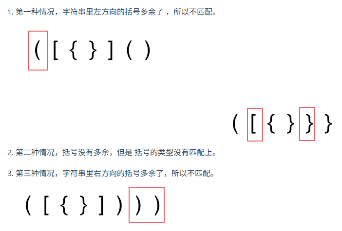

# Day 9

---

## 1. 栈与队列理论基础

了解一下 栈与队列的内部实现机制

文章讲解：https://programmercarl.com/%E6%A0%88%E4%B8%8E%E9%98%9F%E5%88%97%E7%90%86%E8%AE%BA%E5%9F%BA%E7%A1%80.html

## 2. 232.用栈实现队列

题目链接：https://leetcode.cn/problems/implement-queue-using-stacks/description/

文章讲解：https://programmercarl.com/0232.%E7%94%A8%E6%A0%88%E5%AE%9E%E7%8E%B0%E9%98%9F%E5%88%97.html

视频讲解：https://www.bilibili.com/video/BV1nY4y1w7VC

### （1）思路分析

- 栈的特点是：后进先出
- 队列的特点是：先进先出

> 思路：需要两个栈（1）**入队栈**（2）**出队栈**
>
> 模拟入队：直接把元素放到**入队栈**中即可
>
> 模拟出队：首先将<span style = "color:red;font-weight:bold">全部元素</span>从**入队栈**中放到**出队栈**中，之后再将元素从出队栈中出队

#### 动画演示

<image src="https://file1.kamacoder.com/i/algo/232.%E7%94%A8%E6%A0%88%E5%AE%9E%E7%8E%B0%E9%98%9F%E5%88%97%E7%89%88%E6%9C%AC2.gif"/>

### （2）题解

```java
class MyQueue {

    Stack<Integer> stackIn;
    Stack<Integer> stackOut;

    /** Initialize your data structure here. */
    public MyQueue() {
        stackIn = new Stack<>(); // 负责进栈
        stackOut = new Stack<>(); // 负责出栈
    }

    /** Push element x to the back of queue. */
    public void push(int x) {
        stackIn.push(x);
    }

    /** Removes the element from in front of queue and returns that element. */
    public int pop() {
        dumpstackIn();
        return stackOut.pop();
    }

    /** Get the front element. */
    public int peek() {
        dumpstackIn();
        return stackOut.peek();
    }

    /** Returns whether the queue is empty. */
    public boolean empty() {
        return stackIn.isEmpty() && stackOut.isEmpty();
    }

    // 如果stackOut为空，那么将stackIn中的元素全部放到stackOut中
    private void dumpstackIn(){
        if (!stackOut.isEmpty()) return;
        while (!stackIn.isEmpty()){
                stackOut.push(stackIn.pop());
        }
    }
}
```

## 3. 225. 用队列实现栈

题目链接：https://leetcode.cn/problems/implement-stack-using-queues/

文章讲解：https://programmercarl.com/0225.%E7%94%A8%E9%98%9F%E5%88%97%E5%AE%9E%E7%8E%B0%E6%A0%88.html

视频讲解：https://www.bilibili.com/video/BV1Fd4y1K7sm

### （1）思路

由于栈和队列的顺序是相反的，用队列实现栈，可以通过队头元素出队到达队尾的方式在队列中实现栈的顺序

> 举例：如何模拟出栈
>
> 让队列的头元素出队，然后加入到队尾，这个过程执行 **size - 1** 次，那出栈操作就是队列中最后一个元素出队，经过前面的操作，这时队尾元素已经到达队头

### （2）题解

```java
class MyStack {

    Queue<Integer> queue;

    public MyStack() {
        queue = new LinkedList<>();
    }

    public void push(int x) {
        queue.add(x);
    }

    public int pop() {
        rePosition();
        return queue.poll();
    }

    public int top() {
        rePosition();
        int result = queue.poll();
        queue.add(result);
        return result;
    }

    public boolean empty() {
        return queue.isEmpty();
    }

    public void rePosition(){
        int size = queue.size();
        size--;
        while(size-->0)
            queue.add(queue.poll());
    }
}
```

## 4. 20. ⭐ 有效的括号

题目链接：https://leetcode.cn/problems/valid-parentheses/description/

文章讲解：https://programmercarl.com/0020.%E6%9C%89%E6%95%88%E7%9A%84%E6%8B%AC%E5%8F%B7.html

视频讲解：https://www.bilibili.com/video/BV1AF411w78g

### （1）思路分析

> **思路：首先遍历括号，遇到左边的括号就**<span style = "color:red;font-weight:bold">把右边的括号入栈</span>，**这样做的**<span style = "color:red;font-weight:bold">目的</span>**就是可以做比对，进而判断括号是否匹配**

#### 三种经典的情况，如下图



#### 动图分析

<image src="https://file1.kamacoder.com/i/algo/20.%E6%9C%89%E6%95%88%E6%8B%AC%E5%8F%B7.gif"/>

### （2）题解

```java
class Solution {
    public boolean isValid(String s) {
        Deque<Character> deque = new LinkedList<>();
        char ch;
        for (int i = 0; i < s.length(); i++) {
            ch = s.charAt(i);
            //碰到左括号，就把相应的右括号入栈
            if (ch == '(') {
                deque.push(')');
            }else if (ch == '{') {
                deque.push('}');
            }else if (ch == '[') {
                deque.push(']');
            } else if (deque.isEmpty() || deque.peek() != ch) {
                /*
                    deque.peek() != ch 对应第二种情况：中间的括号不匹配
                    deque.isEmpty() 对应第三种情况：右括号多了
                    （因为先有左括号才会把右括号入栈，如果栈空了，说明前面的括号全部匹配，这部分括号就是多的）
                 */
                return false;
            }else {
                deque.pop();// 此时遍历的元素就是遍历到左括号时对应的右括号元素，括号匹配，出栈
            }
        }
        /*
            1. 遍历结束，如果栈为空，则括号全部匹配
            2. 栈不为空，对应第一种情况：左括号多了没有匹配，还遗留在栈中
         */
        return deque.isEmpty();
    }
}
```

## 5. ⭐1047. 删除字符串中的所有相邻重复项

题目链接：https://leetcode.cn/problems/remove-all-adjacent-duplicates-in-string/

文章讲解：https://programmercarl.com/1047.%E5%88%A0%E9%99%A4%E5%AD%97%E7%AC%A6%E4%B8%B2%E4%B8%AD%E7%9A%84%E6%89%80%E6%9C%89%E7%9B%B8%E9%82%BB%E9%87%8D%E5%A4%8D%E9%A1%B9.html

视频讲解：https://www.bilibili.com/video/BV12a411P7mw

### （1）思路分析

> 为什么用栈？<span style = "color:red;font-weight:bold">目的就是为了保存遍历过的元素</span>
>
> **相邻的重复项可以看成是括号匹配，用同样的思路解决**
>
> - 如果栈不为空并且第一次遍历该元素，入栈
> - 继续遍历元素，和栈顶元素比较
>   - 相同：说明是相邻重复元素
>   - 不相同：将该元素入栈

### （2）利用栈的特点

```java
class Solution {
    public String removeDuplicates(String s) {
        // 利用栈的特点
        Deque<Character> deque = new LinkedList<>();
        char[] chars = s.toCharArray();
        for (int i = 0; i < chars.length; i++) {
            // 第一次遍历该元素，入栈，表示记录已经遍历过该元素
            if(deque.isEmpty() || chars[i] != deque.peek()){
                deque.push(chars[i]);
            }else{
                deque.pop(); // 匹配到相邻重复项，出栈
            }
        }
        String str = "";
        while (!deque.isEmpty()){
            str = deque.pop() + str; // 在字符串的前面拼接
        }
        return str;
    }
}
```

### （3）⭐ 双指针解法

```java
public class Solution {
    // 双指针
    public String removeDuplicates(String s) {
        char[] ch = s.toCharArray();
        int fast = 0;
        int slow = 0;
        while (fast < s.length()) {
            // 直接用fast指针覆盖slow指针的值
            ch[slow] = ch[fast];
            // 遇到前后相同值的，就跳过，即slow指针后退一步，下次循环就可以直接被覆盖掉了
            if (slow > 0 && ch[slow] == ch[slow - 1]) {
                slow--;
            } else {
                slow++;
            }
            fast++;
        }
        return new String(ch, 0, slow);
    }
}
```
