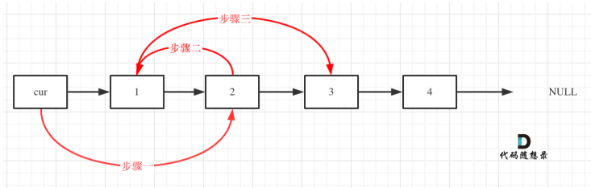
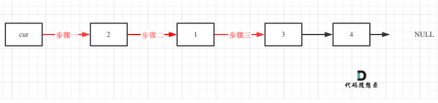

# Day 4

---

## 1. 24. 两两交换链表中的节点

建议：先看视频，视频里讲解了注意事项，为什么需要 temp 保存临时节点。

题目链接：https://leetcode.cn/problems/swap-nodes-in-pairs/description/

文章链接： https://programmercarl.com/0024.%E4%B8%A4%E4%B8%A4%E4%BA%A4%E6%8D%A2%E9%93%BE%E8%A1%A8%E4%B8%AD%E7%9A%84%E8%8A%82%E7%82%B9.html

视频链接：https://www.bilibili.com/video/BV1YT411g7br

### （1）思路分析

- 本题的核心还是虚拟头节点的使用，为什么？因为涉及了链表的操作，使用虚拟头节点可以统一处理方法
- 做题经验：虚拟头节点可以实现被操作的对象一定是**cur->next**
- 解题关键
  - 1. 遍历什么时候结束？ 需要分奇数节点和偶数节点两种情况
    - 对于偶数节点：**cur -> next != nill** 结束（从第一个元素开始，刚好是两两配对）
    - 对于奇数节点：**cur -> next -> next != null**（最后还剩余一个节点）
    - **注意：先写偶数条件再写奇数条件，否则会有空指针异常的风险**
  - 2. 如何实现节点交换？交换时需要临时保存哪些节点？
  - 3. **易错点**：在交换的过程中，指针的指向发生了变化，变化后的后继是谁

#### 交换过程



#### 交换后的结果



### （2）题解

#### 版本一：交换过程中 cur 的指向变化

```java
class Soulution {
    public ListNode swapPairs(ListNode head) {
        // 添加虚拟头节点
        ListNode dummy = new ListNode();
        dummy.next = head;

        // 使用临时指针
        ListNode cur = dummy;

        /*
            遍历的结束条件
            偶数节点：cur.next != null
            奇数节点：cur.next.next != null
         */

        // 遍历节点
        while(cur.next != null && cur.next.next != null){
            // 首先用临时指针保存两个节点
            ListNode temp1 = cur.next; // 节点一
            ListNode temp2 = cur.next.next.next; // 节点三

            // 实现节点交换
            cur.next = cur.next.next; // dummy 指向节点二

            // 注意：此时cur的指向发生了变化，则后继节点的表示也需要变化
            cur.next.next = temp1; // 节点二指向节点一

            temp1.next = temp2; // 节点一指向节点三

            // 交换完成，cur向后移动一位，准备下一次交换
            cur = cur.next;
        }

        // 返回头节点
        return dummy.next;
    }
}
```

#### 版本二：使用临时节点直接保存,更容易理解

```java
class Solution {
  public ListNode swapPairs(ListNode head) {
        ListNode dumyhead = new ListNode(-1); // 设置一个虚拟头结点
        dumyhead.next = head; // 将虚拟头结点指向head，这样方便后面做删除操作
        ListNode cur = dumyhead;
        ListNode temp; // 临时节点，保存两个节点后面的节点
        ListNode firstnode; // 临时节点，保存两个节点之中的第一个节点
        ListNode secondnode; // 临时节点，保存两个节点之中的第二个节点
        while (cur.next != null && cur.next.next != null) {
            temp = cur.next.next.next;
            firstnode = cur.next;
            secondnode = cur.next.next;
            cur.next = secondnode;       // 步骤一
            secondnode.next = firstnode; // 步骤二
            firstnode.next = temp;      // 步骤三
            cur = firstnode; // cur移动，准备下一轮交换
        }
        return dumyhead.next;
    }
}
```

## 2. 19.删除链表的倒数第 N 个节点

建议：先看视频，双指针的操作，要注意，删除第 N 个节点，那么我们当前遍历的指针一定要指向 第 N 个节点的前一个节点

题目链接：https://leetcode.cn/problems/remove-nth-node-from-end-of-list/

文章链接：https://programmercarl.com/0019.%E5%88%A0%E9%99%A4%E9%93%BE%E8%A1%A8%E7%9A%84%E5%80%92%E6%95%B0%E7%AC%ACN%E4%B8%AA%E8%8A%82%E7%82%B9.html

视频链接：https://www.bilibili.com/video/BV1vW4y1U7Gf

### （1）思路分析

本题的精髓就在于如何找到倒数第 n 个节点，使用<span style="color:red;font-weight:bold">快慢双指针</span>操作，同时使用**虚拟头节点**统一操作

#### 如何实现找到倒数第 n 个节点 ？

**初始时，让 slow 和 fast 相差 n 个节点**，这样当 fast 到达末尾时，从后往前看，slow 指向的就是倒数第 n 个节点，但是删除操作应该是指向被删节点的前驱，即**实际上 slow 和 fast 应该相差 <span style="color:red;font-weight:bold">n+1</span> 个节点**，这样 fast 到达末尾时，slow 就能指向被删节点的前驱

### （2）题解

```java
public class Solution {
    public ListNode removeNthFromEnd(ListNode head, int n) {
        // 添加虚拟头节点
        ListNode dummy = new ListNode();
        dummy.next = head;

        // 定义快慢指针
        ListNode fast = dummy;
        ListNode slow = dummy;

        /*
            1. 找到倒数第n个节点，其次慢指针需要指向操作节点的前一个节点
            2. 即二者初始时相差 n + 1 个位置
            3. 到达末尾时，slow 指向的位置刚好是倒数第 n 个节点的前驱
            4. 然后就可以进行删除操作了
         */
        for (int i = 0; i <= n; i++) {
            fast = fast.next;
        }

        // 快慢指针同时移动
        while(fast != null){
            fast = fast.next;
            slow = slow.next;
        }

        // 此时慢指针指向需要被操作节点的前一个节点
        if(slow.next!=null){
            slow.next = slow.next.next;
        }

        // 返回头节点
        return dummy.next;
    }
}

class ListNode {
    int val;
    ListNode next;

    ListNode() {
    }

    ListNode(int val) {
        this.val = val;
    }

    ListNode(int val, ListNode next) {
        this.val = val;
        this.next = next;
    }
}
```

## 3. 面试题 02.07. 链表相交

说明：本题没有视频讲解，大家注意 数值相同，不代表指针相同。

题目链接：https://leetcode.cn/problems/intersection-of-two-linked-lists-lcci/

文章链接：https://programmercarl.com/%E9%9D%A2%E8%AF%95%E9%A2%9802.07.%E9%93%BE%E8%A1%A8%E7%9B%B8%E4%BA%A4.html

### （1）思路分析

- 本题的**关键**在于如何处理不等长的情况，首先通过计算长度，让二者处于同起点的位置
- 这里有三个**易错点**
  - 计算完表长后，此时指针处于表尾为 null，头指针指向**需要重置**，否则会有空指针异常
  - 由于差值可能是负数，为了避免混淆，指定 pa 指向的就是最长的链表
    - 交换链表长度
    - 交换链表头指针的指向
  - 经过处理后，二者处于同起点，应该是<span style="color:red;font-weight:bold">先判断，再移动</span>，**否则会遗漏同起点这个点的判断**

### （2）题解

```java
public class Solution {
    public ListNode getIntersectionNode(ListNode headA, ListNode headB) {
        ListNode pa;
        ListNode pb;

        pa = headA;
        pb = headB;

        int len_a = 0;
        int len_b = 0;

        // 1. 首先计算链表长度，目的是让二者同起点

        // 计算 a 的表长
        while (pa != null) {
            pa = pa.next;
            len_a++;
        }

        // 计算 b 的表长
        while (pb != null) {
            pb = pb.next;
            len_b++;
        }

        // 易错点：此时 pa 和 pb 都已经到达了标为，需要重置一下
        pa = headA;
        pb = headB;

        // 2. 由于表长差值可能是负数，就不知道谁是最长的，假定 pa 指向的是最长的链表
        if (len_b > len_a) {

            // 交换表长
            int temp_len = len_a;
            len_a = len_b;
            len_b = temp_len;

            // 交换头指针指向
            ListNode temp = pa;
            pa = pb;
            pb = temp;

        }

        // 3. 得到差值，实现同起点
        int gap = len_a - len_b;
        while(gap>0){
            pa = pa.next;
            gap--;
        }

        // 4. 同起点后，同步移动
        while(pa != null){
            // 易错：先判断再移动，否则会遗漏同起点这个点的判断
            if(pa == pb){
                return pa;
            }
            pa = pa.next;
            pb = pb.next;

        }

        // 5. 没有交点，返回空
        return null;
    }
}

class ListNode {
    int val;
    ListNode next;

    ListNode(int x) {
        val = x;
        next = null;
    }
}
```

## 4. ⚠️142.环形链表 II

建议：先看视频，算是链表比较有难度的题目，需要多花点时间理解 确定环和找环入口

题目链接：https://leetcode.cn/problems/linked-list-cycle-ii/

文章链接：https://programmercarl.com/0142.%E7%8E%AF%E5%BD%A2%E9%93%BE%E8%A1%A8II.html

视频讲解：https://www.bilibili.com/video/BV1if4y1d7ob

### （1）思路分析

本题主要考察一下两个点

- 判断链表是否环
- 如果有环，如何找到这个环的入口

思路：采用<span style="color:red;font-weight:bold">快慢指针</span>

### 1. 判断是否有环

- **让快指针走两步，慢指针走一步**，二者最终会相遇

- 相遇分析

  - （1）fast 指针一定先进入环中，如果 fast 指针和 slow 指针相遇的话，一定是在环中相遇，这是毋庸置疑的
  - （2）fast 是走两步，slow 是走一步，其实相对于 slow 来说，**fast 是一个节点一个节点的靠近 slow 的**，所以 fast 一定可以和 slow 重合

- 动画分析


### 2. 找到环的出口

**假设从头结点到环形入口节点 的节点数为 x。 环形入口节点到 fast 指针与 slow 指针相遇节点 节点数为 y。 从相遇节点 再到环形入口节点节点数为 z**


#### 推导关系

- 相遇时
  - slow 指针走过的节点数为: **x + y**
  - fast 指针走过的节点数：**x + y + n (y + z)**（n 表示 fast 指针在环内走了 n 圈才遇到 slow 指针）
- 根据关系，快指针走两步，满指针走一步，有如下关系式
  - **(x + y) \* 2 = x + y + n (y + z)**
  - 经过化简可以得到
    - **x = n (y + z) - y**
    - **x = (n - 1) (y + z) + z**
      - **n 一定是大于等于 1 的，因为 fast 指针至少要多走一圈才能相遇 slow 指针**
  - 当 **n = 1**时，可以得到：<span style="color:red;font-weight:bold;font-size:30px;">x = z</span>

#### 结论如下

<span style="color:red;font-weight:bold">从头结点出发一个指针，从相遇节点 也出发一个指针，这两个指针每次只走一个节点， 那么当这两个指针相遇的时候就是 环形入口的节点</span>


### （2）题解

```java
public class Solution {
    public ListNode detectCycle(ListNode head) {
        // 定义快慢指针
        ListNode fast;
        ListNode slow;

        fast = head;
        slow = head;

        // 快指针走两步，满指针走一步
        while (fast != null && fast.next != null) {
            fast = fast.next.next;
            slow = slow.next;
            // 如果相遇，说明有环，需要找到环的入口
            if(slow == fast){
                ListNode index1 = head;
                ListNode index2 = fast;
                // 两个指针，从头结点和相遇结点，各走一步，直到相遇，相遇点即为环入口
                while(index1 != index2){
                    index1 = index1.next;
                    index2 = index2.next;
                }
                return index1; // 环的入口
            }
        }
        return null;
    }
}

class ListNode {
    int val;
    ListNode next;

    ListNode(int x) {
        val = x;
        next = null;
    }
}
```

## 5. 阶段二结束：链表总结

文章链接：https://programmercarl.com/%E9%93%BE%E8%A1%A8%E6%80%BB%E7%BB%93%E7%AF%87.html

### （1）虚拟头节点

方便统一操作，尤其是增删改查，对于头节点无序特殊处理

### （2）链表的基本操作

- 获取链表第 index 个节点的数值
- 在链表的最前面插入一个节点
- 在链表的最后面插入一个节点
- 在链表第 index 个节点前面插入一个节点
- 删除链表的第 index 个节点的数值

### （3）翻转链表

还是**双指针**思想，重点就在遍历什么时候结束，在原基础上改进可以变成递归写法，**优先弄懂迭代法**，递归写法虽然代码简洁，但是很容易混乱

### （4）删除倒数第 N 个节点

还是**双指针（快慢指针）思想**，关键在于如何理解倒数第 N 个节点，是以两个指针的间隔实现的（**注意是 N+1 个间隔**），需要观察到最后快指针为空慢指针指向的最终状态

### （5）链表相交

对于不同长度的链表，**理解如何实现同起点遍历是核心**

### （6）环形链表

理解**什么时候会有环**，理解如何**寻找环入口**的推导过程是关键
