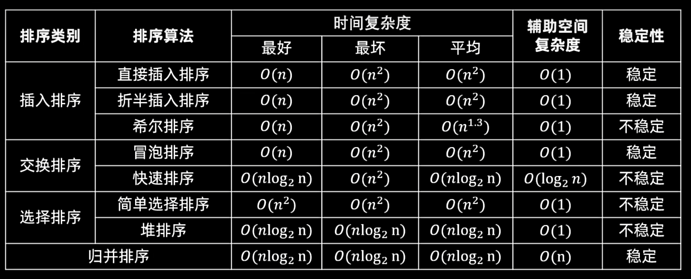
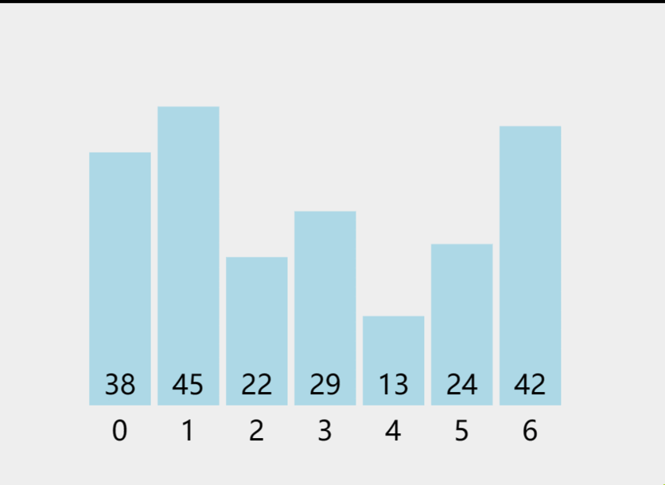

# 八大排序算法

## 目录

## 注意：以下排序均==属于内部排序==

- ## （1）插入排序
  - ## 直接插入排序
  - ## 改进版本
    - ## 折半插入排序
    - ## 希尔排序
- ## （2）交换排序
  - ## 冒泡排序
  - ## 快速排序
- ## （3）选择排序
  - ## 简单选择排序
  - ## 堆排序（树形选择排序）
- ## （4）归并排序
- ## （5）基数排序

---

# 排序总结分析表

## 

---

# 一、插入排序


# 1. 直接插入排序

## （1）整体思路

## 通过动图可以形象的理解到

- ## 1. 抽出一张牌，和当前元素之前的元素逐个比较，如果比当前元素小，该元素就后移，直到找到插入位置
- ## 2. 在==无序序列==中==抽取一张牌==，通过比较插入到有序序列中

## 说明：（惯用思想）==初始时视第一个元素是有序的==，之后通过排序逐渐增大有序序列的长度

## （2）代码实现

## 第一种写法：==while 循环==（==更规范==）

```java
public static void insert_sort(int[] arr) {
    /*
    插入排序的思想：从无序的序列中拿一个数，通过比较的方式插入到有序序列中
    初始状态：假设第一个数是有序的，从第二个元素开始，和有序序列比较，然后插入
        */

    // 在无序序列中抽取一张牌
    for (int i = 1; i < arr.length; i++) {

        // 记录要插入的元素值，位置位于有序序列的末尾
        int insertvalue = arr[i];

        // 在有序序列中从后往前和插入元素比较，找到插入位置
        int j = i - 1;

        /*

        1 2 3 9 10 15 5

        插入5：需要插入在3的后面。所以只要插入元素比当前比较元素小，就往后移

            */
        // 推荐这种写法，更规范
        while (j >= 0 && insertvalue < arr[j]) {
            arr[j + 1] = arr[j]; //  元素后裔
            j--;
        }

        // 插入元素（插入到  比当前插入元素小的 元素  的后面）
        arr[j + 1] = insertvalue;
    }
}
```

## 第二种写法：使用==for 循环==

```java
public static void insert_sort_1(int[] arr) {
    // 第二种写法：使用for循环
    for (int i = 1; i < arr.length; i++) {
        int insertvalue = arr[i];
        int j = i - 1;
        for (; j >= 0; j--) {
            if (insertvalue < arr[j]) {
                arr[j + 1] = arr[j];
            }
            else{
                break; // 如果 insertvalue >= arr[j] 就退出循环
            }
        }
        arr[j + 1] = insertvalue;
    }
}
```

---

# 2. 折半插入排序

## 改进点：使用折半查找提高效率，使用循环遍历逐个匹配的效率太差

```java
    // 查找插入位置的方法采用二分思想（由于查找位置的序列本身就是有序的，所以可以使用二分）
public static void binary_insert_sort(int[] arr) {
    for (int i = 1; i < arr.length; i++) {

        // 初始时：把第一个元素看成是有序的，然后进行插入排序
        int insertvalue = arr[i];

        int left = 0;
        int right = i - 1; // 和 j = i -1 是等价的

        while (left <= right) {
            int mid = left + ((right - left) / 2);
            if (arr[mid] < insertvalue) {
                left = mid + 1;
            } else {
                right = mid - 1;
            }
        }

        // 找到了插入位置，移动元素为插入做准备
        // 为了维持稳定性，应该插入到 right 的后边
        // 插入位置为 right + 1 , 需要把这个位置空出来才可以插入，所以要取等
        for (int j = i - 1; j >= right + 1; j--) {
            arr[j + 1] = arr[j]; //元素后移
        }
        arr[right + 1] = insertvalue;
    }
}
```

---

# 3. 希尔排序

## 动图演示


## 使用间隔 gap，gap 逐渐递减，==最后 gap 的值必须是一==，每一轮排序对 gap 产生的序列进行排序

## 快速写希尔排序：把直接插入排序中 ==“ 1 ”== 的位置==全部替换==成 ==“ gap ”==

```java
/*
快速写希尔排序算法代码：只要把直接插入排序中为 1 的地方全部改成 gap 即可
    */
public static void shell_sort(int[] arr){
    // 增量序列取中间值（常用方法）
    /*
    增量序列是递减的，并且最后一个值一定是一
        */
    int gap = arr.length / 2; // 向下取整
    while (gap >= 1) {
        shell(arr, gap);
        gap /= 2;
    }
}

// 一趟写入排序的过程
public static void shell(int[] arr, int gap){
    // 思想和直接插入排序，不同点就在原来 “加/减一” 的位置全部变成 “gap”

    // 由于是分组排，这里需要包含分组的第一个元素，所以不加一
    for (int i = gap; i < arr.length; i++) {
        int insertvalue = arr[i];
        int j = i - gap;
        // 移动元素
        while(j >= 0 && insertvalue < arr[j]){
            arr[j + gap] = arr[j];
            j -= gap;
        }
        arr[j + gap] = insertvalue;
    }
}
```

---

# 二、交换排序

# 1. 冒泡排序

## 动图演示


## （1）普通版本

```java
public static void bubble_sort(int[] arr){
    for (int i = 0; i < arr.length - 1; i++) {
        for (int j = 0; j < arr.length - 1 - i; j++) {
            // 前面的比后面大，交换位置
            if(arr[j] > arr[j + 1]){
                int temp = arr[j];
                arr[j] = arr[j + 1];
                arr[j + 1] = temp;
            }
        }
    }
}
```

## （2）==改进版本==

## 亮点：通过变量标记的方式标记是否执行了交换操作，可以一定程度上==减少比较次数==

```java
// 改进版本：如果本身就有序，则无序交换，减少比较次数
public static void bubble_sort_improve(int[] arr){
    for (int i = 0; i < arr.length - 1; i++) {
        int flag = 0;  // 每次进入循环都标记为0，如果有序就不交换，flag = 0
        for (int j = 0; j < arr.length - 1 - i; j++) {
            // 前面的比后面大，交换位置
            if(arr[j] > arr[j + 1]){
                flag = 1; // 交换了就标记为一
                int temp = arr[j];
                arr[j] = arr[j + 1];
                arr[j + 1] = temp;
            }
        }

        if(flag == 0){
            /* 在一趟遍历之后，如果都没有发生交换，说明元素已经有序了，
                后面的比较没有意义了，直接退出
                */
            break;
        }
    }
}
```

---

# 2. 快速排序

## 动图演示


## 主要思想：递归，双指针（对撞指针）

## 思路分析

- ## 把第一个元素当作枢纽，然后通过两个指针 left 和 right

- ## left ： 在==前面==找比枢纽==大==的元素==搬到==枢纽的==后面==
- ## right ： 在==后面==找比枢纽==小==的元素==搬到==枢纽的==前面==

- ## 递归左右子区间

```java
 /*
    快速排序是冒泡排序的改进版本，核心在于递归和双指针思想

    说明
    1.选取数组的第一个元素为枢纽
    2.left,right为数组下标
    3.延申：可以对任意区间排序

     */

public static int partition(int[] arr, int left, int right) {
    /*
    双指针思想
    1.left：指向数组的 第一个 元素，从 左往右 找，如果比中间值 大，就搬到后面（high的位置）
    2.right：指向数组的 最后一个 元素，从 左右往左 找，如果比中间值 小，就搬到前面（left的位置）
        */
    int pivot = arr[left];
    // 两个指针的移动逐渐靠近，当两个指针重合时，退出循环
    // 此时指向的位置就是枢纽的位置
    while (left < right) {

        /*
        注意：指针的移动可能会越界，需要加上判断条件 left < right
        易错点：先找小的，后找大的
            */

        // 首先在后面找小的往前搬(那对立面就是不符合要求，right指针往前移)
        while (arr[right] >= pivot && left < right) {
            right--;
        }
        arr[left] = arr[right];

        // 然后在前面找大的往后搬(那对立面就是不符合要求，left指针往后移)
        while (arr[left] <= pivot && left < right) {
            left++;
        }
        arr[right] = arr[left];
    }

    // 此时 left = right，指向中间枢纽的位置，放入枢纽值，返回枢纽的位置
    arr[left] = pivot;
    return left;
}


public static void quicksort(int[] arr, int left, int right) {
    /*
    递归易错的地方：需要有一个递归出口
        */
    if(left < right){
        int pivot = partition(arr,left,right); // 首先计算枢纽值

        // 递归递归左子区间
        quicksort(arr,left,pivot - 1);

        // 递归排序右子区间
        quicksort(arr,pivot + 1,right);
    }
}
```

---

# 三、选择排序

# 1. 简单选择排序

## 动图演示



## 基本思路：选一个数，在这个数的后面找有没有比本身还小的，有就交换位置

## 优化点：在后面找一个==最小的数==，避免重复的覆盖，减少比较次数

## ==区别冒泡排序==的优化

- ## ==冒泡排序==中是比较相邻==两个元素之间==是否有序，如果==有序就不交换位置==
- ## ==选择排序==中是在后面找一个比本身小的数，然后交换位置，为了避免重复的覆盖，==需要找到一个最小的数进行交换==

## （1）普通版本

```java
public static void select_sort(int[] arr){
    for (int i = 0; i < arr.length; i++) {
        for (int j = i + 1; j < arr.length; j++){
            if(arr[j] < arr[i]){
                int temp = arr[j];
                arr[j] = arr[i];
                arr[i] = temp;
            }
        }
    }
}
```

## （2）==改进版本==

```java
public static void select_sort_improve(int[] arr){
    // 比较 n-1 趟
    for (int i = 0; i < arr.length; i++) {
        int min_index = i; // 假设当前元素是最小的，记录下标

        // 在当前元素的后面找有没有更小的，有就交换位置
        for (int j = i + 1; j < arr.length; j++){
            // 如果找到更小的，就更新下标
            if(arr[j] < arr[min_index]){
                min_index = j;
            }
        }

        // 如果最小元素不是本身（找到了更小的），就交换位置
        if(min_index != i){
            int temp = arr[i];
            arr[i] = arr[min_index];
            arr[min_index] = temp;
        }
    }
}
```

# 2. 堆排序（二叉堆）

## （1）基本介绍

- ## 堆的性质是符合完全二叉树的，在结构上是递归定义的树结构
- ## ==重要性质回顾==
  - ## 1. 若一个==非叶子节点节点==的物理位置为 ==“ i ”==
    - ## （1）左孩子
      - ## 物理位置：==“ 2i ”==
      - ## ==数组下标：“ 2i + 1 ”==
    - ## （2）右孩子
      - ## 物理位置：==“ 2i + 1 ”==
      - ## ==数组下标：“ 2i + 2 ”==
  - ## 2. 若一个数组的元素可以构成一棵树，==数组大小为 n==
    - ## （1）最后一个元素（==叶子节点==）在树中的标号对应的数组下标是==n / 2==
    - ## （2）从后往前遍历的第一个==非叶子节点==在树中的标号对应的==数组下标是[n / 2] - 1==

## 补充：关于树中节点的序号和数组下标的关系

## 方法：==从左到右，从上到下依次标号==

## 图例（==对应数组下标==）

```java
       0
     /   \
    1      2
   / \    / \
  3   4  5   6
```

- ## 分类
  - ## ==大根堆==：对于完全二叉树中的任意一个节点，其值都==大于或等于其子树==中所有节点的值。这意味着大根堆的==根节点是堆中最大的元素==
  - ## ==小根堆==：完全二叉树中任意一个节点的值都==小于或等于其子树==中所有节点的值，即==小根堆的根节点是堆中最小的元素==

## 大根堆示例

```java
       10
     /    \
    8      6
   / \    / \
  5   3  2
```

## 小根堆示例

```java
       1
     /    \
    3      4
   / \    / \
  6   8  9
```

## （2）==堆排序思想==

- ## 1. 构建一个大根堆
  - ## 从后面的===第一个非叶子节点==（==下标：n / 2 - 1==）开始，依次递归的往上调整，使得整棵树形成大根堆的结构
- ## 2. 交换最大和最小的节点，重新调整堆
  - ## 交换思想：交换的过程就是排序的过程，把最大的和最小的交换，即==把最大的放入有序区，数组从后往前依次递减排序==
  - ## 调整堆思想：先调整一颗树的左右孩子和根节点的大小关系，构成大根堆后，采用==递归思想==，==递归调整左右子树==
    - ## 理解：在调整过程中，指向的最大根节点会发生变化，==对根节点调整即可实现对左右子树的调整==）
- ## 3. 重复 2 的操作（ n 个元素进行 `n - 1` 趟排序）
  - ## 关于==n - 1==的说明
    - ## （1）进行==n - 1 趟排序==
    - ## （2）循环的起始变量，对应数组中最后的那个元素，刚好可以和第一个元素==完成交换操作==（最大的和最小的交换）
    - ## （3）循环过程中，刚好对应==堆的大小的变化==，每一轮排序一个元素（交换的过程），堆中==需要调整的元素总数减小一==

## 堆排序代码

```java
/*
堆排序思想（又叫二叉堆）
分类：大顶堆，小顶堆

堆符合二叉树的性质

说明：数组的下标在树中是：从上到下，从左到右依次编号的

排序过程说明

1. 构建一个大顶堆，每次交换最小和最大的，并且堆大小缩小减一，
2. 交换的过程：把最大的放在有序区，但是破坏了大顶堆的结构，需要重新调整堆

3. 有序的过程：把最大的放在有序区，数组从后往前一次放入有序元素完成排序
    */

// 堆调整（大顶堆）
// n：表示数组的大小；i：表示最大值的下标索引
public static void heapify(int[] arr, int n, int i) {

    /*
    易错：这里表示的下标值，然而二叉树中的性质指的是物理位置

    数组是从0开始编号的，举例说明
                  7
                /   \
               6     5

    7：下标索引是0
    6：按照物理位置计算方法（左孩子：2 * i = 0），结果还是0，但是下标索引是1

    得出的关系：在物理位置的基础上加一才是索引下标

        */
    int max_index = i; // 初始化最大值下标索引
    int left = 2 * i + 1; // 左孩子的下标索引
    int right = 2 * i + 2; // 右孩子的下标索引

    // 和左右孩子比较，更新最大值下标索引
    // 注意：防止越界，需要加上限制条件
    if (left < n && arr[left] > arr[max_index]) {
        max_index = left;
    }

    if (right < n && arr[right] > arr[max_index]) {
        max_index = right;
    }

    // 如果最大值不是初始化的值，说明找到了更大的值，把最大值放到根节点
    if (max_index != i) {
        int temp = arr[i];
        arr[i] = arr[max_index];
        arr[max_index] = temp;

        // 递归调整左右子树（max_index在这个过程中做了更新）
        heapify(arr, n, max_index);
    }
}

//堆排序
public static void heap_sort(int[] arr) {

    /*
                7
              /   \
             6     5
            / \   / \
           4   3 2   1
        总节点数：7

        循环起点：7/2 - 1 = 3 - 1 = 2，即下标为2的元素开始（元素5）

        */

    // 构建大顶堆（如果每一个子树都是大顶堆，则整个二叉堆就是大顶堆）
    int n = arr.length;
    // 从最后一个非叶子节点开始向上进行堆调整
    for (int i = n / 2 - 1; i >= 0; i--) {
        heapify(arr, n, i);
    }

    // 排序过程：交换元素，调整堆，进行 n - 1 趟排序
    // 初值：每交换一次，可以理解为排序一个元素，则堆中需要排序的元素总数减少一
    // 初值为 i -1 正好对应最后一个元素的下标，方便交换
    for (int i = n - 1; i > 0; i--) {
        // 把最大的和最小的进行交换
        int temp = arr[0];
        arr[0] = arr[i];
        arr[i] = temp;

        // 交换后破坏了大顶堆的结构，重新调整堆（排序的过程中堆的大小在递减）
        heapify(arr, i, 0);
    }
}
```

---

# 四、归并排序

## 动图演示


## 思路：运用合并为有序序列的思想、递归思想，两个有序序列通过比较的方式合并成一个更长的有序序列，而比较的过程正好是排序的过程

## 小结：排序左区间，排序右区间，两个区间合并，然而排序的过程又是两个区间合并的过程，即采用==递归思想==

## 归并排序代码

```java
package 内部排序.归并排序;

public class 归并排序 {
    public static void main(String[] args) {
        int[] arr = {1, 2, 5, 6, 9, 8, 7, 4, 3};
        sort.merge_sort(arr,0, arr.length - 1);
        sort.printarr(arr);
    }
}

class sort {

    public static void merge(int[] arr, int left, int mid, int right) {
        // 双指针思想 + 顺序表合并的思路

        // 使用两个指针 i j 遍历两个子序列
        int i = left;
        int j = mid + 1;
        // 用临时数组保存合并结果，之后更新原数组
        int[] temp = new int[right - left + 1];
        int k = 0; // 合并成新数组的指针

        // 比较值，放入新数组（前提：不能越界）
        while (i <= mid && j <= right) {
            if (arr[i] <= arr[j]) {
                // 简洁写法：先赋值后自增
                temp[k++] = arr[i++];
            } else {
                temp[k++] = arr[j++];
            }
        }

        // 把剩余的元素放入数组（这些数是有序的）
        /*
        说明：最开始把每一个数看成是有序的，通过不断递归回溯合并成子区间，
              所以能保证剩余的数是有序的
         */

        while (i <= mid) {
            temp[k++] = arr[i++];
        }

        while (j <= right) {
            temp[k++] = arr[j++];
        }

        // 给新数组赋值（赋值后就是由两个序列合并成的有序序列）
        for (int p = 0; p < temp.length; p++) {
            arr[left + p] = temp[p];
        }

    }

    public static void merge_sort(int[] arr, int left, int right) {
        // 采用递归思想

        // 设置递归出口
        if (left >= right) {
            return;
        }

        int mid = left + ((right - left) / 2);
        // 排序左右区间，然后合并
        merge_sort(arr, left, mid);
        merge_sort(arr, mid + 1, right);
        merge(arr, left, mid, right);
    }


    public static void printarr(int arr[]) {
        for (int i = 0; i < arr.length; i++) {
            System.out.print(arr[i] + " ");
        }
    }
}
```

---

# 五、基数排序
