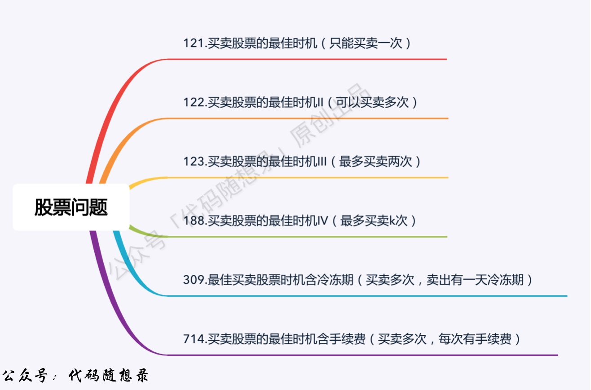

# 代码随想录算法学习路线

# 一、基本介绍

- ## >>[视频教学链接](https://www.bilibili.com/video/BV1fA4y1o715/?spm_id_from=333.788.videopod.sections&vd_source=822e86b53dab98632ef279a46d2536db)

- ## >>[代码随想录网站](https://www.programmercarl.com/)

  - ## >>[网站验证码生成](https://open.techgrow.cn/#/readmore/captcha/generate?blogId=08787-1354603941702-945)

- ## 题目来源：[力扣](https://leetcode.cn/problemset/)
- ## >>[算法训练营安排跟连计划](https://docs.qq.com/doc/DUHFmamRJVEpYaUdS)
  - ## 两个月刷完代码随想录
  - ## 每天 2 - 3 道题目
  - ## 每天 3 - 4 小时学习算法
- ## >>[卡玛网](https://kamacoder.com/)

# 二、模块分类（12 个模块）

- ## [数组](#数组)
- ## [链表](#链表)
- ## [哈希表](#哈希表)
- ## [字符串](#字符串)
- ## [双指针法](#双指针法)
- ## [栈和队列](#栈和队列)
- ## [二叉树](#二叉树)
- ## [回溯算法](#回溯算法)
- ## [贪心算法](#贪心算法)
- ## [动态规划](#动态规划)
- ## [单调栈](#单调栈)
- ## [图论](#图论)
- ## [补充题目](#补充题目)

## 注意：没有标明题目题号的都是[卡玛网](https://kamacoder.com/)中的题目

# 三、模块分类及对应的题目链接如下

---

# 数组

## 1. [数组理论基础](https://www.programmercarl.com/%E6%95%B0%E7%BB%84%E7%90%86%E8%AE%BA%E5%9F%BA%E7%A1%80.html)（网站文章）

## 2. [数组：704.二分查找](https://leetcode.cn/problems/binary-search/)

## 3. [数组：27.移除元素](https://leetcode.cn/problems/remove-element/)

## 4. [数组：977.有序数组的平方](https://leetcode.cn/problems/squares-of-a-sorted-array/)

## 5. [数组：209.长度最小的子数组](https://leetcode.cn/problems/minimum-size-subarray-sum/)

## 6. [数组：区间和](https://kamacoder.com/problempage.php?pid=1070)

## 7. [数组：开发商购买土地](https://kamacoder.com/problempage.php?pid=1044)

## 8. [数组：59.螺旋矩阵 II](https://leetcode.cn/problems/spiral-matrix-ii/)

## 9. [数组：总结篇](https://programmercarl.com/%E6%95%B0%E7%BB%84%E6%80%BB%E7%BB%93%E7%AF%87.html)（网站文章）

---

# 链表

## 2. [链表：203.移除链表元素](https://leetcode.cn/problems/remove-linked-list-elements/)

## 3. [链表：707.设计链表](https://leetcode.cn/problems/design-linked-list/)

## 4. [链表：206.翻转链表](https://leetcode.cn/problems/reverse-linked-list/)

## 5. [链表：24.两两交换链表中的节点](https://leetcode.cn/problems/swap-nodes-in-pairs/)

## 6. [链表：19.删除链表的倒数第 N 个结点](https://leetcode.cn/problems/remove-nth-node-from-end-of-list/)

## 7. [链表：链表相交](https://kamacoder.com/problempage.php?pid=1207)

## 8. [链表：142.环形链表 II](https://leetcode.cn/problems/linked-list-cycle-ii/)

## 9. [链表：总结篇！](https://kamacoder.com/problempage.php?pid=1111)

---

# 哈希表

## 2. [哈希表：242.有效的字母异位词](https://leetcode.cn/problems/valid-anagram/)

## 3. [哈希表：1002.查找常用字符](https://leetcode.cn/problems/find-common-characters/)

## 4. [哈希表：349.两个数组的交集](https://leetcode.cn/problems/intersection-of-two-arrays/)

## 5. [哈希表：202.快乐数](https://leetcode.cn/problems/happy-number/)

## 6. [哈希表：1.两数之和](https://leetcode.cn/problems/two-sum/)

## 7. [哈希表：454.四数相加 II](https://leetcode.cn/problems/4sum-ii/)

## 8. [哈希表：383.赎金信](https://leetcode.cn/problems/ransom-note/)

## 9. [哈希表：15.三数之和](https://leetcode.cn/problems/3sum/)

## 10. [双指针法：18.四数之和](https://leetcode.cn/problems/4sum/)

## 11. [哈希表：总结篇！](https://kamacoder.com/problempage.php?pid=1206)

---

# 字符串

## 1. [字符串：344.反转字符串](https://leetcode.cn/problems/reverse-string/)

## 2. [字符串：541.反转字符串 II](https://leetcode.cn/problems/reverse-string-ii/)

## 3. [字符串：替换数字](https://kamacoder.com/problempage.php?pid=1105)

## 4. [字符串：151.翻转字符串里的单词](https://leetcode.cn/problems/reverse-words-in-a-string/)

## 5. [字符串：右旋字符串](https://kamacoder.com/problempage.php?pid=1106)

## 6. [帮你把 KMP 算法学个通透](https://leetcode.cn/problems/implement-strstr/)

## 7. [字符串：459.重复的子字符串](https://leetcode.cn/problems/repeated-substring-pattern/)

## 8. [字符串：总结篇！](https://kamacoder.com/problempage.php?pid=1099)

---

# 双指针法

## 1. [数组：27.移除元素](https://leetcode.cn/problems/remove-element/)

## 2. [字符串：344.反转字符串](https://leetcode.cn/problems/reverse-string/)

## 3. [字符串：替换数字](https://kamacoder.com/problempage.php?pid=1105)

## 4. [字符串：151.翻转字符串里的单词](https://leetcode.cn/problems/reverse-words-in-a-string/)

## 5. [链表：206.翻转链表](https://leetcode.cn/problems/reverse-linked-list/)

## 6. [链表：19.删除链表的倒数第 N 个结点](https://leetcode.cn/problems/remove-nth-node-from-end-of-list/)

## 7. [链表：链表相交](https://kamacoder.com/problempage.php?pid=1207)

## 8. [链表：142.环形链表](https://leetcode.cn/problems/linked-list-cycle-ii/)

## 9. [双指针：15.三数之和](https://leetcode.cn/problems/3sum/)

## 10. [双指针：18.四数之和](https://leetcode.cn/problems/4sum/)

## 11. [双指针：总结篇！](https://kamacoder.com/problempage.php?pid=1199)

---

# 栈与队列

## 1. [栈与队列：理论基础](https://kamacoder.com/problempage.php?pid=1188)

## 2. [栈与队列：232.用栈实现队列](https://leetcode.cn/problems/implement-queue-using-stacks/)

## 3. [栈与队列：225.用队列实现栈](https://leetcode.cn/problems/implement-stack-using-queues/)

## 4. [栈与队列：20.有效的括号](https://leetcode.cn/problems/valid-parentheses/)

## 5. [栈与队列：1047.删除字符串中的所有相邻重复项](https://leetcode.cn/problems/remove-all-adjacent-duplicates-in-string/)

## 6. [栈与队列：150.逆波兰表达式求值](https://leetcode.cn/problems/evaluate-reverse-polish-notation/)

## 7. [栈与队列：239.滑动窗口最大值](https://leetcode.cn/problems/sliding-window-maximum/)

## 8. [栈与队列：347.前 K 个高频元素](https://leetcode.cn/problems/top-k-frequent-elements/)

## 9. [栈与队列：总结篇！](https://kamacoder.com/problempage.php?pid=1189)

---

# 二叉树

## 1. [关于二叉树，你该了解这些！](./problems/二叉树理论基础.md)

## 2. [二叉树：二叉树的递归遍历](./problems/二叉树的递归遍历.md)

## 3. [二叉树：二叉树的迭代遍历](./problems/二叉树的迭代遍历.md)

## 4. [二叉树：二叉树的统一迭代法](./problems/二叉树的统一迭代法.md)

## 5. [二叉树：二叉树的层序遍历](https://leetcode.cn/problems/binary-tree-level-order-traversal/)

## 6. [二叉树：226.翻转二叉树](https://leetcode.cn/problems/invert-binary-tree/)

## 7. [本周小结！（二叉树）](./problems/周总结/20200927二叉树周末总结.md)

## 8. [二叉树：101.对称二叉树](https://leetcode.cn/problems/symmetric-tree/)

## 9. [二叉树：104.二叉树的最大深度](https://leetcode.cn/problems/maximum-depth-of-binary-tree/)

## 10. [二叉树：111.二叉树的最小深度](https://leetcode.cn/problems/minimum-depth-of-binary-tree/)

## 11. [二叉树：222.完全二叉树的节点个数](https://leetcode.cn/problems/count-complete-tree-nodes/)

## 12. [二叉树：110.平衡二叉树](https://leetcode.cn/problems/balanced-binary-tree/)

## 13. [二叉树：257.二叉树的所有路径](https://leetcode.cn/problems/binary-tree-paths/)

## 14. [本周总结！（二叉树）](./problems/周总结/20201003二叉树周末总结.md)

## 15. [二叉树：404.左叶子之和](https://leetcode.cn/problems/sum-of-left-leaves/)

## 16. [二叉树：513.找树左下角的值](https://leetcode.cn/problems/find-bottom-left-tree-value/)

## 17. [二叉树：112.路径总和](https://leetcode.cn/problems/path-sum/)

## 18. [二叉树：106.构造二叉树](https://leetcode.cn/problems/construct-binary-tree-from-inorder-and-postorder-traversal/)

## 19. [二叉树：654.最大二叉树](https://leetcode.cn/problems/maximum-binary-tree/)

## 20. [本周小结！（二叉树）](./problems/周总结/20201010二叉树周末总结.md)

## 21. [二叉树：617.合并两个二叉树](https://leetcode.cn/problems/merge-two-binary-trees/)

## 22. [二叉树：700.二叉搜索树登场！](https://leetcode.cn/problems/search-in-a-binary-search-tree/)

## 23. [二叉树：98.验证二叉搜索树](https://leetcode.cn/problems/validate-binary-search-tree/)

## 24. [二叉树：530.搜索树的最小绝对差](https://leetcode.cn/problems/minimum-absolute-difference-in-bst/)

## 25. [二叉树：501.二叉搜索树中的众数](https://leetcode.cn/problems/find-mode-in-binary-search-tree/)

## 26. [二叉树：236.公共祖先问题](https://leetcode.cn/problems/lowest-common-ancestor-of-a-binary-tree/)

## 27. [本周小结！（二叉树）](./problems/周总结/20201017二叉树周末总结.md)

## 28. [二叉树：235.搜索树的最近公共祖先](https://leetcode.cn/problems/lowest-common-ancestor-of-a-binary-search-tree/)

## 29. [二叉树：701.搜索树中的插入操作](https://leetcode.cn/problems/insert-into-a-binary-search-tree/)

## 30. [二叉树：450.搜索树中的删除操作](https://leetcode.cn/problems/delete-node-in-a-binary-search-tree/)

## 31. [二叉树：669.修剪二叉搜索树](https://leetcode.cn/problems/trim-a-binary-search-tree/)

## 32. [二叉树：108.将有序数组转换为二叉搜索树](https://leetcode.cn/problems/convert-sorted-array-to-binary-search-tree/)

## 33. [二叉树：538.把二叉搜索树转换为累加树](https://leetcode.cn/problems/convert-bst-to-greater-tree/)

## 34. [二叉树：总结篇！（需要掌握的二叉树技能都在这里了）](./problems/二叉树总结篇.md)

---

# 回溯算法

## 1. [关于回溯算法，你该了解这些！](./problems/回溯算法理论基础.md)

## 2. [回溯算法：77.组合](https://leetcode.cn/problems/combinations/)

## 3. [回溯算法：77.组合优化](./problems/0077.组合优化.md)

## 4. [回溯算法：216.组合总和 III](https://leetcode.cn/problems/combination-sum-iii/)

## 5. [回溯算法：17.电话号码的字母组合](https://leetcode.cn/problems/letter-combinations-of-a-phone-number/)

## 6. [本周小结！（回溯算法系列一）](./problems/周总结/20201030回溯周末总结.md)

## 7. [回溯算法：39.组合总和](https://leetcode.cn/problems/combination-sum/)

## 8. [回溯算法：40.组合总和 II](https://leetcode.cn/problems/combination-sum-ii/)

## 9. [回溯算法：131.分割回文串](https://leetcode.cn/problems/palindrome-partitioning/)

## 10. [回溯算法：93.复原 IP 地址](https://leetcode.cn/problems/restore-ip-addresses/)

## 11. [回溯算法：78.子集](https://leetcode.cn/problems/subsets/)

## 12. [本周小结！（回溯算法系列二）](./problems/周总结/20201107回溯周末总结.md)

## 13. [回溯算法：90.子集 II](https://leetcode.cn/problems/subsets-ii/)

## 14. [回溯算法：491.递增子序列](https://leetcode.cn/problems/increasing-subsequences/)

## 15. [回溯算法：46.全排列](https://leetcode.cn/problems/permutations/)

## 16. [回溯算法：47.全排列 II](https://leetcode.cn/problems/permutations-ii/)

## 17. [本周小结！（回溯算法系列三）](./problems/周总结/20201112回溯周末总结.md)

## 18. [回溯算法去重问题的另一种写法](./problems/回溯算法去重问题的另一种写法.md)

## 19. [回溯算法：332.重新安排行程](https://leetcode.cn/problems/reconstruct-itinerary/)

## 20. [回溯算法：51.N 皇后](https://leetcode.cn/problems/n-queens/)

## 21. [回溯算法：37.解数独](https://leetcode.cn/problems/sudoku-solver/)

## 22. [回溯算法总结篇](./problems/回溯总结.md)

---

# 贪心算法

## 1. [关于贪心算法，你该了解这些！](./problems/贪心算法理论基础.md)

## 2. [贪心算法：455.分发饼干](https://leetcode.cn/problems/assign-cookies/)

## 3. [贪心算法：376.摆动序列](https://leetcode.cn/problems/wiggle-subsequence/)

## 4. [贪心算法：53.最大子序和](https://leetcode.cn/problems/maximum-subarray/)

## 5. [本周小结！（贪心算法系列一）](./problems/周总结/20201126贪心周末总结.md)

## 6. [贪心算法：122.买卖股票的最佳时机 II](https://leetcode.cn/problems/best-time-to-buy-and-sell-stock-ii/)

## 7. [贪心算法：55.跳跃游戏](https://leetcode.cn/problems/jump-game/)

## 8. [贪心算法：45.跳跃游戏 II](https://leetcode.cn/problems/jump-game-ii/)

## 9. [贪心算法：1005.K 次取反后最大化的数组和](https://leetcode.cn/problems/maximize-sum-of-array-after-k-negations/)

## 10. [本周小结！（贪心算法系列二）](./problems/周总结/20201203贪心周末总结.md)

## 11. [贪心算法：134.加油站](https://leetcode.cn/problems/gas-station/)

## 12. [贪心算法：135.分发糖果](https://leetcode.cn/problems/candy/)

## 13. [贪心算法：860.柠檬水找零](https://leetcode.cn/problems/lemonade-change/)

## 14. [贪心算法：406.根据身高重建队列](https://leetcode.cn/problems/queue-reconstruction-by-height/)

## 15. [本周小结！（贪心算法系列三）](./problems/周总结/20201217贪心周末总结.md)

## 16. [贪心算法：406.根据身高重建队列（续集）](./problems/根据身高重建队列（vector原理讲解）.md)

## 17. [贪心算法：452.用最少数量的箭引爆气球](https://leetcode.cn/problems/minimum-number-of-arrows-to-burst-balloons/)

## 18. [贪心算法：435.无重叠区间](https://leetcode.cn/problems/non-overlapping-intervals/)

## 19. [贪心算法：763.划分字母区间](https://leetcode.cn/problems/partition-labels/)

## 20. [贪心算法：56.合并区间](https://leetcode.cn/problems/merge-intervals/)

## 21. [本周小结！（贪心算法系列四）](./problems/周总结/20201224贪心周末总结.md)

## 22. [贪心算法：738.单调递增的数字](https://leetcode.cn/problems/monotone-increasing-digits/)

## 23. [贪心算法：968.监控二叉树](https://leetcode.cn/problems/binary-tree-cameras/)

## 24. [贪心算法：总结篇！（每逢总结必经典）](./problems/贪心算法总结篇.md)

---

# 动态规划

## 1. [关于动态规划，你该了解这些！](./problems/动态规划理论基础.md)

## 2. [动态规划：509.斐波那契数](https://leetcode.cn/problems/fibonacci-number/)

## 3. [动态规划：70.爬楼梯](https://leetcode.cn/problems/climbing-stairs/)

## 4. [动态规划：746.使用最小花费爬楼梯](https://leetcode.cn/problems/min-cost-climbing-stairs/)

## 5. [本周小结！（动态规划系列一）](./problems/周总结/20210107动规周末总结.md)

## 6. [动态规划：62.不同路径](https://leetcode.cn/problems/unique-paths/)

## 7. [动态规划：63.不同路径 II](https://leetcode.cn/problems/unique-paths-ii/)

## 8. [动态规划：343.整数拆分](https://leetcode.cn/problems/integer-break/)

## 9. [动态规划：96.不同的二叉搜索树](https://leetcode.cn/problems/unique-binary-search-trees/)

## 10. [本周小结！（动态规划系列二）](./problems/周总结/20210114动规周末总结.md)

## 背包问题

## 11. [动态规划：01 背包理论基础（二维 dp 数组）](./problems/背包理论基础01背包-1.md)

## 12. [动态规划：01 背包理论基础（一维 dp 数组）](./problems/背包理论基础01背包-2.md)

## 13. [动态规划：416.分割等和子集](https://leetcode.cn/problems/partition-equal-subset-sum/)

## 14. [动态规划：1049.最后一块石头的重量 II](https://leetcode.cn/problems/last-stone-weight-ii/)

## 15. [本周小结！（动态规划系列三）](./problems/周总结/20210121动规周末总结.md)

## 16. [动态规划：494.目标和](https://leetcode.cn/problems/target-sum/)

## 17. [动态规划：474.一和零](https://leetcode.cn/problems/ones-and-zeroes/)

## 18. [动态规划：完全背包理论基础（二维 dp 数组）](./problems/背包问题理论基础完全背包.md)

## 19. [动态规划：完全背包理论基础（一维 dp 数组）](./problems/背包问题完全背包一维.md)

## 20. [动态规划：518.零钱兑换 II](https://leetcode.cn/problems/coin-change-ii/)

## 21. [本周小结！（动态规划系列四）](./problems/周总结/20210128动规周末总结.md)

## 22. [动态规划：377.组合总和 Ⅳ](https://leetcode.cn/problems/combinations-sum-iv/)

## 23. [动态规划：70.爬楼梯（完全背包版本）](./problems/0070.爬楼梯完全背包版本.md)

## 24. [动态规划：322.零钱兑换](https://leetcode.cn/problems/coin-change/)

## 25. [动态规划：279.完全平方数](https://leetcode.cn/problems/perfect-squares/)

## 26. [本周小结！（动态规划系列五）](./problems/周总结/20210204动规周末总结.md)

## 27. [动态规划：139.单词拆分](https://leetcode.cn/problems/word-break/)

## 28. [动态规划：多重背包理论基础](./problems/背包问题理论基础多重背包.md)

## 29. [背包问题总结篇](./problems/背包总结篇.md)

## 打家劫舍系列

## 29. [动态规划：198.打家劫舍](https://leetcode.cn/problems/house-robber/)

## 30. [动态规划：213.打家劫舍 II](https://leetcode.cn/problems/house-robber-ii/)

## 31. [动态规划：337.打家劫舍 III](https://leetcode.cn/problems/house-robber-iii/)

## 股票系列

## 32. [动态规划：121.买卖股票的最佳时机](https://leetcode.cn/problems/best-time-to-buy-and-sell-stock/)

## 33. [动态规划：本周小结（系列六）](./problems/周总结/20210225动规周末总结.md)

## 34. [动态规划：122.买卖股票的最佳时机 II](https://leetcode.cn/problems/best-time-to-buy-and-sell-stock-ii/)

## 35. [动态规划：123.买卖股票的最佳时机 III](https://leetcode.cn/problems/best-time-to-buy-and-sell-stock-iii/)

## 36. [动态规划：188.买卖股票的最佳时机 IV](https://leetcode.cn/problems/best-time-to-buy-and-sell-stock-iv/)

## 37. [动态规划：309.最佳买卖股票时机含冷冻期](https://leetcode.cn/problems/best-time-to-buy-and-sell-stock-with-cooldown/)

## 38. [动态规划：本周小结（系列七）](./problems/周总结/20210304动规周末总结.md)

## 39. [动态规划：714.买卖股票的最佳时机含手续费](https://leetcode.cn/problems/best-time-to-buy-and-sell-stock-with-transaction-fee/)

## 40. [动态规划：股票系列总结篇](./problems/动态规划-股票问题总结篇.md)

## 子序列

## 41. [动态规划：300.最长递增子序列](https://leetcode.cn/problems/longest-increasing-subsequence/)

## 42. [动态规划：674.最长连续递增序列](https://leetcode.cn/problems/longest-continuous-increasing-subsequence/)

## 43. [动态规划：718.最长重复子数组](https://leetcode.cn/problems/maximum-length-of-repeated-subarray/)

## 44. [动态规划：1143.最长公共子序列](https://leetcode.cn/problems/longest-common-subsequence/)

## 45. [动态规划：1035.不相交的线](https://leetcode.cn/problems/uncrossed-lines/)

## 46. [动态规划：53.最大子序和](https://leetcode.cn/problems/maximum-subarray/)

## 47. [动态规划：392.判断子序列](https://leetcode.cn/problems/is-subsequence/)

## 48. [动态规划：115.不同的子序列](https://leetcode.cn/problems/distinct-subsequences/)

## 49. [动态规划：583.两个字符串的删除操作](https://leetcode.cn/problems/delete-operation-for-two-strings/)

## 50. [动态规划：72.编辑距离](https://leetcode.cn/problems/edit-distance/)

## 51. [编辑距离总结篇](./problems/为了绝杀编辑距离，卡尔做了三步铺垫.md)

## 52. [动态规划：647.回文子串](https://leetcode.cn/problems/palindromic-substrings/)

## 53. [动态规划：516.最长回文子序列](https://leetcode.cn/problems/longest-palindromic-subsequence/)

## 54. [动态规划总结篇](./problems/动态规划总结篇.md)

---

# 单调栈

## 1. [单调栈：739.每日温度](https://leetcode.cn/problems/daily-temperatures/)

## 2. [单调栈：496.下一个更大元素 I](https://leetcode.cn/problems/next-greater-element-i/)

## 3. [单调栈：503.下一个更大元素 II](https://leetcode.cn/problems/next-greater-element-ii/)

## 4. [单调栈：42.接雨水](https://leetcode.cn/problems/trapping-rain-water/)

## 5. [单调栈：84.柱状图中最大的矩形](https://leetcode.cn/problems/largest-rectangle-in-histogram/)

---

# 图论

## 1. [图论：理论基础](https://kamacoder.com/图论理论基础.md)

## 2. [图论：深度优先搜索理论基础](https://kamacoder.com/图论深搜理论基础.md)

## 3. [图论：所有可达路径](https://kamacoder.com/0098.所有可达路径.md)

## 4. [图论：广度优先搜索理论基础](https://kamacoder.com/图论广搜理论基础.md)

## 5. [图论：岛屿数量.深搜版](https://kamacoder.com/0099.岛屿的数量深搜.md)

## 6. [图论：岛屿数量.广搜版](https://kamacoder.com/0099.岛屿的数量广搜.md)

## 7. [图论：岛屿的最大面积](https://kamacoder.com/0100.岛屿的最大面积.md)

## 8. [图论：孤岛的总面积](https://kamacoder.com/0101.孤岛的总面积.md)

## 9. [图论：沉没孤岛](https://kamacoder.com/0102.沉没孤岛.md)

## 10. [图论：水流问题](https://kamacoder.com/0103.水流问题.md)

## 11. [图论：建造最大岛屿](https://kamacoder.com/0104.建造最大岛屿.md)

## 12. [图论：岛屿的周长](https://kamacoder.com/0106.岛屿的周长.md)

## 13. [图论：字符串接龙](https://kamacoder.com/0110.字符串接龙.md)

## 14. [图论：有向图的完全可达性](https://kamacoder.com/0105.有向图的完全可达性.md)

## 15. [图论：并查集理论基础](https://kamacoder.com/图论并查集理论基础.md)

## 16. [图论：寻找存在的路径](https://kamacoder.com/0107.寻找存在的路径.md)

## 17. [图论：冗余连接](https://kamacoder.com/0108.冗余连接.md)

## 18. [图论：冗余连接 II](https://kamacoder.com/0109.冗余连接II.md)

## 19. [图论：最小生成树之 prim](https://kamacoder.com/0053.寻宝-prim.md)

## 20. [图论：最小生成树之 kruskal](https://kamacoder.com/0053.寻宝-Kruskal.md)

## 21. [图论：拓扑排序](https://kamacoder.com/0117.软件构建.md)

## 22. [图论：dijkstra（朴素版）](https://kamacoder.com/0047.参会dijkstra朴素.md)

## 23. [图论：dijkstra（堆优化版）](https://kamacoder.com/0047.参会dijkstra堆.md)

## 24. [图论：Bellman_ford 算法](https://kamacoder.com/0094.城市间货物运输I.md)

## 25. [图论：Bellman_ford 队列优化算法（又名 SPFA）](https://kamacoder.com/0094.城市间货物运输I-SPFA.md)

## 26. [图论：Bellman_ford 之判断负权回路](https://kamacoder.com/0095.城市间货物运输II.md)

## 27. [图论：Bellman_ford 之单源有限最短路](https://kamacoder.com/0096.城市间货物运输III.md)

## 28. [图论：Floyd 算法](https://kamacoder.com/0097.小明逛公园.md)

## 29. [图论：A \* 算法](https://kamacoder.com/0126.骑士的攻击astar.md)

## 30. [图论：最短路算法总结篇](https://kamacoder.com/最短路问题总结篇.md)

## 31. [图论：图论总结篇](https://kamacoder.com/图论总结篇.md)

---

# 补充题目

# 数组

- ## [1365.有多少小于当前数字的数字](./problems/1365.有多少小于当前数字的数字.md)
- ## [941.有效的山脉数组](./problems/0941.有效的山脉数组.md) （双指针）
- ## [1207.独一无二的出现次数](./problems/1207.独一无二的出现次数.md) 数组在哈希法中的经典应用
- ## [283.移动零](./problems/0283.移动零.md) 【数组】【双指针】
- ## [189.旋转数组](./problems/0189.旋转数组.md)
- ## [724.寻找数组的中心索引](./problems/0724.寻找数组的中心索引.md)
- ## [34.在排序数组中查找元素的第一个和最后一个位置](./problems/0034.在排序数组中查找元素的第一个和最后一个位置.md) （二分法）
- ## [922.按奇偶排序数组 II](./problems/0922.按奇偶排序数组II.md)
- ## [35.搜索插入位置](./problems/0035.搜索插入位置.md)

# 链表

- ## [24.两两交换链表中的节点](./problems/0024.两两交换链表中的节点.md)
- ## [234.回文链表](./problems/0234.回文链表.md)
- ## [143.重排链表](./problems/0143.重排链表.md)【数组】【双向队列】【直接操作链表】
- ## [141.环形链表](./problems/0141.环形链表.md)
- ## [160.相交链表](./problems/面试题02.07.链表相交.md)

# 哈希表

- ## [205.同构字符串](./problems/0205.同构字符串.md):【哈希表的应用】

# 字符串

- ## [925.长按键入](./problems/0925.长按键入.md) 模拟匹配
- ## [0844.比较含退格的字符串](./problems/0844.比较含退格的字符串.md)【栈模拟】【空间更优的双指针】

# 二叉树

- ## [129.求根到叶子节点数字之和](./problems/0129.求根到叶子节点数字之和.md)
- ## [1382.将二叉搜索树变平衡](./problems/1382.将二叉搜索树变平衡.md) 构造平衡二叉搜索树
- ## [100.相同的树](./problems/0100.相同的树.md) 同 101.对称二叉树 一个思路
- ## [116.填充每个节点的下一个右侧节点指针](./problems/0116.填充每个节点的下一个右侧节点指针.md)

## 回溯算法

- ## [52.N 皇后 II](./problems/0052.N皇后II.md)

## 贪心

- ## [649.Dota2 参议院](./problems/0649.Dota2参议院.md) 有难度
- ## [1221.分割平衡字符](./problems/1221.分割平衡字符串.md) 简单贪心

# 动态规划

- ## [5.最长回文子串](./problems/0005.最长回文子串.md) 和[647.回文子串](https://mp.weixin.qq.com/s/2WetyP6IYQ6VotegepVpEw) 差不多是一样的
- ## [132.分割回文串 II](./problems/0132.分割回文串II.md) 与 647.回文子串和 5.最长回文子串 很像
- ## [673.最长递增子序列的个数](./problems/0673.最长递增子序列的个数.md)

# 图论

- ## [463.岛屿的周长](./problems/0463.岛屿的周长.md) （模拟）
- ## [841.钥匙和房间](./problems/0841.钥匙和房间.md) 【有向图】dfs，bfs 都可以
- ## [127.单词接龙](./problems/0127.单词接龙.md) 广搜

# 并查集

- ## [684.冗余连接](./problems/0684.冗余连接.md) 【并查集基础题目】
- ## [685.冗余连接 II](./problems/0685.冗余连接II.md)【并查集的应用】

# 模拟

- ## [657.机器人能否返回原点](./problems/0657.机器人能否返回原点.md)
- ## [31.下一个排列](./problems/0031.下一个排列.md)

# 位运算

- ## [1356.根据数字二进制下 1 的数目排序](./problems/1356.根据数字二进制下1的数目排序.md)

# 算法模板

## [各类基础算法模板](https://github.com/youngyangyang04/leetcode/blob/master/problems/算法模板.md)
