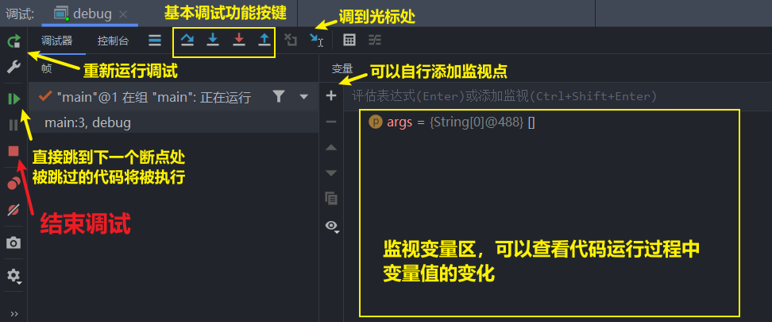

# IDEA 断点调试的使用

## 断点：==打了断点==后，程序会==停在断点行处==，可以人为的控制程序的运行（注意：调试时高亮的代码行是等待执行，==`F8`步过后（高亮朓到下一行代码），原先高亮的代码才会被执行==）

## 快捷键

## 启动调试：默认`shift + F9`

- ## （1）`F8`：步过（一步步往下执行）
- ## （2）`F7`：步入（进入某个==方法==或者==源码==）
  - ## 说明：如果在设置中修改是不会进入源码中的，需要使用==强制步入==
- ## （3）`shift + F8`：步出（步出某个==方法==或者==源码==）
  - ## 说明：遵循层级关系，==步入==了多少次，就需要==步出==多少次（==方法中可能调用其他方法==）
- ## （4）`alt + shift + F7`：强制步入
- ## （5）`F9`：==直接跳到下一个断点==（可以跳过不想查看的调试过程，==跳过的内容将被执行==）

## 说明：在调试过程中，如果代码==出现 bug==会直接在==调试过程==中直接==报错==，这也是为什么==调试可以解决 bug==的原因

# 调式控制台图例

