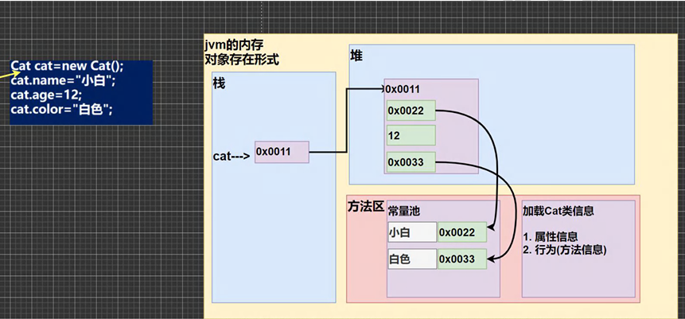

# 类与对象

---

# 什么是类？

## 知识迁移：类比 C 语言中的结构体

## 类的描述

> ## 类是一个对象的抽象，从字面意思就表示一个类的事物，类具有==属性==和==方法（行为）==，==对象==是类的一个具体表现

## 总结：==类==是==对象==的==抽象==，==对象==是==类==的==映射==

> ## 实例理解：创建一个==猫类==
>
> - ## 这个类具有==属性==：姓名，年龄，体色.....
> - ## ==方法（行为）==：吃饭，跑步....

## 对象的引出

> ## 由这个类可以映射出不同的猫（==对象==），当==属性==和==方法==在==变化==时只需要==在类中进行修改==就可以映射到不同的类上，这也体现了==类的便捷性==

## ==小结：类与对象的关系==

- ## 类是抽象的、概念的，代表一类事物，比如人类、猫类……，即它==是数据类型==。
- ## ==对象==是==具体==的、实际的，代表一个具体事物，即是实例。
- ## ==类==是对象的==模板==，对象是类的一个个体，对应一个实例。

---

# 快速入门

- # 如何创建一个类？
- # 如何创建一个对象？==两种方式==
  - ## 直接创建
  - ## 先声明后创建

## 第一种方式：直接创建一个对象

```java
public class hello{
    public static void main(String[] args){
        person person1 = new person();  //直接创建
    }
}
class person{
    int age;
    String name;
    double height;
    String[] job; //属性既可以基本数据类型，也可以是引用类型
}
```

## 第二种方式：先声明一个对象，之后创建

```java
public class hello{
    public static void main(String[] args){
        //先声明一个对象，然后创建
        person person1;
        person1 = new person();
    }
}
class person{
    int age;
    String name;
    double height;
    String[] job; //属性既可以基本数据类型，也可以是引用类型
}
```

## 代码解析

```java
person person1 = new person();
```

> ## 在 main 方法中使用 ==new== 创建一个类，用一个==数据类型==为 person 这个类的一个对象接收

# ==重点==：对象在内存中的存在形式



## 分析

- ## （1）当还没有创建 cat 这个类并用一个==数据类型==为 cat 这个类的一个对象接收时，cat 在栈空间中指向空
- ## （2）类创建后
  - ## 1. 在堆空间中分配一段空间，存储类中的==成员变量==，==初始值==为对应数据类型的==默认值==，最后==把地址返回给 cat==，使得==cat 指向这个堆空间==
  - ## 2. 在方法区==加载==类的属性和方法，==只会加载一次==
  - ## 3.（默认初始化和显示初始化）==String 是一个类==，当成员变量中有 String 出现时，会把 String 放到方法区中的一个==常量池==里面，==把这个地址返回给堆空间中的 String==
  - ## 4. 构造器初始化

---

# 类的要素一：==属性==

## 概念：==成员变量 = 属性 =field(字段)==

## 即成员变量是用来表示属性的

## 1. 简要提及==访问修饰符==

- ## 作用：用来控制属性的访问范围
- ## 类型
  - ## `public`
  - ## `protected`
  - ## 默认
  - ## `private`

## 2. 使用细节

- ## （1）属性的定义类型可以为任意类型，包含==基本类型==和==引用类型==
- ## （2）属性如果不赋值，==有默认值==，规则和数组一致
  | 数据类型                   | 默认值   |
  | -------------------------- | -------- |
  | byte                       | 0        |
  | short                      | 0        |
  | int                        | 0        |
  | long                       | 0L       |
  | char                       | '\u0000' |
  | float                      | 0.0f     |
  | double                     | 0.0d     |
  | ==String==（==是一个类==） | ==null== |

## 属性的访问方法：使用`类.属性`的方式，可以用一个变量接收结果

## 注意点：如果==属性是`String`类型==，即是一个类（引用类型），需要和类一样，==需要创建一个对象接收==

## 代码示例

```java
public clas objectexercise{
    public static void main(String[] args){
        person person1 = new person();
        int age = person1.age = 18;
        double height = person1.height = 1.63;
        String name = person1.name = "jackson";
        person1.job = new String[] {"student","programmer"};
        String[] job = person1.job
        System.out.println("age: " + age);
        System.out.println("height: " + height);
        System.out.println("name: " + name);
        System.out.print("job: ");
        for(int i = 0; i < person1.job.length; i++){
            System.out.print("第" + (i+1) + "份工作是：" + person1.job[i] + " ");
        }
    }
}
class person{
    int age;
    String name;
    double height;
    String[] job; //属性既可以基本数据类型，也可以是引用类型
}

//输出结果
age: 18
height: 1.63
name: jackson
job: 第1份工作是：student 第2份工作是：programmer
```

## ==深刻理解对象的内存分配机制==

## 过程再回顾

```java
person p = new person()
p.name = "jack"
p.age = 10;
```

- ## （1）先加载 `Person` 类信息（属性和方法信息，只会加载一次）
- ## （2）在堆中分配空间，进行默认初始化
- ## （3）把地址赋给 `p`，`p` 就指向对象
- ## （4）进行指定初始化，比如 `p.name = "jack"`、`p.age = 10`

## 练习一

```java
Person p1 = new Person();
p1.age  = 10;
p1.name = "小明";

Person p2 = p1;
```

## 问`P2`的属性是否和`P1`一致？

## 首先明确一点，==类是引用类型==，在传值的过程中传的地址，代码中把`P1`的地址赋给了`P2`,即`P1`和`P2`指向同一块堆空间，==结果一致==

## 练习二

```java
// Person.java
public class Person {
    public int age;
    public String name;
}

// Main.java
public class Main {
    public static void main(String[] args) {
        Person a = new Person();
        a.age = 10;
        a.name = "小明";

        Person b;
        b = a;

        System.out.println(b.name);  // 小明

        b.age = 200;
        b = null;

        System.out.println(a.age);  // 200
        System.out.println(b.age);  // 会抛出 NullPointerException
    }
}
```
