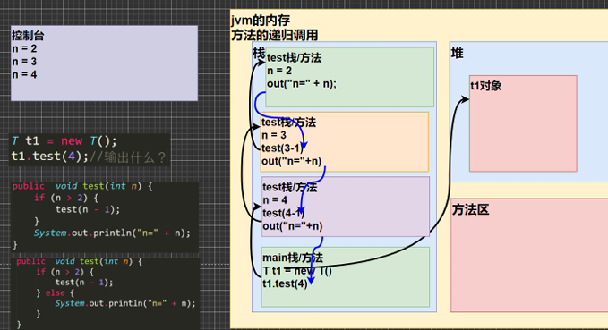
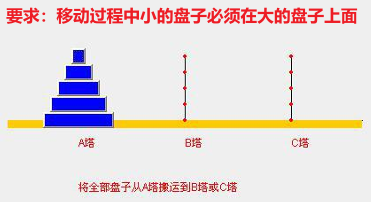

# 递归（`recursion`）

## ==思想==：把一个复杂的问题拆分成一个简单问题和子问题，子问题又是更小规模的复杂问题，循环往复

## ==本质==：栈的使用

## 递归的==注意事项==

- ## （1）==需要有递归出口==，否者就会无限递归造成栈溢出
- ## （2）每一次递归调用都会生成一个新的栈空间（==即：执行一个方法时，就创建一个新的受保护的独立空间（栈空间）==），代码继续从上往下执行，如果符合条件就会一直递归，直到递归出口，最后一层一层返回值，完成函数的调用
- ## （3）方法的局部变量都是独立的，不会相互应影响
- ## （4）当一个方法执行完毕，或者遇到`return`就会返回，==遵守谁调用，就将结果返回给谁==，同时当方法执行完毕或者返回时，该方法也就执行完毕

---

# 递归的内存机制分析

## 代码示例

```java

public class Recursion01 {
    public static void main(String[] args) {
        Tt1 = newT();
        t1.test(4);//输出什么？ n=2 n=3 n=4
    }
 }

class T {
    public void test(int n) {
        if (n > 2) {
            test(n- 1);
        }
        System.out.println("n=" + n);
    }
}

```

## 内存视图分析



---

# 递归实例

## 案例一：阶乘问题（`factorial`）

```java
import java.util.Scanner;
public class recursion {
    public static void main(String[] args){
        Scanner input = new Scanner(System.in);
        object object = new object();
        System.out.print("input a number：");
        long n = input.nextLong();
        long result = object.factorial(n);
        System.out.print("factorial(" + n + ") is：" + result);
    }
}

class object{
    public long factorial(long n){
        if(n == 1){
            return 1;
        }
        else{
            return n * factorial(n - 1);
        }
    }
}
```

## 案例二：猴子吃桃问题

### 有一堆桃子，猴子第一天吃了其中的一半，并再多吃了一个！以后每天猴子都吃其中的一半，然后再多吃一个。当到第 10 天时，想再吃时（即还没吃），发现只有 1 个桃子了。问题：最初共多少个桃子？

```java
public class recursion {
    public static void main(String[] args){
        method t = new method();
        int res = t.peach(1);
        System.out.print(res);
    }
}

class method{
    public int peach(int day){
        if(day == 10){
            return 1;
        } else if(day >= 1 && day <= 9){
            return ( peach(day + 1) + 1 ) * 2;   // 枚举每天的情况找规律得到
        }else{
            return -1;
        }
    }
}
```

## 案例三：斐波那契数列

### 1,1,2,3,5,8,13...给你一个整数 n，求出它的值是多少？

### 特点：从第三个数开始，后一个数等于前面两个数之和

```java
//斐波那契数列：1,1,2,3,5,8,13...

public class recursion {
    public static void main(String[] args){
        method t = new method();
        int res = t.fibonacci(10);
        System.out.print(res);
    }
}

class method{
    public int fibonacci(int n){
        if(n == 1 || n == 2){
            return 1;
        }
        else{
            return fibonacci(n - 1) + fibonacci(n - 2);
        }
    }
}

//输出：55
```

## 案例四；汉诺塔

> ### 有趣的小故事
>
> - #### 汉诺塔：汉诺塔（又称河内塔）问题是源于印度一个古老传说的益智玩具。大梵天创造世界的时候做了三根金刚石柱子，在一根柱子上从下往上按照大小顺序攥着 64 片圆盘。大梵天命令婆罗门把圆盘从下面开始按大小顺序重新摆放在另一根柱子上。并且规定，在小圆盘上不能放大圆盘，在三根柱子之间一次只能移动一个圆盘。
> - #### 假如每秒钟移动一次，共需多长时间呢？移完这些金片需要 5845.54 亿年以上，太阳系的预期寿命据说也就是数百亿年。真的过了 5845.54 亿年，地球上的一切生命，连同梵塔、庙宇等，都早已经灰飞烟灭。



## 思路分析：可以把这个问题拆分

- ## （1）把最底层移动到`C塔`
- ## （2）把上面的`n-1`个圆盘看作整体，移动到`B塔`
- ## （3）上面的`n-1`个圆盘又可以拆分成如上的问题，==不断递归下去==

```java
//斐波那契数列：1,1,2,3,5,8,13...

public class recursion {
    public static void main(String[] args){
        tower t = new tower();
        t.move(3, 'a', 'b', 'c');
    }
}

class tower{
    // 移动的圆盘个数， A塔 ，B塔 ， C塔
    public void move(int num, char a, char b, char c){
        if(num == 1){
            System.out.println(a + "->" + c);
        }else{
            // 把上面的 n-1 个圆盘从 a塔 移动到 b塔，中间借助 c 塔
            move(num -1, a, c, b);
            // 把最下面的圆盘移动到 c塔
            System.out.println(a + "->" + c);
            // 把 b塔 的所有盘移动到 c塔，中介借助 a塔
            move(num -1, b, a, c);
        }
    }
}

//输出
a->c
a->b
c->b
a->c
b->a
b->c
a->c
```

## 迷宫问题


## 思路：运用二维数组表示迷宫，初始位置为（1，1），走到出口处，标记路线

- ## `0`表示可以走（还未被标记）
- ## `1`表示障碍物
- ## `7`表示可以走（被标记后）
- ## `3`表示走过，但是走不通是死路

## 代码示例

```java
public class migong {
    public static void main(String[] args){

        int[][] map = new int[8][7];

        //标记墙面的部分
        for(int i = 0; i < 8; i++){
                map[i][0] = 1;
                map[i][6] = 1;
            }
        for(int i = 0; i < 7; i++){
            map[0][i] = 1;
            map[7][i] = 1;
        }
        map[3][1] = 1;
        map[3][2] = 1;

        // 回溯测试：辅助理解方法调用完成后栈空间释放，是如何返回的
//        map[2][2] = 1;

        // 封闭路径，测试结果
//        map[2][1] = 1;
//        map[2][2] = 1;
//        map[1][2] = 1;

        // 调用方法
        t finder = new t();
        finder.findway(map,1,1); // 起点是（1，1）
        //打印找路结果
        for(int i = 0; i < map.length; i++){
            for(int j = 0; j < map[i].length; j++){
                System.out.print(map[i][j] + " ");
            }
            System.out.println("");
        }

    }
}


class t{
    public boolean findway(int[][] map, int i, int j){
        // 找路策略：下右上左

        // 如果找到了就出口返回 true
        if(map[6][5] == 7){
            return true;
        }else{
            if(map[i][j] == 0){
                //假设当前点使用探路策略可以走通，就说明可以和之前的点衔接起来构成一条可以走通的路线
                map[i][j] = 7;

                // 接着使用找路策略开始探路，验证当前点开始是否可以走通

                //往下走
                if(findway(map, i+1, j)){
                    return true;
                }
                // 往右走
                else if(findway(map, i, j+1)){
                    return true;
                }
                // 往上走
                else if(findway(map, i-1, j)){
                    return true;
                }
                // 往左走
                else if(findway(map, i, j-1)){
                    return true;
                }
                // 都走不通，走过了但是走不通就标记为 3
                else{
                    map[i][j] = 3;
                    return false;
                }
            }else{  // 此时 map[i][j] = 1, 7, 3 ; 7 表示测试过了就不要再重复测试
                return false;
            }
        }
    }
}
```

## 理解：没走到一个点，就会递归的使用`下->右->上->左`的方式进行探路，如果都走不通就会返回到上一次递归调用，继续探路，指导找到出口为止
