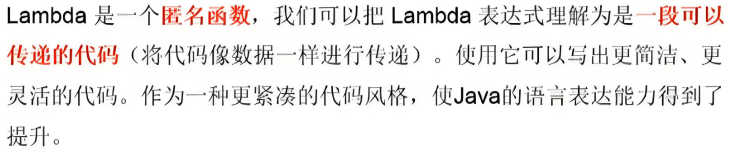
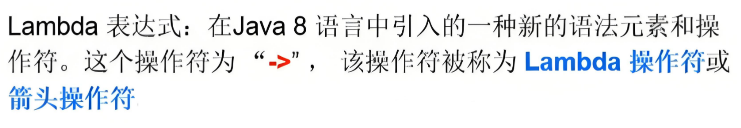
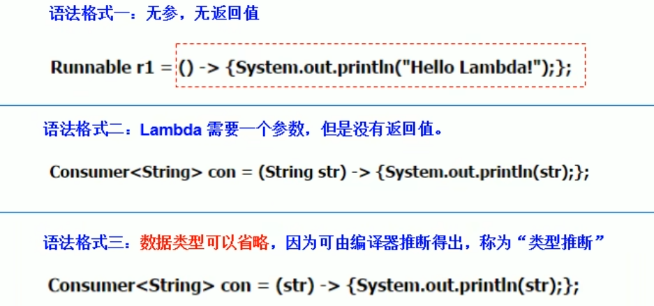
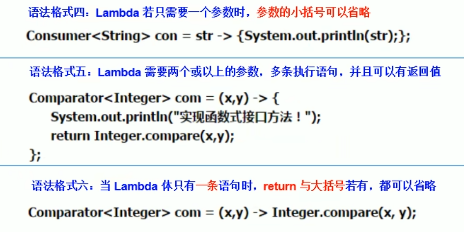

<h1 style="text-align: center; font-weight: bold;">lambda表达式</h1>

---

## 基本介绍

 

## ⭐ 表达式本质

> #### 作为函数式接口的实例，lambda 表达式是一个对象，区别于其他语言，不是一个函数

#### 什么是函数式接口？

> #### 如果一个接口中，只声明了一个抽象方法，则此接口就称为函数式接口（Runnable、Comparable 接口等）

## ⭐ 应用场景

> #### 只要一个对象是函数式接口的实例，那么该对象就可以用 lambda 表达式来表示（原先采用创建一个匿名内部类对象来实现）

## 基本结构

 

<h3>箭头的两端</h3>

> #### 左边；lambda 形参列表（接口中的抽象方法的形参列表）
>
> #### 右边；lambda 体（重写的抽象方法的方法体）

## 基本语法

 

## 总结

#### （1）lambda 形参列表的参数类型可以省略（类型推断）：如果 lambda 形参列表只有一个参数，其一对 ( ) 可以省略

#### （2）lambda 体应该用一对 { } 包裹：如果 lambda 体只有一条执行语句（可能是 return 语句），省略这一对 { } 和 return
