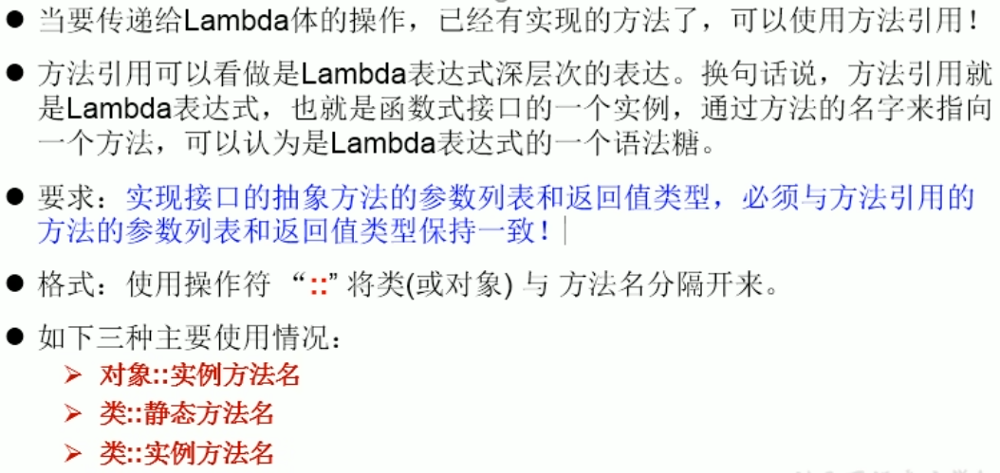
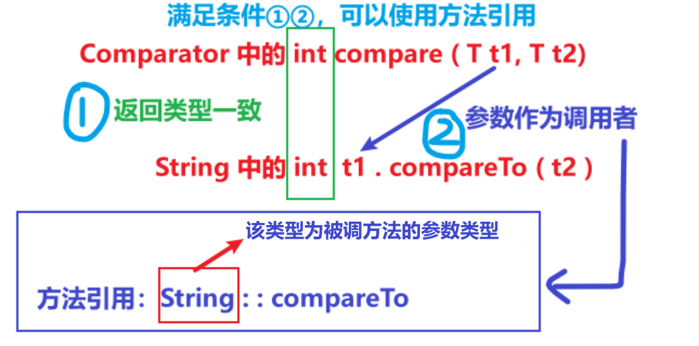

<h1 style="text-align: center; font-weight: bold;">引用</h1>

---

## 方法引用

<br>


### 对象 :: 非静态方法

```java
// Consumer中的void accept(T t)
// PrintStream中的void println(T t)

@Test
public void test1() {

    // lambda 表达式
    Consumer<String> con1 = str -> System.out.println(str);
    con1.accept("北京");

    // 方法引用
    PrintStream ps = System.out;
    Consumer<String> con2 = ps::println;
    con2.accept("beijing");
}
```

### 类 :: 静态方法

```java
// 情况三：类::静态方法
// Comparator中的int compare(T t1, T t2)
// Integer中的int compare(T t1, T t2)

@Test
public void test3() {

    // lambda 表达式
    Comparator<Integer> com1 = (t1, t2) -> Integer.compare(t1, t2);
    System.out.println(com1.compare(12, 21));

    // 方法引用
    Comparator<Integer> com2 = Integer::compare;
    System.out.println(com2.compare(12, 3));
}

```

### 类 :: 非静态方法

#### 案例一（有第二个参数）

```java
// 情况三：类::实例方法（有难度）
// Comparator中的int compare(T t1, T t2)
// String中的int t1.compareTo(t2)

@Test
public void test5() {

    // lambda 表达式
    Comparator<String> com1 = (s1, s2) -> s1.compareTo(s2);
    System.out.println(com1.compare("abc", "abd"));

     // 方法引用
    Comparator<String> com2 = String::compareTo;
}

```

#### 案例二（没有第二个参数）

```java
// Function中的R apply(T t);
// Employee中的String getName();

@Test
public void test7() {

    Employee employee = new Employee(id: 1001, name: "Jerry", age: 23, salary: 6000);

    // lambda 表达式
    Function<Employee, String> func1 = e -> e.getName();
    System.out.println(func1.apply(employee));

     // 方法引用
    Function<Employee, String> func2 = Employee::getName;
}
```

#### 总结

> #### 如果调用的方法对象的类型和接口中需要实现的抽象方法中<span style="color:red">第一个参数</span>的类型一致（第二个参数可有可无），则被调用的方法可以写成：<span style="color:red">对应类型的类名::调用方法名</span>

<br/>


## 构造器引用

### 案例一

```java
// 构造器引用
// Supplier中的T get()
// Employee的空参构造器：Employee()

@Test
public void test1() {
    Supplier<Employee> sup = new Supplier<Employee>() {
        @Override
        public Employee get() {
            return new Employee();
        }
    };
    System.out.println("***********************");

    Supplier<Employee> sup1 = () -> new Employee();
    System.out.println(sup1.get());

    System.out.println("***********************");

    Supplier<Employee> sup2 = Employee::new;
    System.out.println(sup2.get());
}
```

### 案例二

```java
// Function中的R apply(T t)

@Test
public void test2() {
    Function<Integer, Employee> func1 = id -> new Employee(id);
    Employee employee = func1.apply(1001);
    System.out.println(employee);

    System.out.println("***********************");

    Function<Integer, Employee> func2 = Employee::new;
    Employee employee1 = func2.apply(1002);
    System.out.println(employee1);
}
```

### 案例三

```java
// BiFunction中的R apply(T t, U u)

@Test
public void test3() {
    BiFunction<Integer, String, Employee> func1 = (id, name) -> new Employee(id, name);
    System.out.println(func1.apply(1001, "Tom"));

    System.out.println("***********************");

    BiFunction<Integer, String, Employee> func2 = Employee::new;
    System.out.println(func2.apply(1001, "Tom"));
}
```

### 总结

#### 使用条件

> #### 函数式接口的抽象方法的形参列表和构造器的形参列表一致

#### 写法：<span style="color:red">返回类型（类名） :: new</span>

> #### （1）抽象方法的返回类型即为构造器所属的类的类型
>
> #### （2）调用哪个构造器会根据<span style="color:red">泛型（构造器参数类型...，返回类型）</span>来确定，前提是该接口的抽象方法形参列表和构造器一致

## 数组引用

> #### 可以把数组看成是一个特殊的类，<span style="color:red">写法和构造器引用一致，返回的是数组而已</span>

```java
// 数组引用
// Function中的R apply(T t)

@Test
public void test4() {
    Function<Integer, String[]> func1 = length -> new String[length];
    String[] arr1 = func1.apply(5);
    System.out.println(Arrays.toString(arr1));

    System.out.println("***********************");

    Function<Integer, String[]> func2 = String[]::new;
    String[] arr2 = func2.apply(10);
    System.out.println(Arrays.toString(arr2));
}
```
