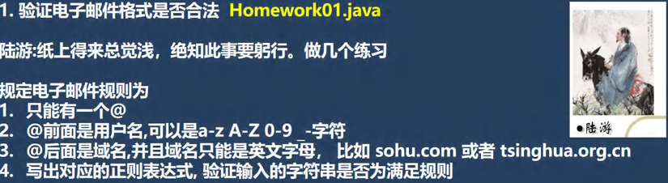
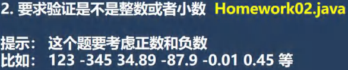
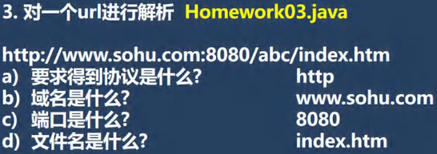

<h1 style="text-align: center;">第二十七章：正则表达式</h1>
 
- - -
##  第一题


```java
public class Main {
    public static void main(String[] args) {
        String content = "jackson@qq.com";
        /*
            1. 使用 matches 方法，最好加上起始符和结束符
            2. @ 固定
            3. @前面的内容：可能是 大小写字母、数字、下划线（用\\w），还有-
            4. @后面的内容：可能是二级域名，即一个到多个字母，考虑大小写（用[a-zA-Z]）
            5. + 表示一个到多个
         */
        String regStr = "^[\\w-]+@([a-zA-Z]+\\.)+[a-zA-Z]+$";
        if (content.matches(regStr)){
            System.out.println("匹配成功");
        }else {
            System.out.println("匹配失败");
        }
    }
}
```

## 第二题



```java
public class Main {
    public static void main(String[] args) {
        String content = "-0.89";
        String regStr = "^[+-]?([1-9]\\d*|0)(\\.\\d+)?$";
        if (content.matches(regStr)){
            System.out.println("匹配成功，是整数或者小数");
        }else {
            System.out.println("匹配失败");
        }
    }
}
```

## 第三题



#### 本题的核心就是<span style="color:red">分组</span>

```java
public class Main {
    public static void main(String[] args) {
        String content = "http://www.sohu.com:8080/abc/xxx/yyy/////inde@#$%x.htm";
        // 因为正则表达式是根据要求来编写的，所以，如果需求需要的话，可以改进。
        String regStr = "^([a-zA-Z]+)://([a-zA-Z.]+):(\\d+)[\\w-/]*/([\\w.@#$%]+)$";
        Pattern pattern = Pattern.compile(regStr);
        Matcher matcher = pattern.matcher(content);
        if (matcher.matches()) {
            System.out.println("整体匹配=" + matcher.group(0));
            System.out.println("协议: " + matcher.group(1));
            System.out.println("域名: " + matcher.group(2));
            System.out.println("端口: " + matcher.group(3));
            System.out.println("文件: " + matcher.group(4));
        } else {
            System.out.println("没有匹配成功");
        }
    }
}
```
