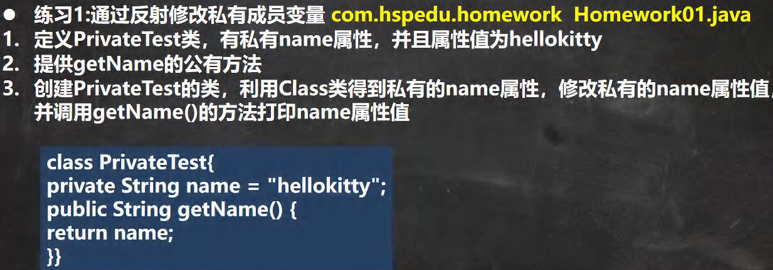
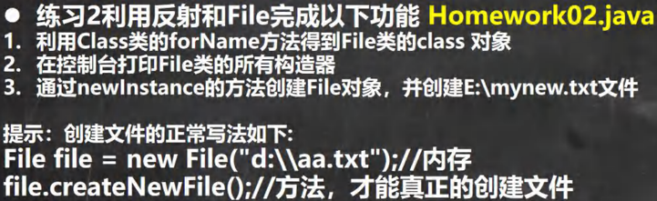

<h1 style="text-align: center;">第二十三章：反射</h1>
 
- - -
## 1. 第一题



### 题解

```java
import java.lang.reflect.Field;
import java.lang.reflect.Method;

public class Main {
    public static void main(String[] args) throws Exception{
        // 获取 Class 对象
        Class<?> cls = Class.forName("chapter_23.question_1.PrivateTest");
        // 创建实例
        Object o = cls.newInstance();

        // 构建 Field 对象
        Field field = cls.getDeclaredField("name");
        // 反射爆破
        field.setAccessible(true);
        // 设置新的 name
        field.set(o,"jack");

        // 构建 Method 对象
        Method method = cls.getMethod("getName");
        Object invoke = method.invoke(o); // 返回值均用 Object 接收
        System.out.println(invoke);
    }
}
```

### PrivateTest

```java
public class PrivateTest {
    private String name = "hellokitty";
    public String getName() {
        return "name = " + name;
    }
}
```

## 2. 第二题



### 题解

```java
import java.lang.reflect.Constructor;
import java.lang.reflect.Method;

public class Main {
    public static void main(String[] args) throws Exception{
        // 获取 Class 对象
        Class<?> cls = Class.forName("java.io.File");
        // 获取构造器对象
        Constructor<?>[] constructors = cls.getDeclaredConstructors();
        for (Constructor<?> constructor : constructors) {
            System.out.println(constructor);
        }
        // 调用指定构造器完成file对象的初始化
        String filePath = "C:\\Users\\jackson\\Desktop\\test.txt";
        Constructor<?> constructor = cls.getDeclaredConstructor(String.class);
        Object o = constructor.newInstance(filePath); // 这里只是得到了 File 对象

        // 创建文件
        Method method = cls.getMethod("createNewFile");
        method.invoke(o);
    }
}
```
