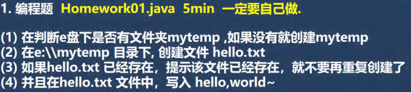
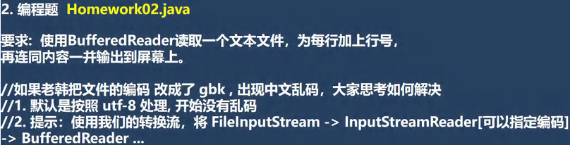
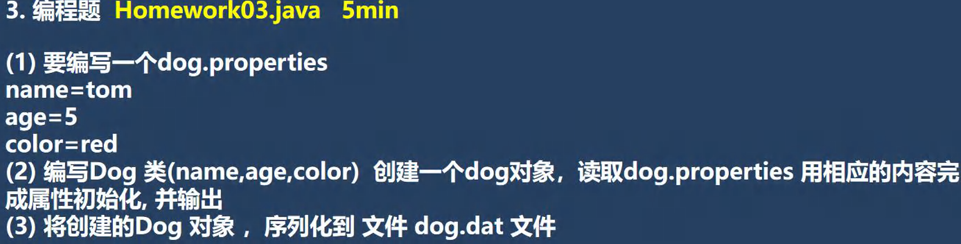

<h1 style="text-align: center;">第十九章：IO流</h1>
 
- - -

## 第一题



### 1. 分析

#### 题目没有什么难度，主要是练习文件相关方法的调用

### 2. 题解

```java
import java.io.*;

public class Main {
    public static void main(String[] args) throws IOException {
        String directoryPath = "E:\\mytemp";
        File file = new File(directoryPath);

        // 第一步
        if (!file.exists()) {
            // 创建文件
            if (file.mkdir()) {
                System.out.println("文件创建成功");
            } else {
                System.out.println("文件创建失败");
            }
        }

        // 第二步 + 第三步
        String filePath = "E:\\mytemp\\hello.txt";
        File newFile = new File(filePath);
        if (!newFile.exists()) {
            if (newFile.createNewFile()) { // 把异常抛出

                System.out.println("文件创建成功");

                // 第四步
                BufferedOutputStream bos = new BufferedOutputStream(new FileOutputStream(filePath));
                bos.write("hello,world~".getBytes());
                bos.close(); // 关闭流

            }else{
                System.out.println("文件创建失败");
            }
        } else {
            System.out.println("文件已经存在，不能重复创建");
        }
    }
}
```

## 第二题



### 1. 分析

#### 本题主要考察转换流的应用

### 2. 题解

```java
import java.io.*;

public class Main {
    public static void main(String[] args) throws IOException {
        // 题目要求
        String filePath = "C:\\Users\\jackson\\Desktop\\file2.txt";
        BufferedReader br = new BufferedReader(new FileReader(filePath));
        int cnt = 1;
        String line;
        while((line = br.readLine())!=null){
            System.out.println(cnt + " " + line);
            cnt++;
        }
        br.close();

        // 附加要求：转换流的应用(字节 --> 字符)
        InputStreamReader isr = new InputStreamReader(new FileInputStream(filePath),"gbk");
        BufferedReader bfr = new BufferedReader(isr);
        while((line = bfr.readLine())!=null){
            System.out.println(cnt + " " + line);
            cnt++;
        }
        bfr.close();
    }
}
```

## 第三题



### 分析

#### 本题主要考察 Properties 和对象处理流的应用，注意序列化的注意事项

### 题解

```java
import java.io.*;
import java.util.Properties;

public class Main {
    public static void main(String[] args) throws IOException, ClassNotFoundException {
        // 配置文件路径
        String filePath = "C:\\Users\\jackson\\Desktop\\dog.properties";

        // 创建 properties 对象
        Properties properties = new Properties();

        // 创建 FileReader 对象，用于配置文件的加载
        FileReader fileReader = new FileReader(filePath);

        // 加载配置文件
        properties.load(fileReader);

        // 根据键值获取信息
        String name = properties.getProperty("name");
        String age = properties.getProperty("age");
        String color = properties.getProperty("color");

        // 变量类型转换
        Integer integer = Integer.parseInt(age);
        int dogAge = integer; // 自动拆箱

        // Dog 类属性的初始化
        Dog dog = new Dog(name, dogAge , color);

        // 序列化到文件中
        String dirPath = "C:\\Users\\jackson\\Desktop\\dog.dat";
        ObjectOutputStream oos = new ObjectOutputStream(new FileOutputStream(dirPath));
        oos.writeObject(dog);
        oos.close();

        // 反序列化，输出内容检查结果
        ObjectInputStream ois = new ObjectInputStream(new FileInputStream(dirPath));
        Dog dog1 = (Dog)ois.readObject();
        System.out.println(dog1);
        ois.close();

    }
}

// 序列化的对象需要实现 Serializable 接口
class Dog implements Serializable{
    String name;
    int age;
    String color;

    public Dog(String name, int age, String color) {
        this.name = name;
        this.age = age;
        this.color = color;
    }

    @Override
    public String toString() {
        return "Dog{" +
                "name='" + name + '\'' +
                ", age=" + age +
                ", color='" + color + '\'' +
                '}';
    }
}
```
