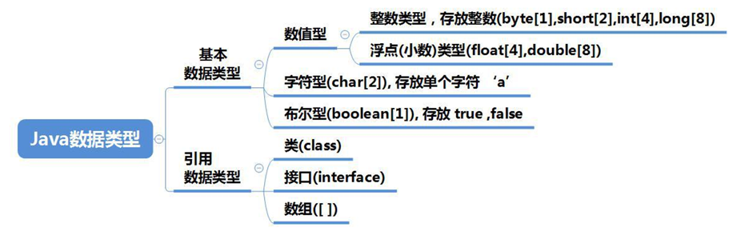

<h1 style="text-align: center; font-weight: bold;">数据类型和变量</h1>

---

## 变量

#### （1）使用原则：<span style="color:red">先声明（定义），后使用</span>

#### （2）类型：<span style="color:red">局部</span>变量和<span style="color:red">全局</span>变量

#### （3）同一个变量可以在不同的类中出现

#### （4）<span style="color:red">变量的三大要素</span>

> #### 数据类型
>
> #### 变量名
>
> #### 值

#### （5）同一个变量，后续的赋值会<span style="color:red">覆盖</span>之前的值

---

## 数据类型



### 基本数据类型

> #### 整数类型，存放整数（byte[1], short[2], int[4], long[8]）
>
> #### 浮点(小数)类型（float[4], double[8]）
>
> #### 字符型（<span style="color:red">char[2]</span>），存放<span style="color:red">单个字符</span> 'a'
>
> #### 布尔型（boolean[1]），存放 true 或 false

### 引用数据类型

> #### 类（class）
>
> #### 数组（[ ]）
>
> #### 接口（interface）

#### 注意事项

> #### （1）除了<span style="color:red">字符型（char）</span>是<span style="color:red">一个字符占用两个字节</span>和多一个<span style="color:red">byte（1 个字节）数据类型</span>以外，其余数据类型和字节大小和 C 语言一样
>
> #### （2）布尔类型的命名稍有不同：boolean

---

## 数据类型存储范围

|                                  类 型                                   |                       占用存储空间                       |                           范 围                            | <span style="color:red;font-weight:bold">默认值</span> |
| :----------------------------------------------------------------------: | :------------------------------------------------------: | :--------------------------------------------------------: | :----------------------------------------------------: |
|                                   byte                                   | <span style="color:red;font-weight:bold">1 个字节</span> |                         -128 ~ 127                         |                           0                            |
|                                  short                                   |                         2 个字节                         |             -(2^15) ~ 2^15-1， -32768 ~ 32767              |                           0                            |
|                                   int                                    |                         4 个字节                         |          -2^31 ~ 2^31-1，-2147483648 ~ 2147483647          |                           0                            |
|                                   long                                   |                         8 个字节                         | -2^63 ~ 2^63-1，-9223372036854775808 ~ 9223372036854775807 |                           0L                           |
|                                   char                                   | <span style="color:red;font-weight:bold">2 个字节</span> |                                                            |                        '\u0000'                        |
|                                  float                                   |                         4 个字节                         |                    -3.403E38 ~ 3.403E38                    |                          0.0f                          |
|                                  double                                  |                         8 个字节                         |                   -1.798E308 ~ 1.798E308                   |                          0.0d                          |
| String(注意<span style="color:red;font-weight:bold">大写</span>)是一个类 |                                                          |                                                            |                          null                          |

---

## 整型

> #### byte、short、int、ong

#### 1. Java 的<span style="color:red">整型常量</span>（具体值）<span style="color:red">默认为 int 型</span>

#### 2. 声明<span style="color:red">long</span>型常量<span style="color:red">须加 'l' 或 'L'</span>表示这个数据是 long 类型

---

## 浮点类型

> #### float、double

#### 面试考点

#### 1. 浮点数的构成？

> #### <span style="color:red">符号位+指数位+尾数位</span>

#### 2. Java<span style="color:red">小数默认</span>是 <span style="color:red">double 类型</span>，声明 float 变量需要在小数<span style="color:red">后面加上 f</span>

> #### 例如： `float a= 1.1f`，表示 1.1 是 float 类型

#### 3. 区别 double 和 float

> #### 问题：<span style="color:red">同一个变量值</span>使用<span style="color:red">不同的类型</span>，输出其值，<span style="color:red">结果不同</span>

#### （1）<span style="color:red">float</span> 是<span style="color:red">单精度</span>类型，会舍弃一些尾数，是一个<span style="color:red">近似值</span>

#### （2）<span style="color:red">double</span> 是一个<span style="color:red">双精度</span>类型，精度更高

#### （3）<span style="color:red">推荐</span>默认使用 <span style="color:red">double</span> 类型

#### 4. 科学计数法的使用

#### 使用方法：数据 e / E（一个正（负）整数：<span style="color:red">表示乘于 10 的几次方</span>

> #### 举例
>
> #### （1）`float a = 1.1e1f`，输出：`11.0`
>
> #### （2）`float a= 1.1e-1f`，输出：`0.11`

---

## 字符类型

> #### <span style="color:red">char：一个字符占用 2 个字节，可以存放汉字</span>

#### 1. 字符存储原理

> #### （1）在 Java 中，<span style="color:red">char 的本质</span>是一个<span style="color:red">整数</span>，在输出时，是<span style="color:red">unicode 码</span>中对应的字符
>
> #### （2）字符型存储到计算机中，需要将字符对应的码值（整数）找出来
>
> #### 举例
>
> #### 存储：'a'： 'a' ---> 码值 97 ---> 二进制 ---> 存储
>
> #### 读取：二进制 ---> 97 ---> 'a' ---> 显示

#### 2. 使用细节

> #### （1）使用<span style="color:red">单引号</span>引起来，<span style="color:red">不可以</span>用<span style="color:red">双引号</span>，双引号表示一个字符串
>
> #### （2）<span style="color:red">转义字符</span>可以作为一个特殊的字符串常量
>
> #### （3）<span style="color:red">可以</span>直接给 char <span style="color:red">赋一个整数</span>，然后<span style="color:red">输出</span>时，就会按照<span style="color:red">对应</span>的 <span style="color:red">unicode</span> 字符输出
>
> #### （4）<span style="color:red">char 类型</span>是<span style="color:red">可以运算</span>的，因为 char 的本质是一个整数，因为每个字符都有对应有 unicode 码

#### 代码示例

```java
public class hello{
    public static void main(String[] args){
        char c5 = 'b' + 1; // 98+1 ==> 99
        System.out.println((int)c5); // 99
        System.out.println(c5); // 99->对应的字符->编码表 ASCII(规定好的) => c
    }
}
```

## 布尔类型（boolean）

> #### 注意：在 Java 中<span style="color:red">不可以用 0 或者 1 表示真假，只能用 true 和 false</span>

## ⭐ 小数精度问题

> #### 问题：判断两个小数是否相等

#### 经典错误：判断如下代码 a = b

```java
double a = 2.7
double b = 8.1 / 3
```

#### 很显然 <span style="color:red">a ≠ b</span>，为什么？

> #### （1）实际上 b 的值并不是 2.7 ，由于精度问题，计算机会认为是 <span style="color:red">8.100000（等多个 0） / 3</span>
>
> #### （2） 即 `b:2.6999999999999997`

## ⭐ 判断小数相等

> #### 思路：采用<span style="color:red">差值的绝对值小于（<）某个精度</span>，可以认为是规定的方法

#### 代码示例

```java
public class Main {
    public static void main(String[] args) {
        double num11 = 2.7;
        double num12 = 8.1 / 3;
        if (Math.abs(num11 - num12) < 0.000001) {
            System.out.println("差值非常小，达到规定精度差值范围，认为相等...");
        }
    }
}
```

## ⚠️ 注意事项

#### （1）<span style="color:red">声明小数变量</span>时需要<span style="color:red">指定类型</span>，如果不声明数据的类型，由于默认数据类型，可能会导致报错

#### 举例

> #### （1）一个<span style="color:red">小的</span>数据类型当然<span style="color:red">可以赋值给大的</span>数据类型（`double a= 1.1f`）
>
> #### （2）一个<span style="color:red">大的</span>数据类型<span style="color:red">不可以赋值给小的</span>数据类型（`float a= 1.1`），这样==会报错，因为默认是 double 类型

#### （2）<span style="color:red">注意小数计算存在的精度问题</span>
