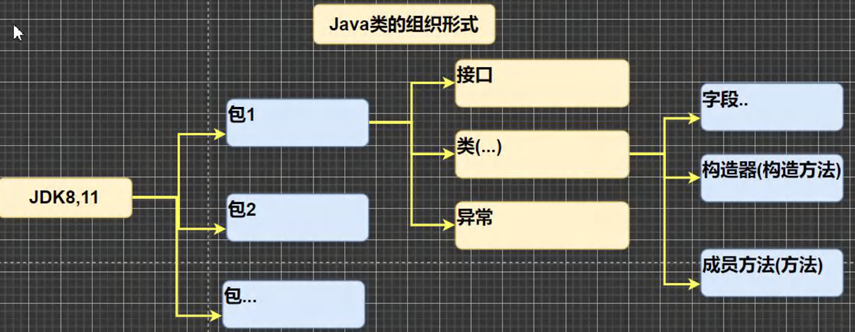

<h1 style="text-align: center; font-weight: bold;">JavaAPI文档介绍</h1>

---

## 基本介绍

#### （1） API（Application Programming Interface, 应用程序编程接口）是 Java 提供的基本编程接口（Java 提供的类还有相关的方法）。中文在线文档： https://www.matools.com

#### （2） Java 语言提供了大量的基础类，因此 Oracle 公司也为这些基础类提供了相应的 API 文档，用于告诉开发者如何使用这些类，以及这些类里包含的方法。

## 结构关系

