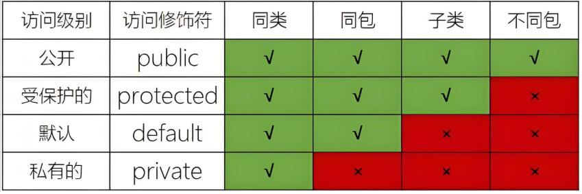

<h1 style="text-align: center; font-weight: bold;">访问修饰符</h1>

---

## 基本介绍

#### 说明

#### （1）公开级别: 用 public 修饰, 对外公开

#### （2）受保护级别: 用 protected 修饰, 对子类和同一个包中的类公开

#### （3）默认级别: 没有修饰符号, 向同一个包的类公开

#### （4）私有级别: 用 private 修饰, 只有类本身可以访问, 不对外公开

#### （5）表格中的子类：指的是父类和子类在不同包的情况，不同的修饰符修饰，能否访问

## 使用细节

#### （1）修饰符可以用来修饰类中的属性，成员方法以及类

#### （2）修饰类：只能用默认的和 public修饰符 ，并且遵循上述访问权限的特点

#### （3）成员方法的访问规则和属性完全一样
