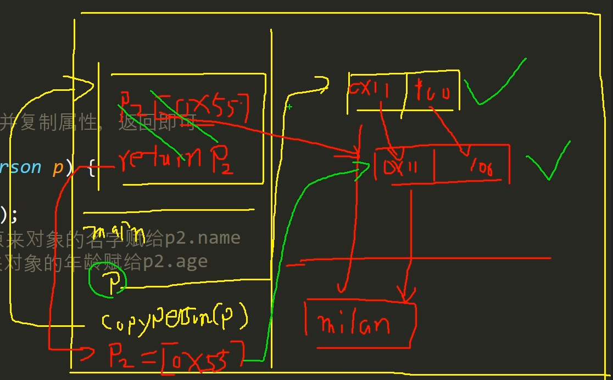

<h1 style="text-align: center; font-weight: bold;">克隆对象</h1>

---

## 思路分析

> #### 创建一个新的对象，拷贝属性值即可

## 代码示例

```java
public class practise {
    public static void main(String[] args){
        person p = new person();
        p.age = 10;
        p.name = "jackson";
        tool mytool = new tool(); // 创建tool类的一个对象
        person p1 = mytool.copyperson(p); // 调用 tool 这个类的一个方法，因为返回值是person类，所以用person类的一个对象接收
        System.out.println("main方法的对象p的年龄为：" + p1.age);
        System.out.println("main方法中的对象p的名字为：" + p1.name);
        System.out.println("复制的对象p1的年龄为：" + p1.age);
        System.out.println("复制的对象p1的名字为：" + p1.name);
    }
}

class person{
    int age;
    String name;
}
class tool{
    public person copyperson(person p){
        person p1 = new person();
        p1.name = p.name;
        p1.age = p.age;
        return p1;
    }
}
```

## ⭐ 底层实现

> #### （1）传递是引用数据类型，即地址传递，<span style="color:red">本质是修改引用（改变指向的地址）</span>
>
> #### （2）调用方法，新创建一个 person 类，内存中会申请一段新的堆空间，p1 指向这段新的堆空间
>
> #### （3）两个堆空间相互独立，调用方法，进行值拷贝
>
> #### （4）方法执行完成，返回 p1 的地址，由于在主栈中用变量接收了返回值，即新的堆空间得到了引用，该堆空间不会当作垃圾进行回收，拷贝完成


