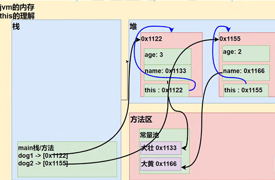

<h1 style="text-align: center; font-weight: bold;">this关键字</h1>

---

## 基本介绍



> #### 在堆空间内存分配时还会给每个对象分配 this
>
> #### this 的<span style="color:red">本质</span>：就是<span style="color:red">指向当前对象</span>，哪个对象调用，this 就代表哪个对象

## 代码示例

```java
public class this关键字 {
    public static void main(String[] args) {
        thiss th = new thiss(18, "jackson");
        System.out.println("th.age:" + th.age);
        System.out.println("th.name:" + th.name);
    }
}

class thiss {
    int age;
    String name;

    public thiss(int age, String name) {
        this.age = age;
        this.name = name;
    }
}
//输出
th.age:18
th.name:jackson
```

> #### this . name、this . age 指向的都是对象中的属性，而不是局部变量，实现了局部变量和全局变量同名但是作用域不同

## 使用细节

#### （1）this 不能在类定义的外部使用，<span style="color:red">只能在类定义的方法中使用</span>

#### （2）this 关键字可以用来<span style="color:red">访问本类</span>的<span style="color:red">属性、方法、构造器</span>

#### （3）this 用于<span style="color:red">区分</span>当前<span style="color:red">类的属性</span>和<span style="color:red">局部变量</span>

#### （4）访问成员方法的语法：this . 方法名(参数列表)

#### （5）<span style="color:red">访问构造器</span>语法：this ( 参数列表 )

> #### 注意点
>
> #### （1）⚠️<span style="color:red">必须放在第一条语句</span>⚠️
>
> #### （2）<span style="color:red">只能在构造器中使用</span>，在一个构造器中访问另一个构造器

#### 在构造器中使用 this 调用其他构造器

```java
public class ggaga {
    public static void main(String[] args) {
        a a1 = new a();
    }
}

class a{
    int age;
    public a(){
        // 注意：this必须放在第一行
        this(10);
        System.out.println("调用了a类的无参构造器");

    }
    public a(int age){
        this.age = age;
        System.out.println("调用了b类的有参构造器，传入的参数为：" + age);
    }
}

// 输出结果
调用了b类的有参构造器，传入的参数为：10
调用了a类的无参构造器
```

## 练习题

> #### 定义 Person 类，里面有 name、age 属性，并提供 compareTo 比较方法，用于判断是否和另一个人相等，提供测试类 TestPerson，用于测试,名字和年龄完全一样，就返回 true,否则返回 false

```java
public class homework2 {
    public static void main(String[] args){
        person p = new person(18,"jackson");
        person testperson = new person(18,"jackson");
        System.out.print(p.compareto(testperson));
    }
}
class person{
    int age;
    String name;
    public person(int age,String name){
        this.name =  name;
        this.age = age;
    }
    public boolean compareto(person p){
        return this.name.equals(p.name) && this.age == p.age;
    }
}
```
