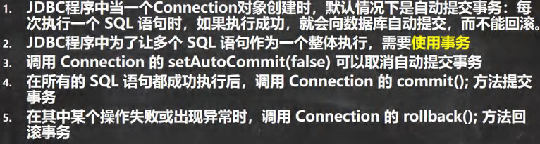

<h1 style="text-align: center; font-weight: bold;">JDBC 事务</h1>

---

## 基本介绍

#### 详见 MySQL 事务部分内容，这里的事务主要用于解决如下业务场景

> #### 双方转账，甲方转出钱，乙方收钱，为了保证钱的流动不出问题，这个时候事务就发挥作用，<span style="color:red;font-weight:bold">将二者看为整体</span>，要么成功，要么失败，<span style="color:red;font-weight:bold">保证了数据的一致性</span>



## 实现思路

> #### 将事务的逻辑放在捕获异常中
>
> #### （1）如果没有出现异常，则正常执行 sql 语句
>
> #### （2）如果<span style="color:red;font-weight:bold">出现异常</span>，进入捕获异常逻辑，执行<span style="color:red;font-weight:bold">事务回滚（默认是回滚到事务起点）</span>

## 相关方法

#### Connection

> #### setAutoCommit(false)：开启事务
>
> #### setSavepoint("保存点名称")：设置保存点
>
> #### commit()：提交事务
>
> #### rollback(Savepoint savepoint)：事务回滚

## 示例代码

```java
public class affairs {
    public static void main(String[] args) {
        // 定义变量
        Connection connection = null;
        PreparedStatement preparedStatement = null;
        // 执行sql
        String sql_1 = "update account set balance = balance- 100 where id = 1";
        String sql_2 = "update account set balance = balance + 100 where id = 2";
        try {
            // 获取 connection，默认自动提交
            connection = JDBCUtils.getConnection();

            // 开启事务，设置为不自动提交
            connection.setAutoCommit(false);

            // 执行 sql_1
            preparedStatement = connection.prepareStatement(sql_1);
            preparedStatement.executeUpdate();

            // 执行 sql_2（此时 preparedStatement 改变指向）
            preparedStatement = connection.prepareStatement(sql_2);
            preparedStatement.executeUpdate();

            // 提交事务
            connection.commit();

        } catch (SQLException e) {
            System.out.println("执行发生了异常，撤销执行的sql");
            // 出现异常，事务回滚
            try {
                connection.rollback(); // 回滚到开启事务的状态
            } catch (SQLException throwables) {
                throwables.printStackTrace();
            }
            e.printStackTrace();
        } finally {
            // 关闭资源
            JDBCUtils.close(null,preparedStatement,connection);
        }
    }
}
```
