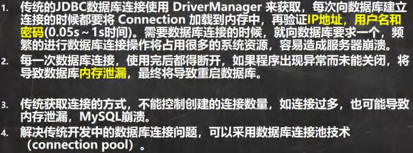
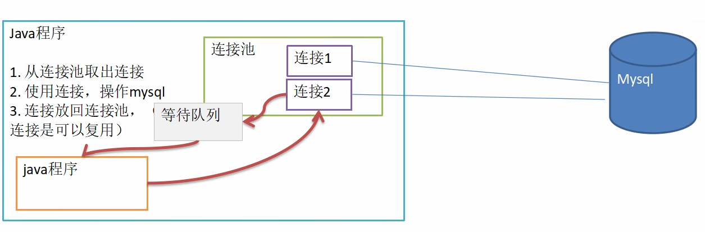
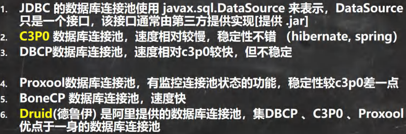

<h1 style="text-align: center; font-weight: bold;">JDBC 连接池</h1>

---

## 问题引入

> #### 实际开发中，数据库的连接是非常多的，然而数据库的连接是有限的，如果同一时间过多连接可能会导致<span style="color:red;font-weight:bold">数据库崩溃，内存泄漏</span>，数据库连接的多了之后，其他连接的连接速度也会明显延长



## 基本介绍




## 连接池种类



## C3P0

### 引入外部库

> #### 获取 c3p0-0.9.1.2
>
> #### 安装包： https://pan.baidu.com/s/1hNC1vSXbkvOGnHNJS0SqaQ?pwd=3tn6 提取码: 3tn6
>
> #### 使用方法：拷贝 jar 包到 libs 文件目录下，右键添加为库，可以参考前面获取 mysql-connector-java-5.1.37-bin.jar 的操作

### 基本介绍

> #### 在引入的外部库中有一个类：<span style="color:red;font-weight:bold">ComboPooledDataSource</span>
>
> #### 这个是数据源类，即连接池，在这其中可以设置多个连接对象，提供给多个 Java 程序与数据库连接，当达到<span style="color:red;font-weight:bold">最大连接数</span>时，则连接请求将加入<span style="color:red;font-weight:bold">等待队列</span>中

### 相关方法

#### 设置数据源对象的初始信息

> #### setUser( )
>
> #### setPassword( )
>
> #### setJdbcUrl( )
>
> #### setDriverClass( )
>
> #### setInitialPoolSize( )：初始化连接数量
>
> #### setMaxPoolSize( )：最大连接数

#### 获取连接

> #### getConnection()

### ⭐close（）方法

> #### ComboPooledDataSource.close() → <span style="color:red;font-weight:bold">关闭整个连接池（销毁所有连接）</span>

### 连接方法一（手动配置）

```java
public static void connection() throws Exception {
    // 创建数据源对象（连接池）
    ComboPooledDataSource comboPooledDataSource = new ComboPooledDataSource();

    // 获取配置信息
    Properties properties = new Properties();
    properties.load(new FileInputStream("src/JDBC/connect.properties"));
    String user = properties.getProperty("user");
    String password = properties.getProperty("password");
    String url = properties.getProperty("url");
    String driver = properties.getProperty("driver");

    // 设置数据源的相关参数
    comboPooledDataSource.setUser(user);
    comboPooledDataSource.setPassword(password);
    comboPooledDataSource.setJdbcUrl(url);
    comboPooledDataSource.setDriverClass(driver);

    // 初始化连接数
    comboPooledDataSource.setInitialPoolSize(5);
    // 最大连接数
    comboPooledDataSource.setMaxPoolSize(10);

    // 测试连接速度
    long start = System.currentTimeMillis();
    for (int i = 0; i < 999999; i++) {
        Connection connection = comboPooledDataSource.getConnection();
        connection.close();
    }
    long end = System.currentTimeMillis();
    System.out.println("总耗时：" + (end - start));
}
```

### 连接方法二（XML 文件）

> #### 创建 c3p0-config.xml 配置文件，拷贝到 src 目录下
>
> #### 区别于方法一，方法二把所有相关的配置信息都写在了配置文件中，直接读取即可，提高效率
>
> #### 相关方法：new ComboPooledDataSource(" <span style="color:red;font-weight:bold">数据源名称（config-name）</span>")

#### c3p0-config.xml 配置文件

```xml
<c3p0-config>
    <!--数据源名称代表连接池-->
    <named-config name="connectionPool">
        <!-- 驱动类 -->
        <property name="driverClass">com.mysql.jdbc.Driver</property>

        <!-- url-->
        <property name="jdbcUrl">jdbc:mysql://localhost:3306/jdbc</property>

        <!-- 用户名 -->
        <property name="user">root</property>

        <!-- 密码 -->
        <property name="password"></property>

        <!-- 每次增长的连接数-->
        <property name="acquireIncrement">5</property>

        <!-- 初始的连接数 -->
        <property name="initialPoolSize">10</property>

        <!-- 最小连接数 -->
        <property name="minPoolSize">5</property>

        <!-- 最大连接数 -->
        <property name="maxPoolSize">10</property>

        <!-- 可连接的最多的命令对象数 -->
        <property name="maxStatements">5</property>

        <!-- 每个连接对象可连接的最多的命令对象数 -->
        <property name="maxStatementsPerConnection">2</property>
    </named-config>
</c3p0-config>
```

#### 示例代码

```java
public static void Xml_Connection() throws Exception{
    // 使用配置文件模板
    ComboPooledDataSource connectionPool = new ComboPooledDataSource("connectionPool");
    // 测试连接速度
    long start = System.currentTimeMillis();
    for (int i = 0; i < 999999; i++) {
        Connection connection = connectionPool.getConnection();
        connection.close();
    }
    long end = System.currentTimeMillis();
    System.out.println("总耗时：" + (end - start));
}
```

## Druid（德鲁伊）

### 引入外部库

> #### 获取 druid-1.1.10
>
> #### 安装包： https://pan.baidu.com/s/1hNC1vSXbkvOGnHNJS0SqaQ?pwd=3tn6 提取码: 3tn6
>
> #### 使用方法：拷贝 jar 包到 libs 文件目录下，右键添加为库，可以参考前面获取 mysql-connector-java-5.1.37-bin.jar 的操作

### 引入配置文件

#### druid.properties

```bash
#key=value
driverClassName=com.mysql.jdbc.Driver
#url=jdbc:mysql://localhost:3306/jdbc
url=jdbc:mysql://localhost:3306/jdbc?rewriteBatchedStatements=true
username=root
password=
#initial connection Size
initialSize=10
#min idle connecton size
minIdle=5
#max active connection size
maxActive=20
#max wait time (5000 mil seconds)
maxWait=5000
```

### 相关方法

> #### 创建 druid.properties 配置文件，把相关的配置信息写在文件中
>
> #### 获取数据源对象：DruidDataSourceFactory.createDataSource(" <span style="color:red;font-weight:bold"> property 对象 </span> ")
>
> #### 获取连接：getConnection()

### ⭐ 关闭连接

> #### 并不是真的<span style="color:red;font-weight:bold">断掉</span>连接，只是<span style="color:red;font-weight:bold">把使用的 Connection 对象放回连接池中</span>
>
> #### 原因：可以用 getclass()方法查看 Druid 的运行类型，close 方法是根据 Druid 底层来实现的

### ⭐ 封装为 JDBCUtils

```java
public class JDBCUtils_Druid {
    private static DataSource dataSource;

    // 静态代码块初始化
    static {
        // 读取配置文件信息
        Properties properties = new Properties();

        try {
            properties.load(new FileInputStream("src/druid.properties"));
            dataSource = DruidDataSourceFactory.createDataSource(properties);
        } catch (Exception e) {
            e.printStackTrace();
        }

    }

    // 连接方法
    public static Connection getConnection() throws SQLException {
        return dataSource.getConnection();
    }

    // 关闭连接（注意：这里不是真的断掉连接，只是把使用的Connection对象放回连接池）
    public static void close(ResultSet resultSet, Connection connection, Statement statement){
        try {
            if (resultSet != null) {
                resultSet.close();
            }
            if (connection != null) {
                connection.close();
            }
            if (statement != null) {
                statement.close();
            }
        } catch (SQLException e) {
            /*
                实际开发中常用下面的方式处理
                1. 将编译异常转为运行异常
                2. 调用者可以选择捕获该异常，也可以选择默认处理该异常，比较方便
             */
            throw new RuntimeException(e);
        }
    }
}
```

### 示例代码

```java
public class JDBCUtils_test {
    public static void main(String[] args) {
        // 定义变量
        Connection connection = null;
        PreparedStatement preparedStatement = null;
        ResultSet resultSet = null;
        // sql 语句
        String sql = "insert into actor values (null,?,'男')";
        try {
            // 获取连接
            connection = JDBCUtils_Druid.getConnection();
            preparedStatement = connection.prepareStatement(sql);
            System.out.println("开始执行...");
            for (int i = 0; i < 500; i++) {
                preparedStatement.setString(1, "john" + (i + 1));
                // 添加到批处理包中
                preparedStatement.addBatch();
                // 自定义处理的批处理的记录数（下方单次处理 100 条记录）
                if ((i + 1) % 100 == 0) {
                    // 批量执行
                    preparedStatement.executeBatch();
                    // 清空批处理包
                    preparedStatement.clearBatch();
                }
            }
            int rows = preparedStatement.executeUpdate();
            if (rows > 0) {
                System.out.println("执行成功");
            } else {
                System.out.println("执行失败");
            }
        } catch (SQLException e) {
            throw new RuntimeException(e);
        } finally {
            JDBCUtils_Druid.close(resultSet, connection, preparedStatement);
        }
    }
}
```
