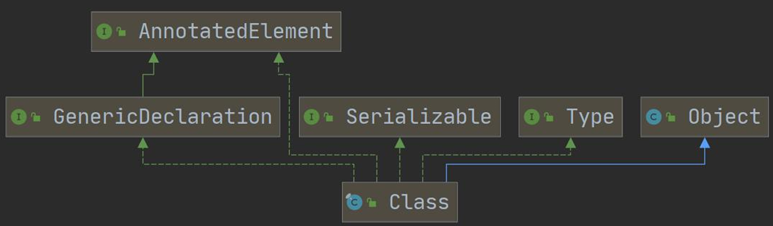
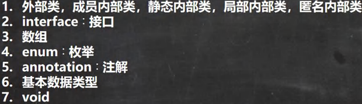

<h1 style="text-align: center; font-weight: bold;">Class类</h1>

---

## 1. 基本介绍

#### （1）Class 也是类，因此也继承 Object 类

#### （2）<span style = "color:red;font-weight:bold">Class 类对象</span>不是 new 出来的，而是<span style = "color:red;font-weight:bold">系统创建</span>的

#### （3）对于某个类的 <span style = "color:red;font-weight:bold">Class 类对象</span>，在内存中<span style = "color:red;font-weight:bold">只有一个</span>，因为<span style = "color:red;font-weight:bold">类只加载一次</span>

#### （4）每个类的实例都会记得自己是由哪个 Class 实例所生成

#### （5）通过 Class 对象<span style = "color:red;font-weight:bold">可以完整地得到一个类的完整结构</span>, 通过一系列 API

#### （6）<span style = "color:red;font-weight:bold">Class 对象</span>是存放在<span style = "color:red;font-weight:bold">堆</span>的

#### （7）<span style = "color:red;font-weight:bold">类的字节码二进制数据</span>，是放在<span style = "color:red;font-weight:bold">方法区</span>的，有的地方称为类的<span style = "color:red;font-weight:bold">元数据</span>(包括 方法代码，变量名，方法名，访问权限等等)

## 2. 类图



## 3. 常用方法

| **方法名**                                                                                             | **功能说明**                                                                                                                                  |
| ------------------------------------------------------------------------------------------------------ | --------------------------------------------------------------------------------------------------------------------------------------------- |
| **forName(String name)**                                                                               | 返回指定类名 `name` 的 Class 对象。                                                                                                           |
| **newInstance()**                                                                                      | 调用被构造函数，返回该 Class 对象的一个实例。                                                                                                 |
| **set(类对象实例，属性(字符串))**                                                                      | 获得某个类的属性对象后，可以通过 set 方法设置值，<span style = "color:red;font-weight:bold">不改变源码</span>                                 |
| **getName()**                                                                                          | 返回此 Class 对象所表示的实体（<span style = "color:red;font-weight:bold">类、接口、数组、基本类型等</span>）名称，不传入参数则获取**全类名** |
| **getPackage().getName()**                                                                             | 获取包名                                                                                                                                      |
| **getMethod(String name, Class... paramTypes)**                                                        | 返回一个 Method 对象，此对象的形参类型为 paramTypes。                                                                                         |
| **getClassLoader()**                                                                                   | 返回该类的类加载器。                                                                                                                          |
| **getSuperclass()**                                                                                    | 返回表示此 Class 所表示的实体的**父类（超类 / 基类）**的 Class 对象。                                                                         |
| **Field[] getDeclaredField<span style = "color:red;font-weight:bold;font-size:15px">s</span>()()**     | 返回 Field 对象的一个数组。                                                                                                                   |
| **Constructor[] getConstructor<span style = "color:red;font-weight:bold;font-size:15px">s</span>()()** | 返回一个包含某些 Constructor 对象的数组。                                                                                                     |
| **Class[] getInterface<span style = "color:red;font-weight:bold;font-size:15px">s</span>()**           | 获取当前 Class 对象实现的所有接口。                                                                                                           |

### 补充：<?>

拿到该类的 Class 对象后，表示 <span style = "color:red;font-weight:bold">Class 对象的类型是不确定的</span>

## 4. 获取类对象的方法

### （1）forName()

#### 阶段：编译阶段（对应反射原理图）

1. 前提: **已知一个类的全类名，且该类在类路径下**，可通过 Class 类的 **静态方法 forName()** 获取，可能抛出 **ClassNotFoundException 异常**

2. 应用场景: 多用于**配置文件**, 读取类全路径，加载类.

```java
public class reflect {
    public static void main(String[] args) throws Exception {
        String filePath  = "src/properties";
        // 获取文件的 Class 对象
        Class cls = Class.forName(filePath);
    }
}
```

### （2）class()

1. 前提: 若<span style = "color:red;font-weight:bold">已知具体的类</span>，通过类的 class 获取，该方式最为安全可靠，程序性能最高

2. 应用场景: 多用于<span style = "color:red;font-weight:bold">参数传递</span>，比如通过反射得到对应构造器对象.

> **实例: Class cls2 = Cat.class**

### （3）getClass()

#### 阶段：运行阶段（对应反射原理图）

1. 前提: <span style = "color:red;font-weight:bold">已知某个类的实例</span>，调用该实例的 <span style = "color:red;font-weight:bold">getClass()</span>方法获取 Class 对象

2. 应用场景: 通过创建好的对象，获取 Class 对象.

> **实例: Class clazz = 对象.getClass()**

### （4）loadClass()

#### 思路分析：因为通过类加载器加载后可以通过获取类的 Class 对象，所以获得该类的类加载器，然后用类加载器加载获得 Class 对象

1. 通过**Class 对象**获得该类的**类加载器**：<span style = "color:red;font-weight:bold">getClassLoader()</span>

2. 通过加载器的方法：<span style = "color:red;font-weight:bold">loadClass()</span>

```java
public class reflect {
    public static void main(String[] args) throws Exception {
        String classPath  = "reflect.Dog";

        Dog dog = new Dog();

        // 首先拿到该类的加载器
        ClassLoader classLoader = dog.getClass().getClassLoader();

        // 通过类加载器获得该类的 Class 对象
        Class cls = classLoader.loadClass(classPath);

        // 输出该类的 Class 对象
        System.out.println(cls);
    }
}
```

### （5）基本数据类型

#### 公式：<span style = "color:red;font-weight:bold">Class cls = 基本数据类型.class</span>

### （6）包装类

#### 公式：<span style = "color:red;font-weight:bold">Class cls = 包装类.TYPE</span>

### ⚠️ 注意点

```java
public class reflect {
    public static void main(String[] args) throws Exception {
        // 基本数据类型
        Class<Integer> integerClass = int.class;
        Class<Character> characterClass = char.class;
        // 包装类
        Class<Integer> type = Integer.TYPE;
        Class<Character> type1 = Character.TYPE;


        System.out.println(integerClass.hashCode());
        System.out.println(type.hashCode());
    }
}

// 输出结果
1163157884
1163157884
```

#### 结论：<span style = "color:red;font-weight:bold">基本数据类型</span>和<span style = "color:red;font-weight:bold">包装类</span>在底层会实现<span style = "color:red;font-weight:bold">自动装箱和自动拆箱</span>，<span style = "color:red;font-weight:bold">二者的 Class 对象相同</span>

## 5. 哪些类型有 Class 对象


