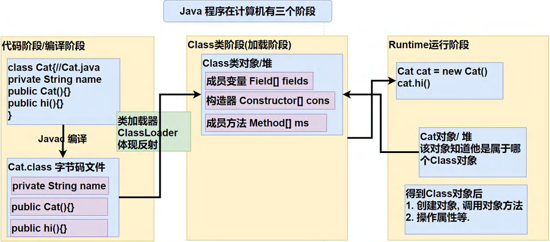
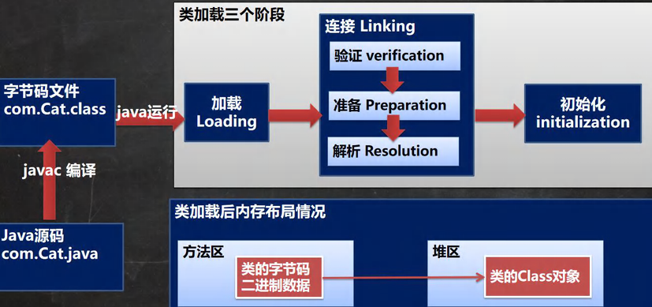
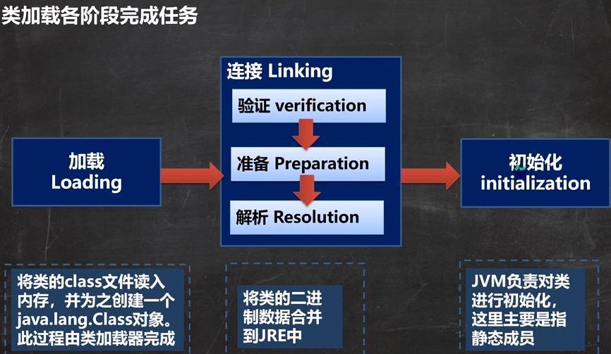
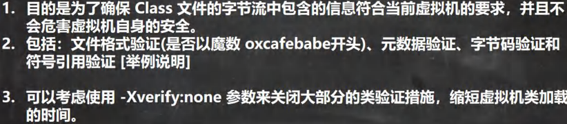

<h1 style="text-align: center; font-weight: bold;">类加载</h1>

---

## 1. 加载类型

> ##### 反射机制是 java 实现动态语言的关键，也就是通过<span style="color:red; font-weight: bold;">反射</span>实现<span style="color:red; font-weight: bold;">类动态加载</span>

### （1）静态加载

> ##### 编译时加载相关的类，如果没有则报错，<span style="color:red; font-weight: bold;">依赖性太强</span>（无论是否使用该类，编译时都会检查代码中使用的类）

### （2）动态加载

> ##### <span style="color:red; font-weight: bold;">运行时加载需要的类</span>，如果运行时不用该类（也就是说代码运行到了那一行才会检测），即使不存在该类，则不报错，降低了依赖性

## 2. ⭐ 类加载

### （1）类加载时机


### （2）加载流程







#### 1. 加载


#### 2. 连接：验证



#### 3. 连接：准备


```java
// n1 是实例属性，不是静态变量，因此在准备阶段，是不会分配内存
public int n1 = 10;
// n2 是静态变量，分配内存 n2 是默认初始化 0，而不是 20（准备阶段特性，后续初始化阶段会赋值为 20）
public static int n2 = 20;
// n3 是 static final 是常量，它和静态变量不一样，因为一旦赋值就不变，准备阶段直接赋值为 30
public static final int n3 = 30;
```

<h4><span style="color:red; font-weight: bold;">小结：默认初始化 + 常量初始化</span></h4>

#### 4. 连接：解析

<h4>虚拟机将常量池内的<span style="color:red; font-weight: bold;">符号引用</span>替换为<span style="color:red; font-weight: bold;">直接引用（内存地址）</span>的过程</h4>

#### 5. 初始化

> ##### 1. 到初始化阶段，才真正开始执行类中定义的 Java 程序代码，此阶段是执行 **clinit()** 方法的过程。

> ##### 2. **clinit()** 方法是由编译器按语句在源文件中出现的顺序，依次自动收集类中的所有**静态变量的赋值动作和静态代码块中的语句**，并进行合并。

> ##### 3. 虚拟机会保证一个类的 **clinit()** 方法在<span style="color:red; font-weight: bold;">多线程</span>环境中被正确地<span style="color:red; font-weight: bold;">加锁、同步</span>，如果多个线程同时去初始化一个类，那么只会有一个线程去执行这个类的 **clinit()** 方法，其他线程都需要阻塞等待，直到活动线程执行 **clinit()** 方法完毕（解释了一个问题：<span style="color:red; font-weight: bold;">类在内存中，只会有一个 Class 对象</span>）

```java
protected Class<?> loadClass(String name, boolean resolve) throws ClassNotFoundException {
    // 正因为有这个机制，才能保证某个类在内存中，只有一份 Class 对象
    synchronized (getClassLoadingLock(name)) {
        //...
    }
}
```
