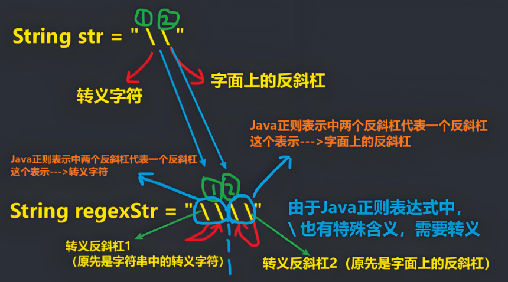

<h1 style="text-align: center; font-weight: bold;">表达式语法</h1>

---

> #### 获取元字符文档资料
>
> #### https://pan.baidu.com/s/1hNC1vSXbkvOGnHNJS0SqaQ?pwd=3tn6 提取码: 3tn6

## 元字符分类

> #### （1）限定符
>
> #### （2）选择匹配符
>
> #### （3）分组组合和反向引用符
>
> #### （4）特殊字符
>
> #### （5）字符匹配符
>
> #### （6）定位符

## 转义符号 \\\\

### 基本介绍

#### <span style = "color:red;font-weight:bold">使用正则表达式</span>去检索某些特殊字符的时候，<span style = "color:red;font-weight:bold">需要</span>用到<span style = "color:red;font-weight:bold">转义符号</span>，否则检索不到结果，甚至会报错

> #### 注意点：在 <span style = "color:red;font-weight:bold">Java 正则表达式</span>中，<span style = "color:red;font-weight:bold">两个反斜杠（ \\\\ ） 代表其他语言的一个反斜杠（ \\ ）</span>（不区分是（1）普通反斜杠（2）还是转义反斜杠的反斜杠），因为反斜杠 （ \ ） 有特殊含义（例如 \d 表示数字）



### 使用场景

#### 如需匹配以下符号，在<span style = "color:red;font-weight:bold">正则表达式中</span>需要在该符号前加上转义符号（<span style = "color:red;font-weight:bold">两个反斜杠表示一个反斜杠</span>）

> #### <span style = "color:red;font-size:25px">. &nbsp;&nbsp;\* &nbsp;&nbsp; + &nbsp;&nbsp; ( &nbsp;&nbsp; ) &nbsp;&nbsp; $ &nbsp;&nbsp; / &nbsp;&nbsp; \ &nbsp;&nbsp; ? &nbsp;&nbsp; [ &nbsp;&nbsp; ] &nbsp;&nbsp; ^ &nbsp;&nbsp; { &nbsp;&nbsp; }</span>

## 字符匹配符

### <span style = "font-size:25px">[&nbsp;]</span>

#### <span style = "color:red;font-weight:bold">包含列表中的任意一个字符</span>即满足匹配条件

> #### 举例：String regStr = "[0-9]"; // 匹配 0-9 之间任意一个字符

### <span style = "font-size:25px">[&nbsp;^ ]</span>

#### <span style = "color:red;font-weight:bold">不包含</span>列表中的任意一个字符（<span style = "color:red;font-weight:bold">包括数字和特殊符号</span>）

> #### 举例：String regStr = "[^0-9]"; // 不在 0-9 之间任意一个字符

### <span style = "font-size:25px">&nbsp;-</span>

#### 连字符，表示<span style = "color:red;font-weight:bold">范围内的任意字符</span>

> #### 举例：String regStr="[a-z]"; // 匹配 a-z 之间任意一个字符

### <span style = "font-size:35px">&nbsp;.</span>

#### 匹配<span style = "color:red;font-weight:bold">除了\n 的所有字符</span>，如果需要匹配本身需要使用转义符即（ \\\\. ）

> #### 举例：String regStr="."; // 匹配所有字符

### \\\\d

#### 匹配<span style = "color:red;font-weight:bold">单个数字字符（0-9）</span>，等价于[0-9]

> #### 举例：String regStr = "\\\\d"; // 匹配 0-9 之间任意一个字符

### \\\\D

#### 匹配<span style = "color:red;font-weight:bold">除了 0-9</span>的任意字符，等价于[^0-9]

> #### 举例：String regStr = "\\\\D"; // 匹配不在 0-9 的任意一个字符

### \\\\w

#### 匹配<span style = "color:red;font-weight:bold">数字、下划线、大小写字符</span>，等价于[0-9a-zA-Z]

> #### 举例：String regStr = "\\\\w"; // 匹配大小写英文字母, 数字，下划线

### \\\\W

#### 匹配<span style = "color:red;font-weight:bold">单个数字字符（0-9）</span>，等价于[^0-9a-zA-Z]

> #### 举例：String regStr = "\\\\W"; // 匹配等价于[^0-9a-zA-Z]

### \\\\s

#### 匹配<span style = "color:red;font-weight:bold">任何空白字符(空格,制表符等)</span>

> #### 举例：String regStr = "\\\\s"; // 匹配任何空白字符(空格,制表符等)

### \\\\S

#### 匹配<span style = "color:red;font-weight:bold">除了任何空白字符(空格,制表符等)</span>

> #### 举例：String regStr = "\\\\S"; // 匹配非空白字符

### （?i）

#### 加上后<span style = "color:red;font-weight:bold">不区分大小写</span>，作用于符号后的所有字符，如果需要指定字符，需要使用括号包起来

#### 1. (?i)abc 表示 abc 都不区分大小写

#### 2. a(?i)bc 表示 bc 不区分大小写

#### 3. a((?i)b)c 表示只有 b 不区分大小写

> #### 举例：String regStr="(?i)abc"; // 匹配 abc 字符串（不区分大小写）

### 指定参数不区分大小写

> #### Pattern pat = Pattern.compile(regEx, <span style = "color:red;font-weight:bold">Pattern.CASE_INSENSITIVE</span>);

### 示例代码

```java
package RegularExpresstion;

import java.util.regex.Matcher;
import java.util.regex.Pattern;

/**
 * ClassName: test
 * Package: RegularExpresstion
 * Description:
 *
 * @author jacksonling
 * @version 1.0
 * @Date 2025-08-02 20:24
 */
public class Main {
    public static void main(String[] args) {
        // 匹配内容
        String content = "_ Aa124563bB@";

        // 创建模式对象（即正则表达式对象）

        // 第一组
        Pattern pattern = Pattern.compile("[0-3]"); // 只匹配 0-3 范围的字符
        /*
            匹配内容：1
            匹配内容：2
            匹配内容：3
         */

        // 第二组
//        Pattern pattern = Pattern.compile("[^0-3]"); // 除了 0-3 范围的字符都匹配
        /*
            匹配内容：_
            匹配内容：
            匹配内容：A
            匹配内容：a
            匹配内容：4
            匹配内容：5
            匹配内容：6
            匹配内容：b
            匹配内容：B
            匹配内容：@
         */

        // 第三组
//        Pattern pattern = Pattern.compile("[a-b]"); // 只匹配 a-b 范围的字符
        /*
            匹配内容：a
            匹配内容：b
         */

        // 第四组
//        Pattern pattern = Pattern.compile("[^a-b]"); // 除了 a-b 范围的字符都匹配
        /*
            匹配内容：_
            匹配内容：
            匹配内容：A
            匹配内容：1
            匹配内容：2
            匹配内容：4
            匹配内容：5
            匹配内容：6
            匹配内容：3
            匹配内容：B
            匹配内容：@
         */

        // 第五组
//        Pattern pattern = Pattern.compile("."); // 匹配所有字符
        /*
            匹配内容：_
            匹配内容：
            匹配内容：A
            匹配内容：a
            匹配内容：1
            匹配内容：2
            匹配内容：4
            匹配内容：5
            匹配内容：6
            匹配内容：3
            匹配内容：b
            匹配内容：B
            匹配内容：@
         */

        // 第六组
//        Pattern pattern = Pattern.compile("\\d"); // 只匹配 0-9 的字符
        /*
            匹配内容：1
            匹配内容：2
            匹配内容：4
            匹配内容：5
            匹配内容：6
            匹配内容：3
         */

        // 第七组
//        Pattern pattern = Pattern.compile("\\D"); // 匹配除了0-9 的字符
        /*
            匹配内容：_
            匹配内容：
            匹配内容：A
            匹配内容：a
            匹配内容：b
            匹配内容：B
            匹配内容：@
         */

        // 第八组
//        Pattern pattern = Pattern.compile("\\w"); // 匹配数字、下划线、大小写字符
        /*
            匹配内容：_
            匹配内容：A
            匹配内容：a
            匹配内容：1
            匹配内容：2
            匹配内容：4
            匹配内容：5
            匹配内容：6
            匹配内容：3
            匹配内容：b
            匹配内容：B
         */
//        // 第九组
//        Pattern pattern = Pattern.compile("\\W"); // 匹配除了数字、下划线、大小写字符
        /*
            匹配内容：
            匹配内容：@
         */
//        // 第十组
//        Pattern pattern = Pattern.compile("\\s"); // 匹配任何空白字符(空格,制表符等)
        /*
            匹配内容：
         */
//        // 第十一组
//        Pattern pattern = Pattern.compile("\\S"); // 匹配除了任何空白字符(空格,制表符等)
        /*
            匹配内容：_
            匹配内容：A
            匹配内容：a
            匹配内容：1
            匹配内容：2
            匹配内容：4
            匹配内容：5
            匹配内容：6
            匹配内容：3
            匹配内容：b
            匹配内容：B
            匹配内容：@
         */

        // 创建匹配器
        Matcher matcher = pattern.matcher(content);
        // 开始匹配
        while (matcher.find()){
            System.out.println("匹配内容：" + matcher.group(0));
        }
    }
}
```

## 选择匹配符：<span style="color:red">&nbsp;|</span>

#### 在匹配某个字符串的时候是选择性的，既可以匹配这个又可以匹配那个，<span style="color:red">应用：一次性匹配多个字符</span>

> #### 举例：String regStr="d [a | b | c] "; // 匹配 da 或 db 或 dc

## 限定符

### 基本介绍

> #### 用于<span style="color:red">指定</span>其前面的字符和组合项<span style="color:red">连续出现多少次</span>

### &nbsp;\*

#### 指定字符<span style="color:red">重复 0 次或 n 次（0 到多）</span>

> #### 举例：(abc)\*--->匹配：abc、abcabc...

### &nbsp;\+

#### 指定字符<span style="color:red">重复 1 次或 n 次（1 到多）</span>

> #### 举例：m + (abc)\*--->匹配：m、mabc、mabcabc...

### &nbsp;?

#### 指定字符<span style="color:red">重复 0 次或 1 次（0 到 1），默认贪婪匹配，即尽可能匹配多的</span>

> #### 举例：m + abc?--->匹配：mab、mabc、mabcabc...

### \{n}

#### 指定列表中任意字符的<span style="color:red">匹配长度为 n</span>

> #### 举例：\[abcd]\{3}，由 abcd 中字母组成的任意长度为 3 的字符串，匹配：abc,dbc,adc
>
> #### 举例：a\{3}，匹配：aaa

### \{n,}

#### 指定列表中匹配字符的长度<span style="color:red">至少为 n（≥ n）</span>

> #### 举例：\[abcd]\{3,}，匹配：abc,dbc,aaabdc...

### \{n,m}

#### 指定列表中匹配字符的长度<span style="color:red">至少为 n（≥ n）个但不多于 m（ ≤ m ）个，默认贪婪匹配，即尽可能匹配多的</span>

> #### 举例：\[abcd]\{3,5}，匹配：abc,abcd、aaaaa、bcdab...

### ⭐ 非贪婪匹配

> #### <span style="color:red;font-weight:bold">在限定符后加上问号</span>
>
> #### String content = "111hello"，String regex = "\\\\d+?"，这样就会匹配三个 1，而不是一次性匹配 111

### 代码示例

```java
public class RegexDemo {
    public static void main(String[] args) {
        String content = "a211111aaaaahello";

        // 以下是各类正则表达式语法示例说明，实际使用时可按需替换 regStr 进行测试
        // a{3},1{4},\\d{2}
        // String regStr = "a{3}";// 表示匹配 aaa
        // String regStr = "1{4}";// 表示匹配 1111
        // String regStr = "\\d{2}";// 表示匹配 两位的任意数字字符

        // a{3,4},1{4,5},\\d{2,5}
        // 细节：java 匹配默认贪婪匹配，即尽可能匹配多的
        // String regStr = "a{3,4}";//表示匹配 aaa 或者 aaaa
        // String regStr = "1{4,5}";//表示匹配 1111 或者 11111
        // String regStr = "\\d{2,5}";//匹配 2 位数或者者 3,4,5

        // 1+
        // String regStr = "1+";//匹配一个 1 或者多个 1
        // String regStr = "\\d+";//匹配一个数字或者多个数字

        // 1*
        // String regStr = "1*";//匹配 0 个 1 或者多个 1

        // 演示?的使用，遵守贪婪匹配
        String regStr = "a1?"; // 匹配 a 或者 a1
        Pattern pattern = Pattern.compile(regStr);
        Matcher matcher = pattern.matcher(content);

        while (matcher.find()) {
            System.out.println("找到 " + matcher.group(0));
        }
    }
}
```

## 定位符

### 基本介绍

> #### <span style="color:red">规定要匹配的字符串出现的位置</span>，比如在字符串的开始还是在结束的位置，这个也是相当有用的，必须掌握

| 符号 | 含义                                                                   | 示例            | 说明                                                                                                                                                                                                                 | 匹配输入                                                                                                                        |
| ---- | ---------------------------------------------------------------------- | --------------- | -------------------------------------------------------------------------------------------------------------------------------------------------------------------------------------------------------------------- | ------------------------------------------------------------------------------------------------------------------------------- |
| ^    | 指定<span style="color:red;font-weight:bold">起始</span>字符符号       | ^[0-9]+[a-z]\*  | 以至少 1 个数字开头，后接任意个小写字母的字符串                                                                                                                                                                      | 123, 6aa, 555edf                                                                                                                |
| $    | 指定<span style="color:red;font-weight:bold">结束</span>字符符号       | [0-9]\\-[a-z]+$ | 以 1 个数字开头后接连字符“-”，并以至少 1 个小写字母结尾的字符串                                                                                                                                                      | 1-a                                                                                                                             |
| \b   | 匹配目标字符串的<span style="color:red;font-weight:bold">边界</span>   | han\b           | 这里说明的字符串的<span style="color:red;font-weight:bold">边界指</span>的是<span style="color:red;font-weight:bold">字符串前空格</span>，或者是<span style="color:red;font-weight:bold">目标字符串的结束位置</span> | hanshuping spa<span style="color:red;font-weight:bold">han</span>（空格） nn<span style="color:red;font-weight:bold">han</span> |
| \B   | 匹配目标字符串的<span style="color:red;font-weight:bold">非边界</span> | han\B           | 和\b 的含义刚刚相反                                                                                                                                                                                                  | <span style="color:red;font-weight:bold">han</span>shuping spahan nnhan                                                         |

### 示例代码

```java
import java.util.regex.Matcher;
import java.util.regex.Pattern;

public class Main {
    public static void main(String[] args) {
        // 测试字符串
        String content = "hanshuping sphan nnhan";
        // String content = "123-abc";

        // 正则表达式示例
        // 至少 1 个数字开头，后接任意个小写字母的字符串
        String regStr = "^[0-9]+[a-z]*";

        // 至少 1 个数字开头，必须至少一个小写字母结尾
        // String regStr = "^[0-9]+[a-z]-a-z$";

        // 表示匹配边界的 han[这边的边界是: 被匹配的字符串最后,
        // 也可以是空格的字符字符串的后面]
        // String regStr = "han\\b";

        // 和\b 的含义刚刚相反
        // String regStr = "han\\B";

        // 创建正则表达式模式对象
        Pattern pattern = Pattern.compile(regStr);

        // 创建匹配器对象
        Matcher matcher = pattern.matcher(content);

        // 查找并输出匹配的部分
        while (matcher.find()) {
            System.out.println("找到=" + matcher.group(0));
        }
    }
}
```

## 分组

### 捕获分组

| 常用分组构造形式                                                   | 说明                                                                                                                                                                                                                                                   |
| ------------------------------------------------------------------ | ------------------------------------------------------------------------------------------------------------------------------------------------------------------------------------------------------------------------------------------------------ |
| (...)                                                              | <span style="color:red;font-weight:bold">非命名捕获</span>。捕获匹配的子字符串。编号为零的捕获是由整个正则表达式模式匹配的文本，其它捕获结果则根据在括号内开始的编号。                                                                                 |
| (<span style="color:red;font-weight:bold">?&lt;name&gt;</span>...) | <span style="color:red;font-weight:bold">命名捕获</span>。将匹配的子字符串捕获到一个组名称或编号中。用于 name 的字符串不能包含任何标点符号，并且<span style="color:red;font-weight:bold">不能以数字开头。可以使用单引号替代尖括号</span>，如 (?‘name’) |

#### 命名分组：可以传入分组名获取内容，<span style="color:red;font-weight:bold">matcher.group("分组名")</span>

#### 代码示例

```java
public class Main {
    public static void main(String[] args) {
        String regStr = "123abc456";
        // 使用 ?<> 命名
        Pattern compile = Pattern.compile("(?<group1>\\d\\d)(?<group2>\\d)");
        Matcher matcher = compile.matcher(regStr);
        while (matcher.find()){
            System.out.println("匹配内容：" + matcher.group());
            System.out.println("第一组：" + matcher.group("group1"));
            System.out.println("第二组：" + matcher.group("group2"));
        }
    }
}
```

#### 输出结果

```bash
匹配内容：123
第一组：12
第二组：3
匹配内容：456
第一组：45
第二组：6
```

### 非捕获分组

> #### ⚠️ 非捕获分组，<span style="color:red;font-weight:bold">没有分组，不可以写 matcher.group(1 / 2 / 3 /...)</span>

#### 查找内容

```java
String regStr = "hello 韩顺平教育 jack 韩顺平老师 韩顺平同学hello韩顺平学生";
```

#### (?:pattern)

> #### 共有部分可以提取（匹配内容为表达式前面的字符），<span style="color:red;font-weight:bold">表示选择</span>，符合条件的都选择
>
> #### 韩顺平(?:教育|老师|同学)，匹配：韩顺平教育 、韩顺平老师、韩顺平同学的韩顺平

#### (?=pattern)

> #### 共有部分可以提取（匹配内容为表达式前面的字符），<span style="color:red;font-weight:bold">表示筛选</span>，只查找符合等号后面的内容
>
> #### 韩顺平(?=教育|老师)，匹配：韩顺平教育、韩顺平老师的韩顺平

#### (?!pattern)

> #### 共有部分可以提取（匹配内容为表达式前面的字符），<span style="color:red;font-weight:bold">表示取反</span>
>
> #### 韩顺平(?!教育|老师)，匹配：韩顺平同学、韩顺平学生的韩顺平
