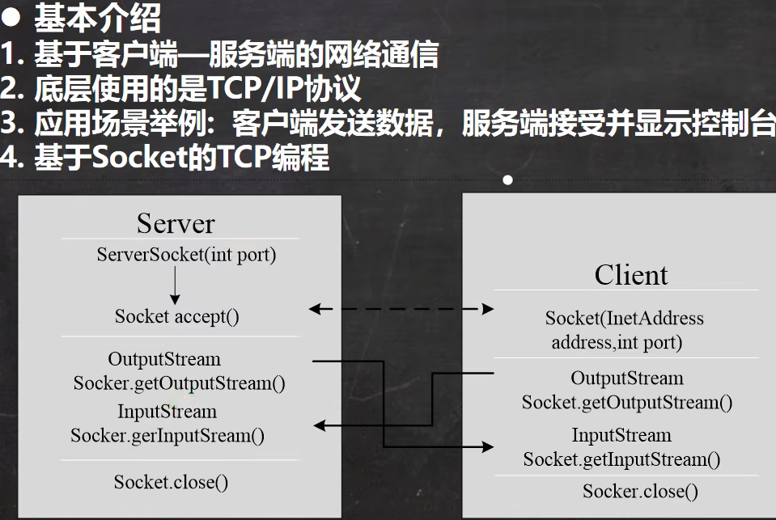

<h1 style="text-align: center; font-weight: bold;">TCP网络编程</h1>

---

## 1. 基本介绍

##### 注意：<span style = "color:red;font-weight:bold">一定要使用 close()方法关闭</span>，服务器的连接数是有限的，避免其他需要连接的设备无法连接



## 2. TCP 字节流编程

### （1）基本介绍

相关的方法

- 客户端：创建 Socket 对象，传入连接的服务器 ip 和端口
- 服务端
  - 创建 **ServerSocket** 对象，传入端口，表示启动服务并在哪个端口监听
  - 调用 Socket 的 <span style = "color:red;font-weight:bold">accept()</span> 方法，用来接收用户端的请求
  - <span style = "color:red;font-weight:bold">注意：ServerSocket 可以通过 accept()返回多个 Socket（多个客户端连接服务器的并发）</span>
- Socket
  - getInputStream：用来接收信息
  - getOutputStream：用来发送信息

### （2）案例一


##### 注意：<span style = "color:red;font-weight:bold">先启动服务端，后启动客户端</span>

#### 1. 客户端

```java
import java.io.IOException;
import java.io.OutputStream;
import java.net.InetAddress;
import java.net.Socket;


public class client {
    public static void main(String[] args) throws IOException {

        System.out.println("客户端启动...");

        // Socket 和 getLocalHost 都会有异常，需要捕获或者抛出
        // 传入连接端口和服务器的ip地址
        Socket socket = new Socket(InetAddress.getLocalHost(), 9999);

        // 客户端发送信息
        OutputStream outputStream = socket.getOutputStream();
        String str = "hello,server";
        outputStream.write(str.getBytes());

        // 关闭资源
        outputStream.close();
        socket.close();
    }
}

```

代码分析

- 通过创建 Socket 对象，传入连接服务的 ip 和端口
- 通过 Socket 对象获取的输出流对象，用于发送信息
- 最后要关闭资源

#### 2. 服务端

```java
import java.io.IOException;
import java.io.InputStream;
import java.net.ServerSocket;
import java.net.Socket;

public class server {
    public static void main(String[] args) throws IOException {

        System.out.println("等待连接中...");

        // ServerSocket 会有异常，需要捕获或者抛出
        ServerSocket serverSocket = new ServerSocket(9999);
        /*
            当没有客户端连接9999端口时，程序会 阻塞, 等待连接
            如果有客户端连接，则会返回Socket对象，程序继续
         */
        Socket socket = serverSocket.accept();

        // 服务器端接收信息
        InputStream inputStream = socket.getInputStream();
        int readLen = 0;
        byte[] buf = new byte[1024];
        while ((readLen = inputStream.read(buf)) != -1) {
            System.out.println("客户端发送如下信息：\n" + new String(buf, 0, readLen));
        }

        // 关闭资源
        inputStream.close();
        serverSocket.close();
        socket.close();
    }
}
```

代码分析

- 通过创建 ServerSocket 对象，启动服务并在 9999 端口监听
- 通过 accept()方法返回 socket 对象，<span style = "color:red;font-weight:bold">注意：ServerSocket 可以通过 accept()返回多个 Socket（多个客户端连接服务器的并发）</span>
- 通过 Socket 对象获取输入流对象，接收客户端发送的信息
- 关闭资源

### （3）案例二

1. 本题多了服务端回送信息的过程，本质是案例一的改进

2. 注意：<span style = "color:red;font-weight:bold">发送信息后，需要有结束标志</span>，调用 <span style = "color:red;font-weight:bold">shutdownOutput()</span> 方法作为结束标志


#### 1. 客户端

```java
import java.io.IOException;
import java.io.InputStream;
import java.io.OutputStream;
import java.net.InetAddress;
import java.net.Socket;


public class client {
    public static void main(String[] args) throws IOException {

        System.out.println("客户端启动...");

        // Socket 和 getLocalHost 都会有异常，需要捕获或者抛出
        // 传入连接端口和服务器的ip地址
        Socket socket = new Socket(InetAddress.getLocalHost(), 9999);

        // 客户端发送信息
        OutputStream outputStream = socket.getOutputStream();
        String str = "客户端发送请求";
        outputStream.write(str.getBytes());
        socket.shutdownOutput(); // 发送信息后的结束标志

        // 客户端接收信息
        InputStream inputStream = socket.getInputStream();
        int readLen = 0;
        byte[] buf = new byte[1024];
        while((readLen = inputStream.read(buf))!= -1){
            System.out.println("服务端发送信息如下：\n" + new String(buf,0,readLen));
        }

        // 关闭资源
        outputStream.close();
        socket.close();
        inputStream.close();
    }
}
```

代码分析

- 客户端发送完信息后，需要**添加结束标志**
- 获取 socket 的输入流对象，接收服务端发送的信息
- 注意关闭资源

#### 2. 服务端

```java
import java.io.IOException;
import java.io.InputStream;
import java.io.OutputStream;
import java.net.ServerSocket;
import java.net.Socket;

public class server {
    public static void main(String[] args) throws IOException {

        System.out.println("等待连接中...");

        // ServerSocket 会有异常，需要捕获或者抛出
        ServerSocket serverSocket = new ServerSocket(9999);
        /*
            当没有客户端连接9999端口时，程序会 阻塞, 等待连接
            如果有客户端连接，则会返回Socket对象，程序继续
         */
        Socket socket = serverSocket.accept();

        // 服务器端接收信息
        InputStream inputStream = socket.getInputStream();
        int readLen = 0;
        byte[] buf = new byte[1024];
        while ((readLen = inputStream.read(buf)) != -1) {
            System.out.println("客户端发送如下信息：\n" + new String(buf, 0, readLen));
        }

        // 服务端发送信息
        OutputStream outputStream = socket.getOutputStream();
        String str = "hello,client";
        outputStream.write(str.getBytes());
        socket.shutdownOutput(); // 服务端发送信息后的结束标志

        // 关闭资源
        inputStream.close();
        serverSocket.close();
        socket.close();
        outputStream.close();
    }
}
```

代码分析

- 服务端发送完信息后，需要**添加结束标志**
- 获取 socket 的输出流对象，给客户端发送信息
- 注意关闭资源

### （3）案例三


1. 本题的核心就是从**字节流**转到**字符流**

2. 使用字符流的几个注意点
   - socket 拿到的 IO 流对象是字节流对象，需要使用**转换流**转成字符流
   - 通过<span style = "color:red;font-weight:bold">readLine()</span>方法来读取信息，<span style = "color:red;font-weight:bold">需要用字符串接收打印出来</span>
   - 信息发送的<span style = "color:red;font-weight:bold">结束标志：newLine()</span>
   - 对于 writer 来说，<span style = "color:red;font-weight:bold">一定要使用 flush()方法刷新</span>**才能成功写入内容**
   - **后面使用的资源先关闭**
3. **注意逻辑：**<span style = "color:red;font-weight:bold">先结束 newLine()后刷新 flush()</span>

#### 1. 客户端

```java
import java.io.*;
import java.net.InetAddress;
import java.net.Socket;


public class client {
    public static void main(String[] args) throws IOException {

        System.out.println("客户端启动...");

        // Socket 和 getLocalHost 都会有异常，需要捕获或者抛出
        // 传入连接端口和服务器的ip地址
        Socket socket = new Socket(InetAddress.getLocalHost(), 9999);

        // 客户端发送信息，运用转换流
        OutputStream outputStream = socket.getOutputStream();
        BufferedWriter bufferedWriter = new BufferedWriter(new OutputStreamWriter(outputStream));
        bufferedWriter.write("你好，服务端");
        bufferedWriter.newLine(); // 作为发送数据的结束标志
        bufferedWriter.flush(); // 一定要刷新才能成功写入内容


        // 客户端接收信息，运用转换流
        InputStream inputStream = socket.getInputStream();
        BufferedReader bufferedReader = new BufferedReader(new InputStreamReader(inputStream));
        System.out.println(bufferedReader.readLine());

        // 关闭资源（最后使用的资源先关闭）
        bufferedWriter.close();
        bufferedReader.close();
        socket.close();
    }
}

```

#### 2. 服务端

```java
import java.io.*;
import java.net.ServerSocket;
import java.net.Socket;

public class server {
    public static void main(String[] args) throws IOException {

        System.out.println("等待连接中...");

        // ServerSocket 会有异常，需要捕获或者抛出
        ServerSocket serverSocket = new ServerSocket(9999);
        /*
            当没有客户端连接9999端口时，程序会 阻塞, 等待连接
            如果有客户端连接，则会返回Socket对象，程序继续
         */
        Socket socket = serverSocket.accept();

        // 服务器端接收信息，运用转换流
        InputStream inputStream = socket.getInputStream();
        BufferedReader bufferedReader = new BufferedReader(new InputStreamReader(inputStream));
        System.out.println(bufferedReader.readLine());

        // 服务端发送信息，运用转换流
        OutputStream outputStream = socket.getOutputStream();
        BufferedWriter bufferedWriter = new BufferedWriter(new OutputStreamWriter(outputStream));
        bufferedWriter.write("你好，客户端");
        bufferedWriter.flush(); // 一定要刷新才能成功写入内容
        bufferedWriter.newLine(); // 作为发送信息的结束标志


        // 关闭资源（最后使用的资源先关闭）
        bufferedWriter.close();
        bufferedReader.close();
        socket.close();
        serverSocket.close();
    }
}

```

## 3 .⭐ 补充：TCP 编程的秘密

##### 当客户端连接到服务端后，实际上<span style = "color:red;font-weight:bold">客户端也是通过一个端口</span>和服务端进行通讯的，这个端口是 TCP/IP 来分配的，<span style = "color:red;font-weight:bold">是不确定的，是随机的</span>


- 服务端：8888 端口
- 客户端：60285 端口，由 TCP/IP **随机分配**
