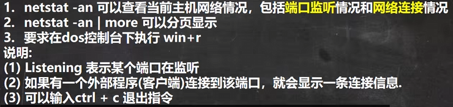
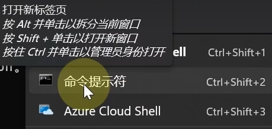

<h1 style="text-align: center; font-weight: bold;">netstat指令</h1>

---

## 1. 基本介绍

#### 基本概念

- 地址构成：IP 地址 + 端口号
- **本机**地址：理解为**服务器**
- **外部**地址：理解为**用户端**

## 2. 演示

如何**以管理员身份运行**（win11 系统）

- 方法一
  - 首先点击开始
  - 找到 windows 工具
  - 右键命令提示符-->以管理员身份运行
- 方法二
  - 打开命令提示符
  - 上方点击下拉按钮，找到命令提示符
  - **按住 ctr 键**点击即可

#### （1）netstat -an | more

- 以普通用户管理权限运行
- 使用回车可以实现单行显示
- 使用空格可以分页显示
- ctrl + c 退出查询

#### （2）netstat -anb

#### 用于查看端口被哪个程序监听

