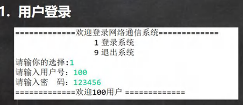
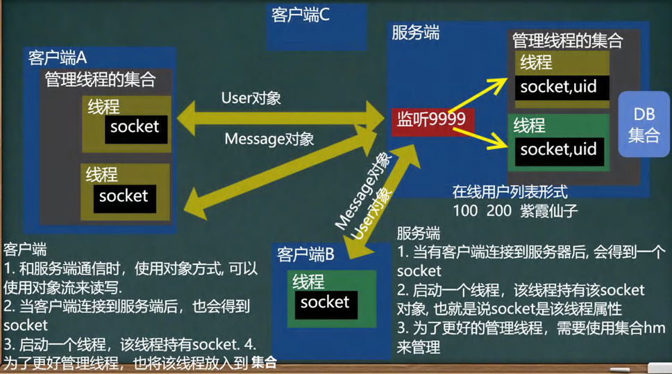

<h1 style="text-align: center; font-weight: bold;">项目介绍</h1>

---

## 1. 项目开发流程介绍

### （1）组成部分

- 需求分析师
- 架构师 / 项目经理
- 开发
  - 前端
  - 后端
- 测试
- 运维（实施工程师）

### （2）补充内容

- 项目的级别越大，需求分析和项目设计所要的时间就越长，分到的薪水也相对较高，后三者开发薪水占比相对来说会比测试和运维高，如果项目较小，开发占比时间会多一些
- 实际开发中一般是**边开发边设计**
- 程序员开发完成后**需要自测**，最后才集中到测试阶段

## 2. 项目介绍

### （1）需求分析

### （2）界面演示

#### 补充功能：无异常退出

### （3）设计思路（非常重要！！！）

#### 分析

- **整体思路**
  - **通讯过程中涉及用户的概念，不能再单一的发送信息，需要使用对象的思想封装信息，使用对象流完成信息的读取和输出**
  - **因为是多用户通信系统，为了不影响各自的通信，实现独立，需要使用**线程
  - **用户进行网络通信，需要使用 socket，不同的用户会和服务器产生**多对 socket，这里使用集合管理，**群发功能**就可以以此为基础实现（**服务端**）
- **客户端**
  > 考虑到信息的交互类型可能不同，可以有文本，文件等，这里可以**启动不同的线程负责不同的模块**，这里可以使用**集合管理线程**
- **服务端**
  > 对**于一个客户端对象，可以和多个用户进行通信**，在服务端当然需要多个线程，这里可以使用**集合管理线程**
- **两个对象**
  - **message**
  - **user**：通过给服务端发送请求，判断是否是合法用户

### （4）项目相关技术

- 1. Java 面向对象编程

- 2. 网络编程

- 3. 多线程

- 4. IO 流

- 5. Mysql（数据库还未学习，这里**使用集合充当内存数据库**）
