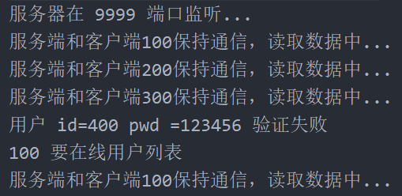
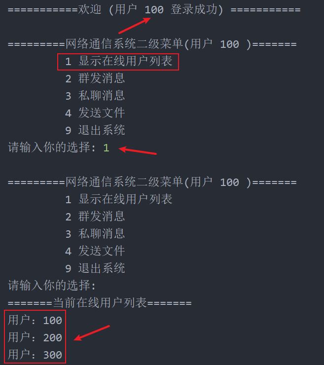

<h1 style="text-align: center; font-weight: bold;">拉取在线用户</h1>

---

##### 设计思路（<span style = "color:red;font-weight:bold">非常重要！！！</span>）


## 说明

<span style = "color:red;font-size:20px;font-weight:bold;">实现多用户的原理是通过线程，所以本模块内容会从线程的角度出发，完成信息的交互</span>

## part 1

<span style = "color:red;font-size:25px;font-weight:bold;">阶段任务：编写客户端向服务端发送拉取在线用户的请求，同时编写接收信息的相关逻辑</span>

### （1）MessageType 扩展

#### MessageType

```java
public interface MessageType {
    String MESSAGE_LOGIN_SUCCEED = "1"; // 表示登录成功
    String MESSAGE_LOGIN_FAIL = "2"; // 表示登录失败
    String MESSAGE_COMM_MES = "3"; //普通信息包
    String MESSAGE_GET_ONLINE_FRIEND = "4"; //要求返回在线用户列表
    String MESSAGE_RET_ONLINE_FRIEND = "5"; //返回的在线用户列表
    String MESSAGE_CLIENT_EXIT = "6"; //客户端请求退出
}
```

<span style="color:red;font-weight:bold;font-size:20px">提醒：服务端也是一样的，拷贝一份</span>

### （2）UserClientService

编写一个方法，向服务端发送信息请求在线用户列表的逻辑，由于把 socket 放到了线程结合中，反过来看，先要从集合中取到线程，从线程中取到 socket，之后获取流来实现信息交互

```java
// 显示用户列表
public void onlineFriend(){
    // 发送一个 Message
    Message message = new Message();
    message.setMesType(MessageType.MESSAGE_GET_ONLINE_FRIEND);
    message.setSender(u.getUserId()); //设置发送人

    try {
        // 从集合中通过 userId 得到对应的线程
        ClientConnectServerThread clientConnectServerThread = ManagerClientConnectServerThread.getClientConnectServerThread(u.getUserId());

        // 获取 socket
        Socket socket = clientConnectServerThread.getSocket();

        // 获取输出流
        ObjectOutputStream oos = new ObjectOutputStream(socket.getOutputStream());

        // 发送信息
        oos.writeObject(message);

    } catch (IOException e) {
        e.printStackTrace();
    }

}
```

### （3）ClientConnectServerThread

在线程中补充：编写接收服务端返回的在线用户列表信息

```java
@Override
public void run() {
    // 在后台和服务器通讯
    while (true){
        System.out.println("等待读取服务端的信息...");
        try {
              ...
            // 接收服务器回送的信息：在线用户列表
            if(message.getMesType().equals(MessageType.MESSAGE_RET_ONLINE_FRIEND)){
                // 取出在新列表信息
                String[] onlineUsers = message.getContent().split(" ");
                System.out.println("\n=======当前在线用户列表=======");
                for (int i = 0; i < onlineUsers.length; i++) {
                    System.out.println("用户：" + onlineUsers[i]);
                }
            }else{
                System.out.println("是其他类型的 message，暂时不处理...");
            }
        } catch (Exception e) {
            e.printStackTrace();
        }
    }
}
```

### （3）QQView

在循环逻辑中调用相应的方法

```java
switch (key) {
    case "1":
        // 给服务端发送拉取在线用户请求，通过线程接收返回的信息
        userClientService.onlineFriend();
        break;
}
```

## part 2

<span style = "color:red;font-size:25px;font-weight:bold;">阶段任务：编写服务端接收用户端拉取在线用户列表的请求，并把信息返回</span>

### （1）ManageClientThreads

编写获取在线用户信息列表的方法

```java
// 返回在新用户列表
public static String getOnlineUser(){
    // 遍历 hashmap
    Iterator<String> iterator = hm.keySet().iterator();
    String onlineUserList = "";
    while(iterator.hasNext()){
        onlineUserList += iterator.next().toString() + " ";
    }
    return onlineUserList;
}
```

### （2）ServerConnectClientThread

在线程端接收信息，通过上面编写好的好方法拿到在线用户列表，构建 message 对象把信息返回给用户端

```java
@Override
public void run() { // 线程，可以给客户端发送信息或者接收客户端的信息
    while (true) {
        System.out.println("服务端和客户端" + userId + "保持通信，读取数据中...");
        try {
            ObjectInputStream ois = new ObjectInputStream(socket.getInputStream());
            Message message = (Message) ois.readObject();

            // 接收用户端发送的信息，做相应的处理
            if (message.getMesType().equals(MessageType.MESSAGE_GET_ONLINE_FRIEND)) {
                System.out.println(message.getSender() + " 要在线用户列表");
                // 通过方法获取到在线用户列表
                String onlineUser = ManageClientThreads.getOnlineUser();
                // 构建 message 对象，准备回复消息给客户端
                Message message2 = new Message();
                // 一定要注意类类型，否则用户端接收的信息类型是错的，业务逻辑就会出现错误
                message2.setMesType(MessageType.MESSAGE_RET_ONLINE_FRIEND);
                message2.setContent(onlineUser); // 放入在线用户信息
                message2.setGetter(message.getSender());
                // 把信息发送给客户端
                ObjectOutputStream oos = new ObjectOutputStream(socket.getOutputStream());
                oos.writeObject(message2);

            } else {
                System.out.println("其他类型的message，暂时不处理");
            }
        } catch (Exception e) {
            e.printStackTrace();
        }
    }
}
```

## 🎉 完结：功能测试 🎉

### 1. 服务端



### 2. 客户端


