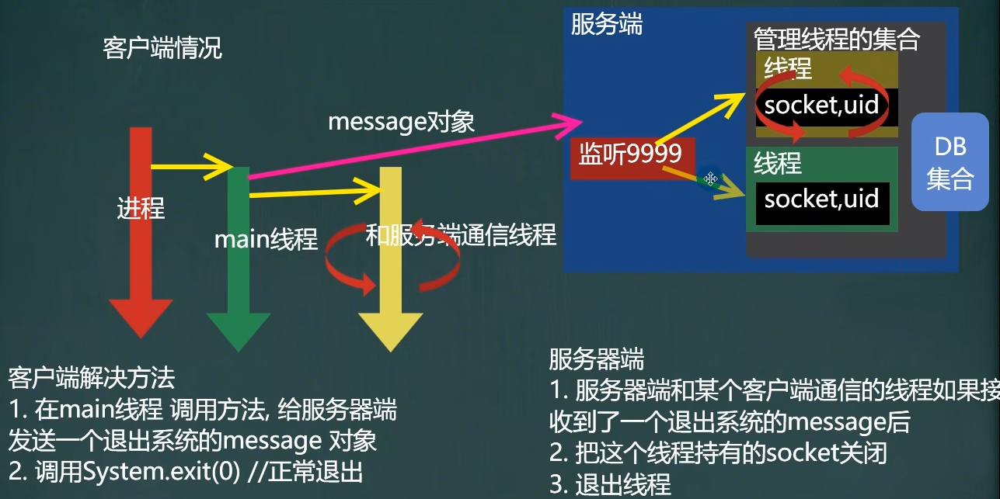
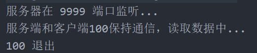

<h1 style="text-align: center; font-weight: bold;">无异常退出</h1>

---

##### 设计思路（<span style = "color:red;font-weight:bold">非常重要！！！</span>）


<span style = "color:red;font-size:30px;font-weight:bold;">阶段任务：解决用户退出抛出异常的问题</span>

#### 两个问题

- **用户端**：退出后进程没有退出
- **服务端**：由于用户端退出了，但是 socket 通道和线程仍未关闭，会<span style ="color:red;font-weight:bold">抛出大量的 IO 异常</span>

#### 思路分析



### （1）客户端

#### 1. 在 UserClientService 中编写退出方法，给服务器发送退出的信息

```java
//编写方法，退出客户端，并给服务端发送一个退出系统的message对象
public void logout() {
    // 构建 message 对象
    Message message = new Message();
    message.setMesType(MessageType.MESSAGE_CLIENT_EXIT);
    message.setSender(u.getUserId());//一定要指定我是哪个客户端id

    //发送message
    try {
        //ObjectOutputStream oos = new ObjectOutputStream(socket.getOutputStream());
        ObjectOutputStream oos =
                new ObjectOutputStream(ManagerClientConnectServerThread.getClientConnectServerThread(u.getUserId()).getSocket().getOutputStream());
        oos.writeObject(message);
        System.out.println(u.getUserId() + " 退出系统 ");
        System.exit(0);//结束进程
    } catch (IOException e) {
        e.printStackTrace();
    }
}
```

#### 2. 在主方法中调用

```java
case "9":
    //调用方法，给服务器发送一个退出系统的message
    userClientService.logout();
    loop = false;
    break;
```

### （2）服务端

思路：接收客户端退出的信息后，需要结束线程，同时把线程从集合中移除，并关闭 socket

#### 1. ManageClientThreads

**补充编写从线程中移除集合的方法**

```java
// 用户退出，线程结束，把线程从集合中取出
public static void removeServerConnectClientThread(String userId){
    hm.remove(userId);
}
```

#### 2. ServerConnectClientThread

**编写方法，结束线程并关闭 socket**

```java
@Override
    public void run() { // 线程，可以给客户端发送信息或者接收客户端的信息
        while (true) {
            System.out.println("服务端和客户端" + userId + "保持通信，读取数据中...");
            try {
                    ...

                // 接收用户端发送的信息，做相应的处理
                if (message.getMesType().equals(MessageType.MESSAGE_GET_ONLINE_FRIEND)) {
                    ...
                } else if (message.getMesType().equals(MessageType.MESSAGE_CLIENT_EXIT)){
                    System.out.println(message.getSender() + " 退出");
                    // 将线程从集合中移除
                    ManageClientThreads.removeServerConnectClientThread(message.getSender());
                    socket.close(); // 关闭连接
                    break; // 退出线程
                }
                else {
                    System.out.println("其他类型的message，暂时不处理");
                }
            } catch (Exception e) {
                e.printStackTrace();
            }
        }
    }
```

## 🎉 完结：功能测试 🎉

### 1. 客户端


### 2. 服务端


