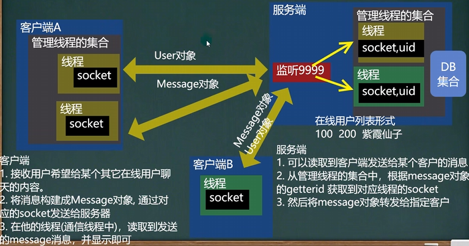
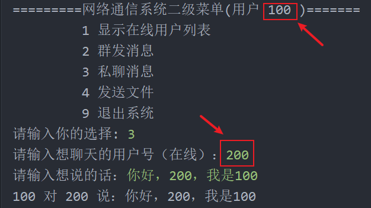
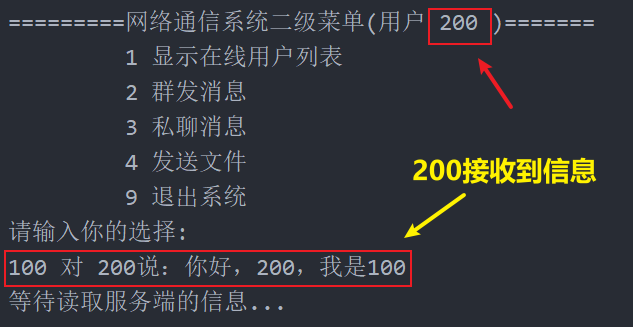

<h1 style="text-align: center; font-weight: bold;">私聊功能</h1>

---

##### 设计思路（<span style = "color:red;font-weight:bold">非常重要！！！</span>）


## 1. 私聊思路分析



## 2. 客户端

### MessageClientService

在 service 包下编写这个类，用于私聊功能

```java
package service;

import common.Message;
import common.MessageType;

import java.io.IOException;
import java.io.ObjectOutputStream;
import java.util.Date;

public class MessageClientService {

    // 私聊功能，发送信息
    public void sendMessageToOne(String content,String senderId,String getterId){
        Message message = new Message();
        message.setMesType(MessageType.MESSAGE_COMM_MES); // 设置消息类型
        message.setSender(senderId);
        message.setGetter(getterId);
        message.setContent(content);
        message.setSendTime(new Date().toString()); // 设置发送时间
        System.out.println(senderId + " 对 " + getterId + " 说 " + content);

        // 发送给服务端
        try {
            ObjectOutputStream oos = new ObjectOutputStream(ManagerClientConnectServerThread.getClientConnectServerThread(senderId).getSocket().getOutputStream());
            oos.writeObject(message);
        } catch (IOException e) {
            e.printStackTrace();
        }
    }
}

```

### QQView

私聊功能在用户界面上的实现

```java
// 私聊
private MessageClientService messageClientService = new MessageClientService();

 case "3":
    System.out.print("请输入想聊天的用户号（在线）：");
    String getterId = Utility.readString(50);
    System.out.print("请输入想说的话：");
    String content = Utility.readString(100);
    // 调用方法，把信息发送给服务器，服务器转发信息
    messageClientService.sendMessageToOne(content,userId,getterId);
    break;
```

### ClientConnectServerThread

接收到对方发来的信息，需要在控制台上显示

```java
    @Override
    public void run() {
        // 在后台和服务器通讯
        while (true){
            System.out.println("等待读取服务端的信息...");
            try {
                    ...
                // 接收服务器回送的信息：在线用户列表
                if(message.getMesType().equals(MessageType.MESSAGE_RET_ONLINE_FRIEND)){
                        ...
                    }
                }else if (message.getMesType().equals(MessageType.MESSAGE_COMM_MES)){
                    System.out.println("\n" + message.getSender() + " 对 " + message.getGetter() + "说：" + message.getContent());
                }
                else{
                    System.out.println("是其他类型的 message，暂时不处理...");
                }
            } catch (Exception e) {
                e.printStackTrace();
            }
        }
```

## 3. 服务端

**ServerConnectClientThread** 类中补充接收用户发来的信息，打包成 message 对象发给对方，同时**补充 getSocket()** 方法

```java
public Socket getSocket() {
    return socket;
}

 @Override
    public void run() { // 线程，可以给客户端发送信息或者接收客户端的信息
        while (true) {
            System.out.println("服务端和客户端" + userId + "保持通信，读取数据中...");
            try {
                    ...

                // 接收用户端发送的信息，做相应的处理
                if (message.getMesType().equals(MessageType.MESSAGE_GET_ONLINE_FRIEND)) {
                    ...

                } else if (message.getMesType().equals(MessageType.MESSAGE_CLIENT_EXIT)){
                    ...
                } else if (message.getMesType().equals(MessageType.MESSAGE_COMM_MES)){
                    // 根据 message 获取 userId
                    ServerConnectClientThread serverConnectClientThread = ManageClientThreads.getServerConnectClientThread(message.getGetter());
                    // 得到 socket 输出流，转发信息
                    ObjectOutputStream oos = new ObjectOutputStream(serverConnectClientThread.getSocket().getOutputStream());
                    oos.writeObject(message); // 转发信息
                }
                else {
                    System.out.println("其他类型的message，暂时不处理");
                }
            } catch (Exception e) {
                e.printStackTrace();
            }
        }
    }

```

## 🎉 完结：功能测试 🎉

### 1.客户端一



### 2. 客户端二


