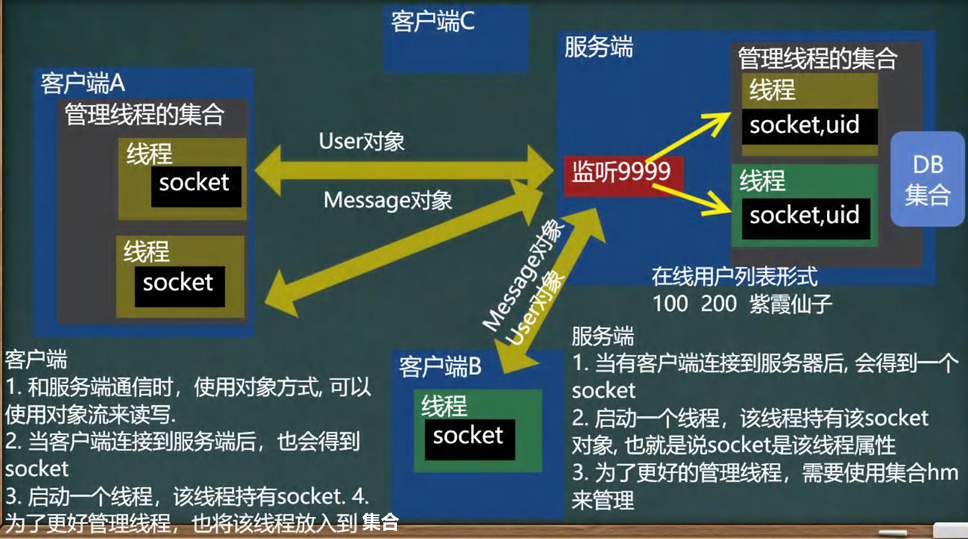
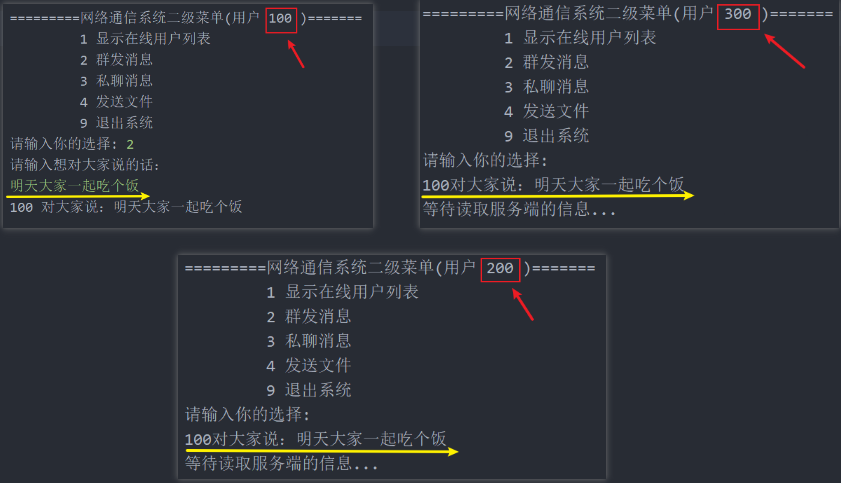

<h1 style="text-align: center; font-weight: bold;">群发功能</h1>

---

##### 设计思路（<span style = "color:red;font-weight:bold">非常重要！！！</span>）



## 思路分析

其实就是私聊功能的扩展，当服务端拿到 socket 之后，通过遍历集合里的所用线程（除了自己），通过线程拿到 socket，把信息发出去

## 1. 客户端

### MessageType

首先增加群发属性，<span style = "color:red;font-weight:bold">在客户端也是一样，拷贝一份即可</span>

```java
package common;

public interface MessageType {
    String MESSAGE_LOGIN_SUCCEED = "1"; // 表示登录成功
    String MESSAGE_LOGIN_FAIL = "2"; // 表示登录失败
    String MESSAGE_COMM_MES = "3"; //普通信息包
    String MESSAGE_GET_ONLINE_FRIEND = "4"; //要求返回在线用户列表
    String MESSAGE_RET_ONLINE_FRIEND = "5"; //返回的在线用户列表
    String MESSAGE_CLIENT_EXIT = "6"; //客户端请求退出
    String MESSAGE_TO_ALL_MES = "7"; // 群发消息
}
```

编写群发方法

### MessageClientService

```java
// 群发消息
public void sendMessageToAll(String content,String senderId){
    Message message = new Message();
    message.setMesType(MessageType.MESSAGE_TO_ALL_MES); // 设置消息类型
    message.setSender(senderId);
    message.setContent(content);
    message.setSendTime(new Date().toString()); // 设置发送时间
    System.out.println(senderId + " 对大家说：" + content);

    // 发送给服务端
    try {
        ObjectOutputStream oos = new ObjectOutputStream(ManagerClientConnectServerThread.getClientConnectServerThread(senderId).getSocket().getOutputStream());
        oos.writeObject(message);
    } catch (IOException e) {
        e.printStackTrace();
    }
```

### ClientConnectServerThread

在线程中接收群发的消息，同时打印在控制台

```java
@Override
public void run() {
    // 在后台和服务器通讯
    while (true){
        System.out.println("等待读取服务端的信息...");
        try {
                ...
            // 接收服务器回送的信息：在线用户列表
            if(message.getMesType().equals(MessageType.MESSAGE_RET_ONLINE_FRIEND)){
                ...
            }else if (message.getMesType().equals(MessageType.MESSAGE_COMM_MES)){
                ...
            }else if (message.getMesType().equals(MessageType.MESSAGE_TO_ALL_MES)) {
                System.out.println("\n" + message.getSender() + "对大家说：" + message.getContent());
            }
            else{
                System.out.println("是其他类型的 message，暂时不处理...");
            }
        } catch (Exception e) {
            e.printStackTrace();
        }
    }
}
```

## 2. 服务端

遍历线程集合，拿到 socket，把消息进行转发

### ManageClientThreads

```java
// 返回 hashmap
public static HashMap<String,ServerConnectClientThread> getHm() {
    return hm;
}
```

### ServerConnectClientThread

编写方法，返回集合

```java
else if (message.getMesType().equals(MessageType.MESSAGE_TO_ALL_MES)){
    // 群发消息：遍历集合，把所有线程的socket都得到，转发message即可
    HashMap<String, ServerConnectClientThread> hm = ManageClientThreads.getHm();
    Iterator<String> iterator = hm.keySet().iterator();
    while (iterator.hasNext()){
        String onLineUserId = iterator.next().toString();
        // 排除群发消息的用户
        if(!onLineUserId.equals(message.getSender())){
            ObjectOutputStream oos = new ObjectOutputStream(hm.get(onLineUserId).getSocket().getOutputStream());
            oos.writeObject(message);
        }
    }
}
```

## 🎉 完结：功能测试 🎉


