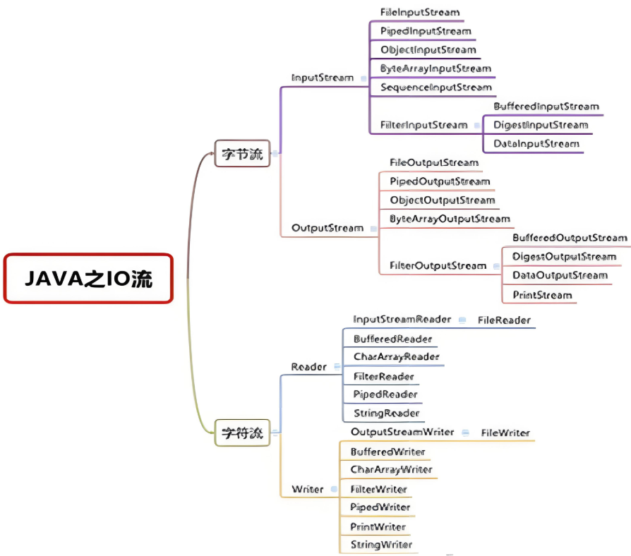
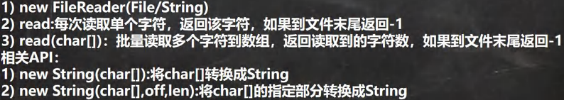
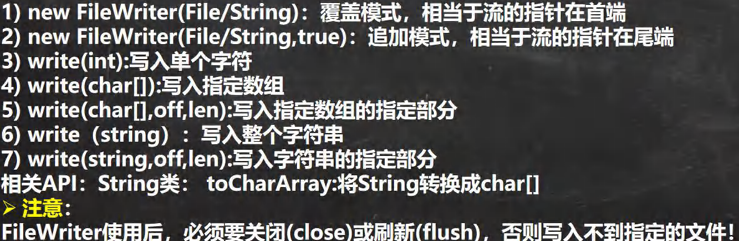

<h1 style="text-align: center; font-weight: bold;">IO流</h1>

---

## 一、基本介绍

- I/O 是 Input/Output 的缩写，I/O 技术是非常实用的技术，用于处理数据传输。如读 / 写文件，网络通讯等。

- <span style="color:red;font-weight:bold">Java 程序中，对于数据的输入 / 输出操作以 “流 (stream)” 的方式进行。</span>

- java.io 包下提供了各种 “流” 类和接口，用以获取不同种类的数据，并通过方法输入或输出数据

- 输入 input：读取外部数据（磁盘、光盘等存储设备的数据）到程序（内存）中。

- 输出 output：将程序（内存）数据输出到磁盘、光盘等存储设备中

## 二、流的分类

- 按**操作数据单位**不同分类
  - <span style="color:red;font-weight:bold">字节流</span>(8 bit)：二进制文件
  - <span style="color:red;font-weight:bold">字符流</span>(按字符)：文本文件
- 按**数据流**的流向分类
  - 输入流
  - 输出流
- 按**流的角色**的分类
  - 节点流
  - 处理流/包装流

| （抽象基类） | <span style="color:red;font-weight:bold">字节流</span> | <span style="color:red;font-weight:bold">字符流</span> |
| ------------ | ------------------------------------------------------ | ------------------------------------------------------ |
| 输入流       | **InputStream**                                        | **Reader**                                             |
| 输出流       | **OutputStream**                                       | **Writer**                                             |

说明

1. 以下四个类<span style="color:red;font-weight:bold">均为抽象类</span>

- **InputStream**
- **OutputStream**
- **Reader**
- **Writer**

2. Java 的 IO 流共涉及 40 多个类，实际上非常规则，都是从如上 4 个抽象基类派生的，由这四个类派生出来的**子类名称都是以其父类名作为子类名后缀**（命名特点---> 记忆方法）

## 三、IO 流体系图



### 1. 字节流

#### InputStream

- FileInputStream
- PipedInputStream
- ObjectInputStream
- ByteArrayInputStream
- SequenceInputStream
- FilterInputStream
  - BufferedInputStream
  - DataInputStream
  - DigestInputStream

#### OutputStream

- FileOutputStream
- PipedOutputStream
- ObjectOutputStream
- ByteArrayOutputStream
- FilterOutputStream
  - BufferedOutputStream
  - DataOutputStream
  - PrintStream

### 2. 字符流

#### Reader

- InputStreamReader
  - FileReader
- BufferedReader
- CharArrayReader
- PipedReader
- StringReader

#### Writer

- OutputStreamWriter
  - FileWriter
- BufferedWriter
- CharArrayWriter
- FilterWriter
- PipedWriter
- PrintWriter
- StringWriter

## 四、常用类

### 1. FileInputStream

方法介绍

- <span style="color:red;font-weight:bold">read() 方法</span>：当文件读取完成后方法会结束，<span style="color:red;font-weight:bold">返回 -1</span>

> --->**即我们可以通过接收返回值（整型）来判断文件是否读取完成**

- <span style="color:red;font-weight:bold">close()方法</span>：读取文件数据完成后，用于关闭资源

> - **close()**方法的使用<span style="color:red;font-weight:bold">会抛出异常</span>，需要**捕获或抛出**

**注意点**

- 该**FileInputStream**类的创建<span style="color:red;font-weight:bold">会抛出异常</span>，需要**捕获或抛出**
- 操作完成后需要**使用 close()方法，以免浪费资源**

#### （1）读取字符

```java
public class newFile {
    public static void main(String[] args) {
        String filePath = "C:\\Users\\jackson\\Desktop\\file.txt";
        int readData = 0;
        FileInputStream fileInputStream = null;  // 定义为全局变量，方便在后续使用
        try {
            fileInputStream  = new FileInputStream(filePath);
            System.out.print("文本的内容是：" );
            while ((readData = fileInputStream.read()) != -1) { // 边读边写
                System.out.print((char)readData);
            }
        } catch (IOException e) {
            e.printStackTrace();
        } finally {
            try {
                fileInputStream.close();
            } catch (IOException e) {
                e.printStackTrace();
            }
        }
    }
}

// 输出如下
文本的内容是：hello,world
```

代码分析

- 由于 **read()** 方法返回的是一个整数，然而我们的目的是读取字符，所以在输出的时候**强转为 char 类型**
- 两个异常需要捕获或者抛出
  - 创建 FileInputStream 对象
  - 调用 close()方法
- 缺点分析：一个一个字符的读取效率稍低，可以使用读取字符串数组的方式，一次性读取多个字符，提高读取效率

#### （2）读取数组

```java
public class newFile {
    public static void main(String[] args) {
        String filePath = "C:\\Users\\jackson\\Desktop\\file.txt";
        int readLength = 0;
        byte[] buf = new byte[8]; // 依次读取八个字符
        FileInputStream fileInputStream = null;  // 定义为全局变量，方便在后续使用
        try {
            fileInputStream  = new FileInputStream(filePath);
            System.out.print("文本的内容是：" );
            while ((readLength = fileInputStream.read(buf)) != -1) { // 边读边写
                System.out.print(new String(buf,0,readLength));
            }
        } catch (IOException e) {
            e.printStackTrace();
        } finally {
            try {
                fileInputStream.close();
            } catch (IOException e) {
                e.printStackTrace();
            }
        }
    }
}

// 输出如下
文本的内容是：hello,world
```

代码分析

- FileInputStream 读取的是**字节**流，所以创建 byte[]数组，代码中创建的数组大小为八，即一次性读取八个字节
- 由于读取过程中可能会导致最后的内容不满八个字节，为了不遗漏信息，用 readLen 来接收读取的字符，确保所有信息都会被读取
- 最后输出时调用 String 的构造器，**表示把这个数组中规定范围的字符转为字符串，然后输出**

### 2. FileOutputStream

两种构造器

- **new FileOutputStream(filePath)** 创建方式，当写入内容是，会<span style="color:red;font-weight:bold">覆盖</span>原来的内容
- **new FileOutputStream(filePath, <span style="color:red;font-weight:bold">true</span>)** 创建方式，当写入内容是，是<span style="color:red;font-weight:bold">追加</span>到文件后面

方法介绍

- <span style="color:red;font-weight:bold">write() 方法</span>：文件中写入内容

  - 写入一个字符
  - 写入字符串

> **注意**
>
> - **write(字符串数组，左区间，<span style="color:red;font-weight:bold">右区间（取不到）</span>)**
> - **指定写入字符串时：区间是左闭右开的**

- <span style="color:red;font-weight:bold">close()方法</span>：读取文件数据完成后，用于关闭资源

> - **close()**方法的使用<span style="color:red;font-weight:bold">会抛出异常</span>，需要**捕获或抛出**

- <span style="color:blue;font-weight:bold">补充方法：getBytes()，将字符串直接转为字符串数组</span>

**注意点**

- 该**FileOutputStream**类的创建<span style="color:red;font-weight:bold">会抛出异常</span>，需要**捕获或抛出**
- 操作完成后需要**使用 close()方法，以免浪费资源**

#### 写入字符

```java
public class newFile {
    public static void main(String[] args) {
        String filePath = "C:\\Users\\jackson\\Desktop\\file.txt";
        FileOutputStream fileOutputStream = null;
        try {
            fileOutputStream = new FileOutputStream(filePath);
            fileOutputStream.write('!');
        } catch (IOException e) {
            e.printStackTrace();
        } finally {
            try {
                fileOutputStream.close();
            } catch (IOException e) {
                e.printStackTrace();
            }
        }
    }
}
```

代码分析

- 调用了 **write()** 方法写入了一个感叹号`!`
- 两个异常需要捕获或者抛出
  - 创建 FileOutputStream 对象
  - 调用 close()方法

#### 写入字符串

调用 **getBytes()** 方法把字符串转成字符串数组

```java
public class newFile {
    public static void main(String[] args) {
        String filePath = "C:\\Users\\jackson\\Desktop\\file.txt";
        FileOutputStream fileOutputStream = null;
        try {
            // 采用追加的方式写入，不会覆盖先前的内容
            fileOutputStream = new FileOutputStream(filePath,true);
            String str = "hello,world!";
            fileOutputStream.write(str.getBytes());// 写入整个字符串
            fileOutputStream.write(str.getBytes(),0,5); // 写入字符串指定内容
        } catch (IOException e) {
            e.printStackTrace();
        } finally {
            try {
                fileOutputStream.close();
            } catch (IOException e) {
                e.printStackTrace();
            }
        }
    }
}
```

代码分析

- 首先调用 **getBytes()** 方法把字符串转成字符串数组
- 使用两钟不同的方法是写入字符串
  - 写入整个字符串
  - 写入字符串中的指定内容（<span style="color:red;font-weight:bold">注意：区间是左闭右开</span>）

### 应用：文件拷贝

题目要求：结合 FileInputStream 和 FileOutputStream 实现文件的拷贝

思路

- 使用输入流读取文件信息
- 使用输出流实现文件拷贝

#### 代码示例

```java
public class newFile {
    public static void main(String[] args) {
        String filePath = "C:\\Users\\jackson\\Desktop\\file.txt"; // 源文件路径
        String dirpath = "C:\\Users\\jackson\\Desktop\\file2.txt"; // 目标文件路径
        FileInputStream fileInputStream = null;
        FileOutputStream fileOutputStream = null;

        try {
            fileInputStream = new FileInputStream(filePath);
            fileOutputStream = new FileOutputStream(dirpath);
            int readLen = 0;
            byte[] buf = new byte[8]; // 一次性读八个字符，提高读取效率
            while ((readLen = fileInputStream.read(buf)) != -1){  // 首先读入内容
                fileOutputStream.write(buf,0,readLen); // 把读入的内容写到文件中
            }

        } catch (IOException e) {
            e.printStackTrace();
        } finally {
            // 关闭流
            try {
                if (fileInputStream != null) {
                    fileInputStream.close();
                }
                if (fileOutputStream != null) {
                    fileOutputStream.close();
                }
            } catch (IOException e) {
                e.printStackTrace();
            }
        }
    }
}
```

### 3. FileReader

说明：FileReader 和 FileWriter 与上面两种类似，区别就在于一个是**字节流**，一个是**字符流**，<span style="color:red;font-weight:bold">字符流可以读取汉字，不会出现乱码</span>



#### 代码示例

#### （1）读取单个字符

```java
public class newFile {
    public static void main(String[] args) {
        String filePath = "C:\\Users\\jackson\\Desktop\\file.txt";
        FileReader fileReader = null;
        try {
            int data;
            fileReader = new FileReader(filePath);
            while((data = fileReader.read()) != -1){
                System.out.print((char)data); // 输出的字符，但是read方法接收的是整数
            }
        } catch (IOException e) {
            e.printStackTrace();
        } finally {
            try {
                fileReader.close();
            } catch (IOException e) {
                e.printStackTrace();
            }
        }
    }
}
```

代码分析

- reader 是**字符流**，需要采用 char 数据类型（字节流采用的是 byte）
- read 方法接收的是整数，需要转成字符输出

#### （2）读取字符串数组

```java
public class newFile {
    public static void main(String[] args) {
        String filePath = "C:\\Users\\jackson\\Desktop\\file.txt";
        FileReader fileReader = null;
        int readLen = 0;
        char[] buf = new char[8]; // 字符流，应该是 char 类型，一次性读取八个字符
        try {

            fileReader = new FileReader(filePath);
            while((readLen = fileReader.read(buf)) != -1){ // 返回的是实际读取的字符数
                System.out.print(new String(buf,0,readLen)); // 输出的字符，但是read方法接收的是整数
            }
        } catch (IOException e) {
            e.printStackTrace();
        } finally {
            try {
                fileReader.close();
            } catch (IOException e) {
                e.printStackTrace();
            }
        }
    }
}

```

代码分析

- 通过构建字符串数组，提高读取效率
- 通过 readlen 来记录每次读取的长度，**转成字符串输出**

### 4. FileWriter



#### 代码示例

#### （1）写入字符

```java
public class newFile {
    public static void main(String[] args) {
        String filePath = "C:\\Users\\jackson\\Desktop\\file.txt"; // 源文件路径
        FileWriter fileWriter = null;
        try {
            fileWriter = new FileWriter(filePath,true); // 追加方式写入，不会覆盖内容
            fileWriter.write("好");
        } catch (IOException e) {
            e.printStackTrace();
        } finally {
            // 一定要关闭流才可以实现内容写入
            try {
                fileWriter.close();
            } catch (IOException e) {
                e.printStackTrace();
            }
        }
    }
}
```

代码分析：以追加的方式写入一个字符

#### （2）写入字符串和字符串数组

```java
public class newFile {
    public static void main(String[] args) {
        String filePath = "C:\\Users\\jackson\\Desktop\\file.txt"; // 源文件路径
        FileWriter fileWriter = null;
        String str = "非常好";
        char[] s = {'a','b','c'};
        try {
            fileWriter = new FileWriter(filePath,true); // 追加方式写入，不会覆盖内容
            fileWriter.write(str);
            fileWriter.write(s);
        } catch (IOException e) {
            e.printStackTrace();
        } finally {
            // 一定要关闭流才可以实现内容写入
            try {
                fileWriter.close();
            } catch (IOException e) {
                e.printStackTrace();
            }
        }
    }
}
```

#### （3）写入字符串的指定内容

注意：写入指定内容需要转成字符串数组，来指定区间，<span style= "color:red;font-weight:bold">左闭右开</span>

```java
public class newFile {
    public static void main(String[] args) {
        String filePath = "C:\\Users\\jackson\\Desktop\\file.txt"; // 源文件路径
        FileWriter fileWriter = null;
        String str = "吃饭了没";
        char[] s = {'a','b','c'};
        try {
            fileWriter = new FileWriter(filePath,true); // 追加方式写入，不会覆盖内容
            fileWriter.write(str.toCharArray(),0,2);
        } catch (IOException e) {
            e.printStackTrace();
        } finally {
            // 一定要关闭流才可以实现内容写入
            try {
                fileWriter.close();
            } catch (IOException e) {
                e.printStackTrace();
            }
        }
    }
}
```
