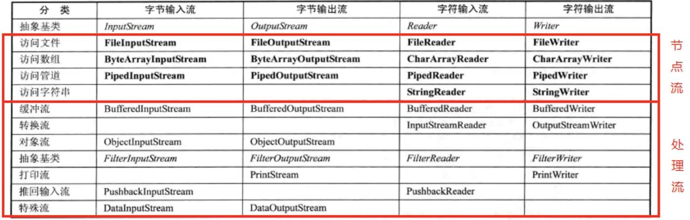
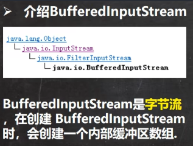
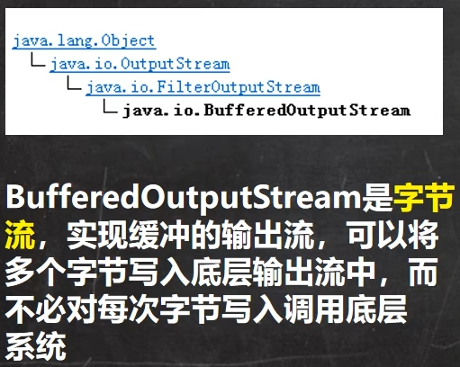

<h1 style="text-align: center; font-weight: bold;">节点流和处理流</h1>

---

## 一、基本介绍

### 1. 节点流

节点流可以从一个<span style= "color:red;font-weight:bold">特定的数据源</span>读写数据，如 FileReader、FileWriter

### 2. 处理流

处理流 (也叫**包装流**) 是 “连接” 在已存在的流（节点流或处理流）之上，为程序提供更为强大的读写功能，也更加灵活，如 BufferedReader、BufferedWriter



#### 小结

- 节点流的类型
  - 文件
  - 数组
  - 管道
  - 字符串
- 处理流的类型

### 3. 区别与联系

1. 节点流是底层流 / 低级流，直接跟数据源相接。

2. 处理流 (**包装流**) 包装节点流，既可以消除不同节点流的实现差异，也可以提供更方便的方法来完成输入输出。

3. 处理流 (也叫包装流) 对节点流进行包装，使用了<span style= "color:red;font-weight:bold">修饰器设计模式</span>，不会直接与数据源相连

### 4. 处理流的优势

1. 性能的提高：主要以增加缓冲的方式来提高输入输出的效率

2. **操作的便捷**：处理流可能提供了**一系列便捷的方法**来一次输入输出**大批量**的数据，使用更加灵活方便

## 二、字符处理流

### 1. BufferReader

1. 说明

- 首先是 Reader 的子类，读取的是**字符流**
- 这是一个**处理流/ 包装流**，需要在构造器中传入**子类对象**

2. 相关方法

<span style = "color:red;font-weight:bold">readline()</span>：读取行，提高了读取效率

**读取规则**

- 返回的是**字符串**，<span style = "color:red;font-weight:bold">需要用字符串接收</span>**并打印内容才可以看到读取的信息**
- 只要返回的**不为空**，则还**没有读取完成**

**注意：reaLine() 方法**<span style = "color:red;font-weight:bold">只会读取内容，不会读取换行符</span>

3. 资源关闭

只需要关闭**外层**即可，**底层会自动实现内层的关闭**

#### 代码示例

```java
public class newFile {
    public static void main(String[] args) throws IOException {
        String filePath = "C:\\Users\\jackson\\Desktop\\file.txt"; // 源文件路径
        BufferedReader bufferedReader = new BufferedReader(new FileReader(filePath));
        String line;
        // 读取规则，当readLine()方法返回的为空，则读取完成
        while((line = bufferedReader.readLine()) != null){
            System.out.println(line);
        }
        bufferedReader.close();
    }
}
```

代码分析：调用 **readLine()** 方法，只要不返回空，就一直读取，把读取的内容输出

### 2. BufferWriter

相关方法

- <span style= "color:red;font-weight:bold">newLine()</span>：**插入换行符**
- 如果要以**追加**的方式写入，需要在 **FileWriter** 中指定 **true 参数**，<span style= "color:red;font-weight:bold">BufferWriter 没有提供该构造器</span>

#### 代码示例

```java
public class newFile {
    public static void main(String[] args) throws IOException {
        String filePath = "C:\\Users\\jackson\\Desktop\\file.txt"; // 源文件路径
        BufferedWriter bufferedWriter = new BufferedWriter(new FileWriter(filePath,true));
        bufferedWriter.write("明天会更好");
        bufferedWriter.newLine();
        bufferedWriter.write("继续努力向前");
        bufferedWriter.close();
    }
}
```

### 3. 应用：文件拷贝

#### 代码示例

题目要求：给定源文件路径和目标文件路径，实现文件内容的拷贝

```java
public class newFile {
    public static void main(String[] args) {
        String srcPath = "C:\\Users\\jackson\\Desktop\\file.txt";
        String dirPath = "C:\\Users\\jackson\\Desktop\\file2.txt";

        BufferedReader bufferedReader = null;
        BufferedWriter bufferedWriter = null;

        String line;

        try {
            bufferedReader = new BufferedReader(new FileReader(srcPath));
            bufferedWriter = new BufferedWriter(new FileWriter(dirPath));

            // 注意：reaLine() 方法只会读取内容，不会读取换行符，需要手动处理
            while((line = bufferedReader.readLine()) != null){
                bufferedWriter.write(line);
                bufferedWriter.newLine();
            }
        } catch (IOException e) {
            e.printStackTrace();
        } finally {
            try {
                if(bufferedReader!=null){
                    bufferedReader.close();
                }
                if(bufferedWriter != null){
                    bufferedWriter.close();
                }
            } catch (IOException e) {
                e.printStackTrace();
            }
        }
    }
}
```

代码分析

- 使用输入流读取信息，使用输出流把信息写入文件实现拷贝操作
- 注意点：**readLine()** 方法只会读取内容，<span style = "color:red;font-weight:bold">不会读取换行符</span>，在拷贝操作时需要使用 **newLine()** 方法手动插入换行符

#### 小结

**BufferWriter** 和 **BufferReader** 都是<span style = "color:red;font-weight:bold">处理字符流的，不要去操作字节流文件</span>（即二进制文件：视频，声音，doc，pdf）

## 三、字节处理流

### 1. BufferedInputStream

方法：read() 方法，和 FileInputpuStream 中的 read() 方法 一样



### 2. BufferedOutputStream

方法：write() 方法，和 FileOutpuStream 中的 write() 方法 一样



### 应用：文件拷贝

#### 代码示例

```java
public class newFile {
    public static void main(String[] args) {
        String srcPath = "C:\\Users\\jackson\\Desktop\\file.txt";
        String dirPath = "C:\\Users\\jackson\\Desktop\\file2.txt";

        BufferedInputStream bufferedInputStream = null;
        BufferedOutputStream bufferedOutputStream = null;

        int data = 0;
        try {
            bufferedInputStream = new BufferedInputStream(new FileInputStream(srcPath));
            bufferedOutputStream = new BufferedOutputStream(new FileOutputStream(dirPath));

            while((data = bufferedInputStream.read()) != -1){
                bufferedOutputStream.write(data);
            }
        } catch (IOException e) {
            e.printStackTrace();
        } finally {
            try {
                if(bufferedInputStream != null){
                    bufferedInputStream.close();
                }
                if (bufferedOutputStream != null){
                    bufferedOutputStream.close();
                }
            } catch (IOException e) {
                e.printStackTrace();
            }
        }
    }
}
```

### 总结

##### 字节流既可以操作二进制文件，又可以操作文本文件（本质还是二进制文件）

## 四、对象处理流

### 1. 基本介绍

1. 应用场景：保存文件时需要保存**值和类型**
2. <span style = "color:red;font-weight:bold">序列化和反序列化</span>

- **序列化**就是在保存数据时，<span style = "color:red;font-weight:bold">保存</span>数据的**值和数据类型**
- **反序列化**就是在恢复数据时，<span style = "color:red;font-weight:bold">恢复</span>数据的**值和数据类型**
- 需要让某个对象**支持序列化机制**，则必须让其<span style = "color:red;font-weight:bold">类是可序列化</span>的，为了让某个类是可序列化的，<span style = "color:red;font-weight:bold">必须实现下列接口</span>
  - **Serializable**：这是一个<span style = "color:red;font-weight:bold">标记接口</span>，**没有方法**
  - **Externalizable**：该接口**有方法需要实现**，因此我们一般实现上面的 Serializable 接口

### 2. ObjectOutputStream

#### （1）相关方法

| 方法                                                         | 描述             |
| ------------------------------------------------------------ | ---------------- |
| <span style = "color:red;font-weight:bold">writeUTF()</span> | **写入字符串**   |
| **writeInt()**                                               | **写入整数**     |
| **writeChar()**                                              | **写入字符**     |
| **writeDouble()**                                            | **写入浮点数**   |
| **writeBoolean()**                                           | **写入布尔值**   |
| **writeObject()**                                            | **写入一个对象** |

#### （2）注意点

保存的内容不是纯文本，而是按照他的类型来保存的，打开保存后的文件可以看到文件内容是乱码的（**但是在反序列化的时候能够准确的输出值和类型**）

#### （3）代码示例

```java
public class newFile {
    public static void main(String[] args) {
        String srcPath = "C:\\Users\\jackson\\Desktop\\file.txt";
        ObjectOutputStream objectOutputStream = null;
        try { // 序列化，保存文件内容
            objectOutputStream = new ObjectOutputStream(new FileOutputStream(srcPath));

            // 由于类型是 Object，在底层会自动装箱
            objectOutputStream.writeUTF("你好"); // 写入字符串
            objectOutputStream.writeInt(10); // 写入整数
            objectOutputStream.writeChar('a'); // 写入字符
            objectOutputStream.writeDouble(1.25); // 写入浮点数
            objectOutputStream.writeBoolean(true); // 写入布尔值
            objectOutputStream.writeObject(new dog("jack", 18)); // 写入一个对象

        } catch (IOException e) {
            e.printStackTrace();
        } finally {
            try {
                objectOutputStream.close();
            } catch (IOException e) {
                e.printStackTrace();
            }
        }
    }
}

class dog implements Serializable{
    String name;
    int age;

    public dog(String name, int age) {
        this.name = name;
        this.age = age;
    }

    @Override
    public String toString() {
        return "dog{" +
                "name='" + name + '\'' +
                ", age=" + age +
                '}';
    }
}
```

代码分析

- **首先要实现序列化，类都必须实现 Serializable 接口或者是 Externalizable 接口**
- 对于方法的理解：由于该类是 Object 的，所以**调用的方法**都是包装类，**底层会实现自动装箱机制**

### 3. ObjectInputStream

#### （1）相关方法

| 方法                                                        | 描述             |
| ----------------------------------------------------------- | ---------------- |
| <span style = "color:red;font-weight:bold">readUTF()</span> | **写入字符串**   |
| **readInt()**                                               | **写入整数**     |
| **readChar()**                                              | **写入字符**     |
| **readDouble()**                                            | **写入浮点数**   |
| **readBoolean()**                                           | **写入布尔值**   |
| **readObject()**                                            | **写入一个对象** |

#### （2）注意点

- <span style = "color:red;font-weight:bold">读取（反序列化）的顺序要和保存的数许（序列化）的顺序一致，否则会抛出异常</span>

- **readObject() 方法会有异常**，这里需要抛出或者捕获

- 如果希望<span style = "color:red;font-weight:bold">读取 dog 对象或者调用 dog 的方法，需要向下转型</span>，**同时需要将 dog 类的定义拷贝到可以引用的位置**

#### （3）代码示例

```java
public class newFile {
    public static void main(String[] args) throws ClassNotFoundException {
        String srcPath = "C:\\Users\\jackson\\Desktop\\file.txt";
        ObjectInputStream objectInputStream = null;
        try { // 序列化，保存文件内容
            objectInputStream = new ObjectInputStream(new FileInputStream(srcPath));

            // 由于类型是 Object，在底层会自动装箱
            System.out.println(objectInputStream .readUTF()); // 写入字符串
            System.out.println(objectInputStream .readInt()); // 写入整数
            System.out.println(objectInputStream .readChar()); // 写入字符
            System.out.println(objectInputStream .readDouble()); // 写入浮点数
            System.out.println(objectInputStream .readBoolean()); // 写入布尔值
            System.out.println(objectInputStream .readObject()); // 写入一个对象

            // 读取对象或者调用对象的方法需要-->向下转型
            dog tom = new dog("tom", 5);
            dog dog_ = (dog)objectInputStream.readObject();
            String name = dog_.getName();
            int age = dog_.getAge();
            System.out.println("dog_的信息是\nname：" + name + "\nage：" + age);

        } catch (IOException e) {
            e.printStackTrace();
        } finally {
            try {
                objectInputStream.close();
            } catch (IOException e) {
                e.printStackTrace();
            }
        }
    }
}

class dog implements Serializable {
    String name;
    int age;

    public dog(String name, int age) {
        this.name = name;
        this.age = age;
    }

    public String getName() {
        return name;
    }

    public void setName(String name) {
        this.name = name;
    }

    public int getAge() {
        return age;
    }

    public void setAge(int age) {
        this.age = age;
    }

    @Override
    public String toString() {
        return "dog{" +
                "name='" + name + '\'' +
                ", age=" + age +
                '}';
    }
}
```

### 4. 注意事项

1. **读写顺序要一致**
2. 要求实现序列化或反序列化对象，<span style = "color:red;font-weight:bold">需要实现 Serializable 接口</span>
3. **序列化的类中建议添加 SerialVersionUID, 为了提高版本的兼容性**（修改对象的内容后，就不会认为是不同的对象而报错）
4. 序列化对象时，默认将里面所有属性都进行序列化，但是**static 或 transient 修饰的成员不会被序列化**
5. 序列化对象时，要求里面<span style = "color:red;font-weight:bold">属性的类型也需要实现序列化接口</span>
6. 序列化具备**可继承性**，也就是如果某类已经实现了序列化，则它的所有子类也已经默认实现了序列化

##### 代码示例：添加 SerialVersionUID 属性

```java
class dog implements Serializable {
    private name;
    private age;

    // 序列化的版本号，可以提高兼容性
    private static final long serialVersionUID = 1L;
    ...
}
```
