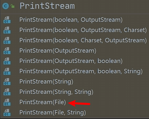
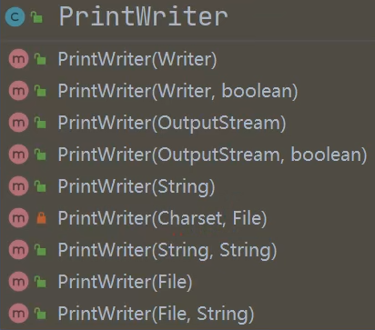

<h1 style="text-align: center; font-weight: bold;">打印流</h1>

---

## 一、介绍

- 注意：**只有打印流，没有输入流**
- **PrintStream**

  - 字节打印流，如果使用 <span style = "color:red;font-weight:bold">write()</span> 方法写入字符串需要调用 <span style = "color:red;font-weight:bold">getBytes()</span> 方法

  - <span style = "color:red;font-weight:bold">调用 print() / println() 方法完成打印</span>

- **PrintWriter**：字符打印流
- 应用场景：<span style = "color:red;font-weight:bold">可以指定地方写入内容</span>，默认是将内容打印在控制台
- 提供了相关构造器，可以指定文件路径





## 二、PrintStream

##### 注意：如果使用 <span style = "color:red;font-weight:bold">write()</span> 方法写入字符串需要调用 <span style = "color:red;font-weight:bold">getBytes()</span> 方法

#### 代码示例 1

#### 使用 PrintStream 提供的 <span style = "color:red;font-weight:bold">print() / println()</span> 方法

```java
public class newFile {
    public static void main(String[] args) throws IOException {
        String filePath = "C:\\Users\\jackson\\Desktop\\file.txt";
        PrintStream printStream = new PrintStream(filePath);
        String info = "你好，Java";
        printStream.println(info);
        printStream.close();
    }
}
```

代码分析：通过调用打印流的构造器，传入文件路径，实现了变化打印内容的位置

## 三、PrintWriter

#### 注意：一定要<span style = "color:red;font-weight:bold">关流</span>才可以成功打印，否则文件为空

#### 代码示例

```java

public class newFile {
    public static void main(String[] args) throws IOException {
        String filePath = "C:\\Users\\jackson\\Desktop\\file.txt";
        PrintWriter printWriter = new PrintWriter(filePath);
        String info = "加油";
        printWriter.println(info);
        printWriter.close();
    }
}
```

## 四、System 方法补充

提供了 <span style = "color:red;font-weight:bold">setOut()</span> 方法，可以修改打印内容的目标（默认是在控制台）

#### 代码示例

```java
public class newFile {
    public static void main(String[] args) throws IOException {
        String filePath = "C:\\Users\\jackson\\Desktop\\file.txt";
        PrintStream printStream = new PrintStream(filePath);
        System.setOut(printStream); // 此时打印目标指向该文件
        System.out.println("成功打印");
        printStream.close();
    }
}
```

代码分析

- 调用打印流的构造器，传入一个文件路径
- 通过 setOut()方法改变内容打印的位置
