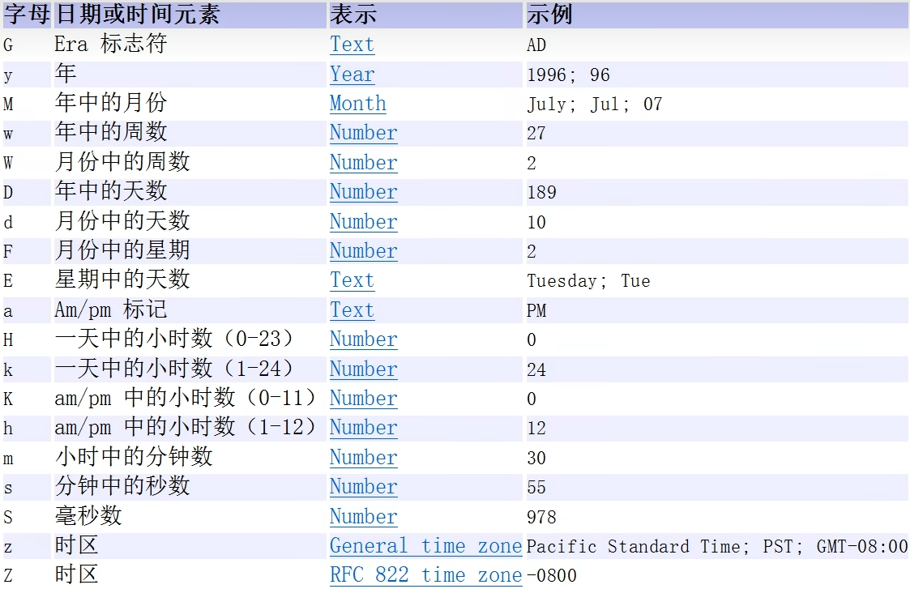

# 日期类

# 第一代日期类：Date

## 引入包

- ## `import java.text.ParseException`：日期转换可能会抛出转换异常
- ## `import java.text.SimpleDateFormat`
- ## `import java.util.Date`

## 1. 基本介绍

- ## Date：精确到毫秒，代表特定的瞬间
- ## SimpleDateFormat：格式化和解析日期
  - ## 日期 --> 文本（`format`方法）
  - ## 文本 --> 日期（`parse`方法）

## 2. Date 格式化的参数表



## 3. 方法介绍

## （1）Date

- ## 调用无参构造器：获取当前时间
- ## 传入数值（单位是毫秒）：计算从`1970 - 1 - 1 00:00:00`开始，经过传入数值（毫秒）后的时间

## （2）SimpleDateFormat

- ## 创建该对象，传入格式化的字符串（`yyyy 年 MM 月 dd 日 hh:mm:ss E`）
- ## `format`方法：实现日期的格式化
- ## `parse`方法：字符串转日期
  - ## ==注意点==
    - ## （1）输出时会按照国外的形式输出，如果希望指定格式输出，需要使用`format`方法格式化
    - ## （2）==String 中的格式必须和`SimpleDateFormat`中传入构造器的字符串格式一样==，否则会抛出转换异常，==需要在该类中添加`throws ParseException`==

## 代码示例

```java
import java.text.ParseException;
import java.text.SimpleDateFormat;
import java.util.Date;

public class main {
    public static void main(String[] args) throws ParseException {
        Date date = new Date();
        System.out.println("date：" + date);

        Date date1 = new Date(89875);
        System.out.println("date1：" + date1);

        // 使用 SimpleDateFormat 来格式化日期（Date --> String）
        SimpleDateFormat sf = new SimpleDateFormat("yyyy 年 MM 月 dd 日 hh:mm:ss E");
        String format_date = sf.format(date);
        System.out.println("Formatted date: " + format_date);

        // String --> Date
        String s = "1996 年 01 月 01 日 10:20:30 星期一";
        Date String_to_Date = sf.parse(s);
        System.out.println("parse = " + sf.format(String_to_Date));
    }
}

// 输出结果
date：Sun Jun 08 17:51:23 CST 2025
date1：Thu Jan 01 08:01:29 CST 1970
Formatted date: 2025 年 06 月 08 日 05:51:23 星期日
parse = 1996 年 01 月 01 日 10:20:30 星期一
```

---

# 二、第二代日期类：Calendar

## 引入包：`java.util.Calendar`

## 基本介绍

- ## `Calendar` 类是一个==抽象类==，构造器是`private`，即==不可以创建该对象==，通过`getinstance()`方法来获取该对象实例
- ## 它为特定时间与一组诸如 `YEAR`, `MONTH`, `DAY_OF_MONTH`, `HOUR` 等日历字段之间的转换提供了一些方法，并操作日历字段
- ## ==注意==：`Calendar`类没有专门的日期格式化方法，需要自己通过==获取字段，用组合的方式实现日期格式化==（使用`get()`方法）

## 常用字段

| 字段          | 描述                                     |
| ------------- | ---------------------------------------- |
| YEAR          | 年份                                     |
| MONTH         | 月份（0-11） ==从 0 开始编号==           |
| DAY_OF_MONTH  | 当前月的天数                             |
| HOUR          | 当前小时（0-23）                         |
| MINUTE        | 当前分钟（0-59）                         |
| SECOND        | 当前秒数（0-59）                         |
| DAY_OF_WEEK   | 一周中的某一天（1-7，1 代表星期天）      |
| WEEK_OF_YEAR  | 一年的第几周                             |
| WEEK_OF_MONTH | 当前月的第几周                           |
| AM_PM         | 上午或下午（==0 为上午==，==1 为下午==） |

## 获取当前时间：`getTime()`方法

```java
Calendar date = Calendar.getInstance();

// 输出当前日期时间
System.out.println("日期：" + date.getTime());
```

## 代码示例

```java
package arrays;

import java.util.Calendar;

public class main {
    public static void main(String[] args) {
        Calendar date = Calendar.getInstance();

        // 输出当前日期时间
        System.out.println("=====输出当前日期时间=====");
        System.out.println("日期：" + date.getTime());
        System.out.println();

        // 输出年、月、日、时、分、秒等信息
        System.out.println("=====输出年、月、日、时、分、秒等信息=====");
        System.out.println("年：" + date.get(Calendar.YEAR));
        System.out.println("月：" + (date.get(Calendar.MONTH) + 1)); // 月份是从0开始的，所以要加1
        System.out.println("日：" + date.get(Calendar.DAY_OF_MONTH));
        System.out.println("小时：" + date.get(Calendar.HOUR_OF_DAY)); // 24小时制
        System.out.println("分钟：" + date.get(Calendar.MINUTE));
        System.out.println("秒：" + date.get(Calendar.SECOND));
        System.out.println();

        // 拼接年月日时分秒
        System.out.println("=====拼接年月日时分秒=====");
        String currentDateTime = date.get(Calendar.YEAR) + "年"
                + (date.get(Calendar.MONTH) + 1) + "月"
                + date.get(Calendar.DAY_OF_MONTH) + "日 "
                + date.get(Calendar.HOUR_OF_DAY) + ":"
                + date.get(Calendar.MINUTE) + ":"
                + date.get(Calendar.SECOND);

        System.out.println("当前时间：" + currentDateTime);
        System.out.println();

        // 输出一周中的某一天、周数等
        System.out.println("=====输出一周中的某一天、周数等=====");
        System.out.println("星期几：" + date.get(Calendar.DAY_OF_WEEK)); // 1代表星期天，7代表星期六
        System.out.println("一年中的第几周：" + date.get(Calendar.WEEK_OF_YEAR));
        System.out.println("当前月的第几周：" + date.get(Calendar.WEEK_OF_MONTH));
        System.out.println();

        // 输出上午下午信息
        System.out.println("=====输出上午下午信息=====");
        System.out.println("上午 / 下午：" + (date.get(Calendar.AM_PM)));
    }
}

// 输出结果
=====输出当前日期时间=====
日期：Sun Jun 08 18:14:53 CST 2025

=====输出年、月、日、时、分、秒等信息=====
年：2025
月：6
日：8
小时：18
分钟：14
秒：53

=====拼接年月日时分秒=====
当前时间：2025年6月8日 18:14:53

=====输出一周中的某一天、周数等=====
星期几：1
一年中的第几周：24
当前月的第几周：2

=====输出上午下午信息=====
上午 / 下午：1

```

---

# 三、第三代日期类

## 引入包

- ## `java.time.LocalDateTime`
- ## `java.time.LocalDate`
- ## `java.time.LocalTime`
- ## `java.time.format.DateTimeFormatter`

## 1. 引言

## ==前面两代==日期类的==不足==分析

## JDK 1.0 中包含了一个 java.util.Date 类，但是它的大多数方法已经在 JDK 1.1 引入 Calendar 类之后被弃用了。而`Calendar`也==存在问题==是：

- ## （1） ==可变性==：像日期和时间这种类别应该是不可变的。
- ## （2） ==偏移性==：Date 中的年份是从 1900 开始的，而月份都从 0 开始。
- ## （3） ==格式化==：格式化只对`Date`有效，`Calendar`则不行。
- ## （4） 此外，它们也==不是线程安全==的；不能处理时区秒等（每隔 2 天，多出 1s）。

## 2. 常用类

## （1）==时间的表示==

- ## `LocalDate`：用于表示没有时间部分的日期（年、月、日）。例如：2025-06-08。

- ## `LocalTime`：用于表示没有日期部分的时间（小时、分钟、秒）。例如：17:30:00。

- ## `LocalDateTime`： 用于表示日期和时间。可以精确到秒或纳秒。例如：2025-06-08T17:30:00。
- ## `get...()`方法：==获取相应的时间信息==

## 补充：==时间的创建==

| 方法名                                             | 描述                                                                  |
| -------------------------------------------------- | --------------------------------------------------------------------- |
| `LocalTime.of(hour, minute)`                       | 创建一个表示特定时间的 `LocalTime` 对象（包含小时、分钟）。           |
| `LocalTime.of(hour, minute, second)`               | 创建一个表示特定时间的 `LocalTime` 对象（包含小时、分钟和秒）。       |
| `LocalTime.of(hour, minute, second, nanoOfSecond)` | 创建一个表示特定时间的 `LocalTime` 对象（包含小时、分钟、秒和纳秒）。 |

## （2）==日期的计算==

## 适用于`LocalDate`、`LocalTime`、`LocalDateTime`

| 方法                                 | 解释                                                         |
| ------------------------------------ | ------------------------------------------------------------ |
| `plusDays(long daysToAdd)`           | 将指定的天数加到当前日期（`LocalDate`、`LocalDateTime`）。   |
| `minusDays(long daysToSubtract)`     | 从当前日期（`LocalDate`、`LocalDateTime`）中减去指定的天数。 |
| `plusMonths(long monthsToAdd)`       | 将指定的月数加到当前日期（`LocalDate`、`LocalDateTime`）。   |
| `minusMonths(long monthsToSubtract)` | 从当前日期（`LocalDate`、`LocalDateTime`）中减去指定的月数。 |
| `plusYears(long yearsToAdd)`         | 将指定的年数加到当前日期（`LocalDate`、`LocalDateTime`）。   |
| `minusYears(long yearsToSubtract)`   | 从当前日期（`LocalDate`、`LocalDateTime`）中减去指定的年数。 |

## ==补充类==

- ## `Period`: ==常用==于计算两个==日期之间==的差异
  - ## 年：`getYears()`方法
  - ## 月：`getMonths()`方法
  - ## 日：`getDays()`方法
- ## `Duration`: ==常用==于计算==两个时间点==之间的差异
  - ## 时：`toHours()`方法
  - ## 分：`toMinutes()`方法
  - ## 秒：`getSeconds()`方法
- ## 使用说明：使用`beteween(起始时间，结束时间)`创建间隔时间，使用对应的方法获取时间差信息

## 关于`between()`方法==传参问题==的说明

## （1）`Period.between()`方法

| 方法名             | 传入参数类型 | 适用情况                     | 说明                                                                      |
| ------------------ | ------------ | ---------------------------- | ------------------------------------------------------------------------- |
| `Period.between()` | `LocalDate`  | 用于计算日期差（年、月、日） | 只能用于 `LocalDate` 类型的日期之间的差异。无法处理时间差（时、分、秒）。 |

## （2）`Duration.between()`方法

| 方法名               | 传入参数类型                                             | 适用情况                     | 说明                                                                                                            |
| -------------------- | -------------------------------------------------------- | ---------------------------- | --------------------------------------------------------------------------------------------------------------- |
| `Duration.between()` | `Temporal`（如 `LocalTime`, `LocalDateTime`, `Instant`） | 用于计算时间差（时、分、秒） | `Temporal` 是一个接口，`LocalTime`、`LocalDateTime` 和 `Instant` 实现了此接口，可以用于计算这三者之间的时间差。 |

## （3）==日期的格式化==：`DateTimeFormatter`类（==不可变且线程安全的类==）

## （4）==时间戳==

- ## `Instant`: 用于表示==时间戳==，通常与 UTC 时间一起使用，精确到纳秒。例如：2025-06-08T09:30:00Z。
- ## `from()`方法：`Instant`转`Date`
- ## `toInstant()`方法：`Date`转`Instant`

## 3. `get...()`方法整理

## 注意：`java.time` 类库中的 `get()` 方法==返回的是真实数据==，==并且不会从 0 开始编号==

| 方法                        | 描述                                          |
| --------------------------- | --------------------------------------------- |
| **年月日相关**              |                                               |
| `getYear()`                 | 获取当前年份                                  |
| `getMonthValue()`           | 获取当前月份（==1-12==）                      |
| `getMonth()`                | 获取当前月份的==名称==                        |
| `getDayOfMonth()`           | 获取==当前日期==（1-31）                      |
| `getDayOfYear()`            | 获取==当前日期是今年的第几天==（1 - 365/366） |
| `getDayOfWeek().getValue()` | 获取当前星期几（1=星期一, 7=星期天）          |
| **时分秒相关**              |                                               |
| `getHour()`                 | 获取当前小时（0-23）                          |
| `getMinute()`               | 获取当前分钟（0-59）                          |
| `getSecond()`               | 获取当前秒数（0-59）                          |

---

# 一、时间的表示：代码示例

## 说明：`LocalDate`和`LocalTime`方法类似（==需要导入相关的包==），这以`LocalDateTime`为例

```java
import java.time.LocalDateTime;

public class main {
    public static void main(String[] args) {
        LocalDateTime now = LocalDateTime.now();

        // 年月日相关
        System.out.println("当前年份: " + now.getYear());
        System.out.println("当前月份（1-12）: " + now.getMonthValue());
        System.out.println("当前月份名称: " + now.getMonth());
        System.out.println("当前日期（1-31）: " + now.getDayOfMonth());
        System.out.println("当前日期是今年的第几天: " + now.getDayOfYear());
        System.out.println("当前星期几（1=星期一, 7=星期天）: " + now.getDayOfWeek().getValue());

        // 时分秒相关
        System.out.println("当前小时（0-23）: " + now.getHour());
        System.out.println("当前分钟（0-59）: " + now.getMinute());
        System.out.println("当前秒数（0-59）: " + now.getSecond());
    }
}

// 输出信息
当前年份: 2025
当前月份（1-12）: 6
当前月份名称: JUNE
当前日期（1-31）: 8
当前日期是今年的第几天: 159
当前星期几（1=星期一, 7=星期天）: 7
当前小时（0-23）: 19
当前分钟（0-59）: 55
当前秒数（0-59）: 59
```

---

# 二、日期的格式化：代码示例

- ## 1. ==调用`ofPattern()`方法传入格式化信息的字符串==，创建`DateTimeFormatter`类对象
- ## 2. 调用方法
  - ## `format`：日期格式化为字符串
  - ## `parse`：字符串转为日期

> ## 补充：类比记忆`Date`中的格式化
>
> ## 调用`SimpleDateFormat`的==构造器传入格式化信息的字符串==

## （1）`format`代码示例

```java
import java.time.LocalDateTime;
import java.time.format.DateTimeFormatter;

public class main {
    public static void main(String[] args) {
        LocalDateTime now  = LocalDateTime.now();

        // 创建格式化对象
        DateTimeFormatter dtf = DateTimeFormatter.ofPattern("yyyy-MM-dd HH:mm:ss E");

        // 格式化字符串
        String format_date = dtf.format(now);

        // 输出格式化后的时间信息
        System.out.println(format_date);
    }
}

// 输出示例
2025-06-08 20:14:56 星期日
```

## （2）`parse`代码示例

## 传参：`parse(n1，n2)`

- ## n1 ： 要解析的字符串
- ## n2：`DateTimeFormatter`对象（==用于指定解析的格式==）

## ==注意==：被格式化字符串要和格式化信息匹配，否则会抛出异常（`DateTimeParseException`）

```java
import java.time.LocalDateTime;
import java.time.format.DateTimeFormatter;

public class main {
    public static void main(String[] args) {
        String str_datetime = "2025-06-08 14:30:00";

        // 创建格式化对象
        DateTimeFormatter dtf = DateTimeFormatter.ofPattern("yyyy-MM-dd HH:mm:ss");

        // String --> LocalDateTime
        LocalDateTime localDateTime = LocalDateTime.parse(str_datetime,dtf);

        System.out.println(localDateTime);
    }
}

// 输出结果
2025-06-08T14:30
```

---

# 三、日期的计算：代码示例

## （1）对于`LocalDateTime`、`LocalDate`、`LocalTime`的计算方法

```java
import java.time.LocalDateTime;
import java.time.format.DateTimeFormatter;

public class main {
    public static void main(String[] args) {
        // 获取当前时间
        LocalDateTime now = LocalDateTime.now();

        // 定义日期格式化器
        DateTimeFormatter formatter = DateTimeFormatter.ofPattern("yyyy-MM-dd HH:mm:ss");

        // 格式化当前日期
        String formattedDate = now.format(formatter);
        System.out.println("当前日期和时间（格式化）: " + formattedDate);

        // 添加和减去天数并格式化
        LocalDateTime newDate = now.plusDays(10);
        System.out.println("加10天后的日期（格式化）: " + newDate.format(formatter));

        newDate = now.minusDays(5);
        System.out.println("减去5天后的日期（格式化）: " + newDate.format(formatter));

        // 添加和减去月数并格式化
        newDate = now.plusMonths(3);
        System.out.println("加3个月后的日期（格式化）: " + newDate.format(formatter));

        newDate = now.minusMonths(2);
        System.out.println("减去2个月后的日期（格式化）: " + newDate.format(formatter));

        // 添加和减去年数并格式化
        newDate = now.plusYears(1);
        System.out.println("加1年后的日期（格式化）: " + newDate.format(formatter));

        newDate = now.minusYears(4);
        System.out.println("减去4年后的日期（格式化）: " + newDate.format(formatter));
    }
}

// 输出结果
当前日期和时间（格式化）: 2025-06-08 20:48:42
加10天后的日期（格式化）: 2025-06-18 20:48:42
减去5天后的日期（格式化）: 2025-06-03 20:48:42
加3个月后的日期（格式化）: 2025-09-08 20:48:42
减去2个月后的日期（格式化）: 2025-04-08 20:48:42
加1年后的日期（格式化）: 2026-06-08 20:48:42
减去4年后的日期（格式化）: 2021-06-08 20:48:42
```

## （2）Period 代码示例

```java
import java.time.LocalDate;
import java.time.Period;

public class PeriodExample {
    public static void main(String[] args) {
        LocalDate startDate = LocalDate.of(2020, 1, 1);
        LocalDate endDate = LocalDate.of(2025, 6, 8);

        Period period = Period.between(startDate, endDate);

        System.out.println("期间：");
        System.out.println("年: " + period.getYears());
        System.out.println("月: " + period.getMonths());
        System.out.println("日: " + period.getDays());
    }
}

// 输出结果
期间：
年: 5
月: 5
日: 7
```

## （3）Duration 代码示例

```java
import java.time.Duration;
import java.time.LocalDateTime;

public class DurationExample {
    public static void main(String[] args) {
        LocalDateTime startTime = LocalDateTime.of(2025, 6, 8, 10, 30, 0);
        LocalDateTime endTime = LocalDateTime.of(2025, 6, 9, 12, 45, 0);

        Duration duration = Duration.between(startTime, endTime);

        System.out.println("持续时间：");
        System.out.println("小时: " + duration.toHours());
        System.out.println("分钟: " + duration.toMinutes());
        System.out.println("秒: " + duration.getSeconds());
    }
}

// 运行结果
持续时间：
小时: 26
分钟: 1575
秒: 94500
```

## （4）==综合计算年月日时分秒的差值==

## `Period`类和`Duration`类的综合使用

## 注意点：==注意取模==

```java
import java.time.Duration;
import java.time.LocalDateTime;
import java.time.Period;


public class main {
    public static void main(String[] args) {
        // 定义两个时间点
        LocalDateTime start = LocalDateTime.of(2025, 6, 1, 14, 30, 0);
        LocalDateTime end = LocalDateTime.of(2025, 6, 8, 18, 45, 30);

        // 计算日期差（年月日）
        Period period = Period.between(start.toLocalDate(), end.toLocalDate());

        // 计算时分秒差（从完整的时间差中提取）
        Duration duration = Duration.between(start, end);

        // 计算日期差（年、月、天）
        int years = period.getYears();
        int months = period.getMonths();
        int days = period.getDays();

        // 计算时间差（时、分、秒）
        long hours = duration.toHours() % 24; // 剩余小时
        long minutes = duration.toMinutes() % 60; // 剩余分钟
        long seconds = duration.getSeconds() % 60; // 剩余秒数

        // 输出日期差（年、月、天）
        System.out.println("日期差： " + years + "年 " + months + "月 " + days + "天");

        // 输出时间差（时、分、秒）
        System.out.println("时分秒差： " + hours + "小时 " + minutes + "分钟 " + seconds + "秒");
    }

// 运行结果
日期差： 0年 0月 7天
时分秒差： 4小时 15分钟 30秒
```

---

# 四、时间戳：代码示例

```java
import java.time.Instant;
import java.util.Date;

public class main {
    public static void main(String[] args) {
        // 获取当前时间戳
        Instant instant_now = Instant.now();
        System.out.println("instant_now：" + instant_now);

        // Instant --> Date
        Date date = Date.from(instant_now);
        System.out.println("date：" + date);

        // Date --> instant
        Instant date_to_instant = date.toInstant();
        System.out.println(date_to_instant);
    }
}
```
