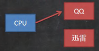
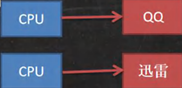

# 线程基础

# 一、基本概念

## 1. 程序

## 是为完成特定任务，用某种语言编写的一组指令的集合（即代码）

## 2. 进程

## （1）进程是程序的一次执行过程，或是正在运行的一个程序，是==动态过程==（有它自身的产生，存在和消亡的过程）

## （2）进程的启动==会占用相应的资源==（CPU、内存等）

## （3）通俗理解：进程是指运行的程序，启动一个程序（打开一个软件）的过程就是启动一个进程，关闭程序的过程就是进程的消亡过程

## 3. 线程

## （1）线程是由进程创建的，==是进程的一个实体==

## （2）一个进程==可以拥有多个线程==

## （3）举例：百度网盘同时下载多个文件，这就是==多线程==

## 4. 单线程

## 同一个时刻，只允许执行一个进程

## 5. 多线程

## 同一个时刻，可以执行多个线程（举例：QQ 可以同时打开多个聊天窗口）

## 6. 并发

## （1）同一个时刻，多个任务交替执行，造成一种 “ 貌似同时 ” 的错觉

## （2）实例：单核 CPU 实现的多任务就是并发



## 解释：由一个 CPU 来回切换任务，然后执行，这个过程很迅速

## 7. 并行

## （1）同一个时刻，多个任务同时执行，多喝 CPU 可以实现并行，并发和并行

## （2）实例：多个 CPU 同时存在，每个 CPU 执行自己的进程



## 注意：==每个 CPU 也可以实现并发==

## 8. 创建线程的两种方法

- ## ==继承 Thread 类==，重 run 方法
- ## ==实现 Runnable 接口==，重写 run 方法

---

# 二、继承 Thead 类

## 代码示例

```java
package Thread;

public class main {
    public static void main(String[] args) {
        a a = new a();
        a.start();
        int i = 0;
        while (true) {
            System.out.println("main " + ++i + "--->" + Thread.currentThread().getName());
            try {
                Thread.sleep(1000);
            } catch (InterruptedException e) {
                e.printStackTrace();
            }
            if (i == 5) {
                break;
            }
        }
    }
}

class a extends Thread {
    @Override
    public void run() {
        int i = 0;
        while (true) {
            System.out.println("hello " + ++i + "--->" +  Thread.currentThread().getName());
            try {
                Thread.sleep(1000);
            } catch (InterruptedException e) {
                e.printStackTrace();
            }
            if (i == 10) {
                break;
            }
        }
    }
}
```

## 运行结果

```java
main 1--->main
hello 1--->Thread-0
main 2--->main
hello 2--->Thread-0
hello 3--->Thread-0
main 3--->main
main 4--->main
hello 4--->Thread-0
main 5--->main
hello 5--->Thread-0
hello 6--->Thread-0
hello 7--->Thread-0
hello 8--->Thread-0
hello 9--->Thread-0
hello 10--->Thread-0
```

## 代码分析

## （1）==sleep()方法会抛出异常==，==需要用 try - catch 包裹==

## （2）关系：sleep()方法休眠的==单位是毫秒==，==1000 毫秒=1 秒==

## （2）==获取线程名称==的方法：`Thread.currentThread().getName()`

## 问题：为什么调用 start()方法可以调用 run()方法，而不是直接调用 run()方法？

## （1）==真正启动线程的是 start()方法==，而不是 run()方法，run()方法是普通方法，会造成线程阻塞

## ==start()方法的底层探究==

## 1. 首先 start()方法会调用 start0()方法

## 2. start0()方法是==native==方法，==由 JVM 机调用==

## 3. 何时启动线程还需根据其他依据综合考虑

方法调用图.png>)

## （2）如调用 run()方法，并不会启动线程，而是等 run()方法执行完之后才会启动 main 方法的调用

```java
public class main {
    public static void main(String[] args) {
        a a = new a();
        a.run();
        int i = 0;
        while (true) {
            System.out.println("main " + ++i + "--->" + Thread.currentThread().getName());
            try {
                Thread.sleep(1000);
            } catch (InterruptedException e) {
                e.printStackTrace();
            }
            if (i == 5) {
                break;
            }
        }
    }
}

class a extends Thread {
    @Override
    public void run() {
        int i = 0;
        while (true) {
            System.out.println("hello " + ++i + "--->" +  Thread.currentThread().getName());
            try {
                Thread.sleep(1000);
            } catch (InterruptedException e) {
                e.printStackTrace();
            }
            if (i == 10) {
                break;
            }
        }
    }
}
```

## 运行结果

```java
hello 1--->main
hello 2--->main
hello 3--->main
hello 4--->main
hello 5--->main
hello 6--->main
hello 7--->main
hello 8--->main
hello 9--->main
hello 10--->main
main 1--->main
main 2--->main
main 3--->main
main 4--->main
main 5--->main
```

## 结论：这里 run()方法的线程名就是 main，即==调用 run()方法并没有启动线程==

## 注意：==主线程的结束并不会导致进程的结束==，需要等到所有线程都执行完成进程才会退出

---

# 三、实现 Runnable 接口

## 引出：由于 ==Java 是单继承机制==，如果类继承了其他类，这个时候可以通过实现接口的方式创建线程

## 1. 代码示例

```java
package Thread;

public class main {
    public static void main(String[] args) {
        a a = new a();
        Thread thread = new Thread(a);
        thread.start();
        int i = 0;
        while (true) {
            System.out.println("main " + ++i + "--->" + Thread.currentThread().getName());
            try {
                Thread.sleep(1000);
            } catch (InterruptedException e) {
                e.printStackTrace();
            }
            if (i == 5) {
                break;
            }
        }
    }
}

class a implements Runnable {
    @Override
    public void run() {
        int i = 0;
        while (true) {
            System.out.println("hello " + ++i + "--->" +  Thread.currentThread().getName());
            try {
                Thread.sleep(1000);
            } catch (InterruptedException e) {
                e.printStackTrace();
            }
            if (i == 10) {
                break;
            }
        }
    }
}
```

## 运行结果

```java
main 1--->main
hello 1--->Thread-0
main 2--->main
hello 2--->Thread-0
hello 3--->Thread-0
main 3--->main
main 4--->main
hello 4--->Thread-0
hello 5--->Thread-0
main 5--->main
hello 6--->Thread-0
hello 7--->Thread-0
hello 8--->Thread-0
hello 9--->Thread-0
hello 10--->Thread-0
```

## 代码分析

## （1）实现了 ==Runnable 接口==，但是这个接口中并==没有 start()方法==，不可以直接调用

## （2）通过把 a 对象作为参数传入构造器中，调用构造器创建 Thread 对象，调用 Thread 对象的 start()方法

## 2. 问题：==为什么调用 Thread 的 start()方法就可以调用 a 类的 run()方法？==

## 回答：底层采用了==静态代理模式==

## 理解：既然 Runnable 接口没有 start()方法，那就借助 Thread 类，让它来实现 start()方法（==体现代理==）

## 3. 模拟 Thread 类，理解实现原理

```java
public class main {
    public static void main(String[] args) {
        test test = new test();
        Thread_proxy thread_proxy = new Thread_proxy(test);
        thread_proxy.start();
    }
}

class Thread_proxy implements Runnable{

    private Runnable target = null;

    // 构造器
    public Thread_proxy(Runnable target) {
        this.target = target;
    }

    // 实现 run() 方法
    @Override
    public void run() {
        if(target != null){
            target.run();
        }
    }

    public void start(){
        start0();
    }

    public void start0(){
        run();
    }
}

class test implements Runnable{

    @Override
    public void run() {
        System.out.println("调用了 test 类的 run() 方法");
    }
}
```

## 代码分析

## （1）创建 Thread_proxy 类，实现 Runnable() 接口，模拟 Thead 类

## （2）创建 test 类，实现 Runnable()接口

## （3）在主函数中创建 Thread_proxy 对象，在构造器中传入 test 对象，调用 Thread_proxy 对象的 start()方法来启动线程

## ==底层分析==

## 1. 为什么可以传入 test？

## 因为 test 是实现了 Runnable 接口的一个类，根据接口的多态，==接口类型可指向实现该接口的类对象==

## 2. 如何实现调用 test 类的 run()方法的？

## （1）thread_proxy 调用 start()方法，最终调用 start0()方法，该方法调用该类中的 run()方法

## （2）此时 target 不为空（==target 指向了传入的 test 对象==），根据==动态绑定机制==，这个时候==会调用 test 类的 run()方法==

---

# 四、两种实现线程方法的对比

## 1. 从 Java 的设计来看，通过继承 `Thread` 或者实现 `Runnable` 接口来创建线程==本质上没有区别==，从 JDK 帮助文档我们可以看到 `Thread` 类本身就实现了 `Runnable` 接口。

## 2. 实现 `Runnable` 接口方式更适合多==个线程共享一个资源==的情况，并且避免了单继承的限制，建议使用 `Runnable`。
