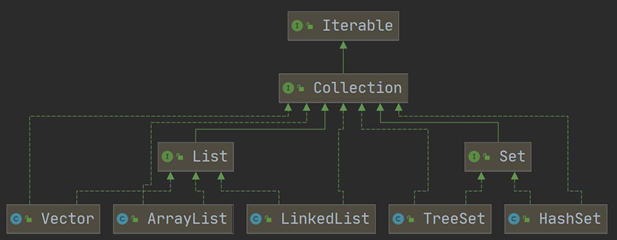
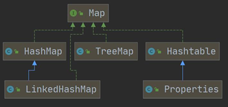

# 集合介绍

## > > 集合的引出

## 在之前常使用数组存储数据，存在的问题如下：

## （1）初始化时，==长度必须指定==，而且一旦指定，不能更改

## （2）不方便扩容（使用循环复制原有元素：==效率太低==）

## （3）==增加、删除==元素操作==比较麻烦==

## （4）==只能存储同一种类型的数据==

---

# 一、集合的基本介绍

## 1. 集合的==优点==

- ## （1）可以==动态保存==任意多个对象，比较方便
- ## （2）提供了==一系列方法==操作对象：`add`、`remove`、`get`等
- ## （3）==方便增加、删除元素==

## 2. 集合的==分类==

## （1）==单列==集合（存放==单个==对象）：`Collection（接口）`

- ## 1. List（==接口==）
  - ## ArrayList
  - ## Vector
  - ## LinkedList
- ## 2. Set（==接口==）
  - ## TreeSet
  - ## HashSet
    - ## LinkedHashSet

## （2）==双列==集合（存放==两个==对象 / 存储==键值对==）:`Map（接口）`

- ## 1. HashMap
  - ## LinkedHashMap
- ## 2. TreeMap
- ## 3. Hashtable
  - ## Properties

# 二、集合的框架图（==重点！！==）

## （1）==Collection==框架图

## 注意：由于==List 接口== 继承了 ==Collection 接口==，则实现 List 接口的三个子类既要实现 List 接口的方法，==还要实现`Collection`接口的方法==

## （2）==Map==框架图

## 说明：接口和类的关系

## （1）如果类实现了接口，就需要实现接口的方法

## （2）根据==接口多态==的特点，一个类既可以拥有实现了接口的方法，还可以用拥有实现了接口的接口（实现接口的==父类==）的方法

## （3）举例：在==Collection==中，三个类`不仅拥有`==List==接口的方法，`还拥有`==List==接口的方法
