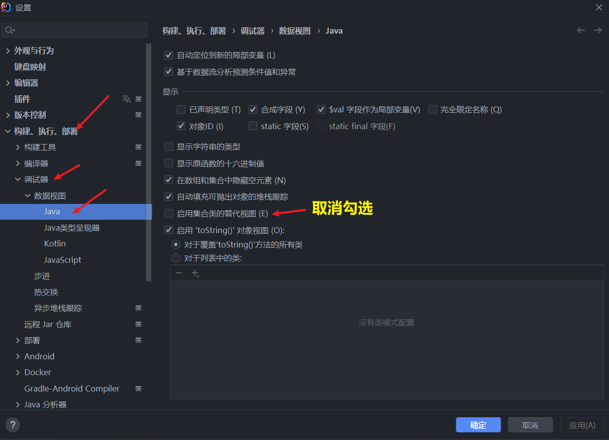
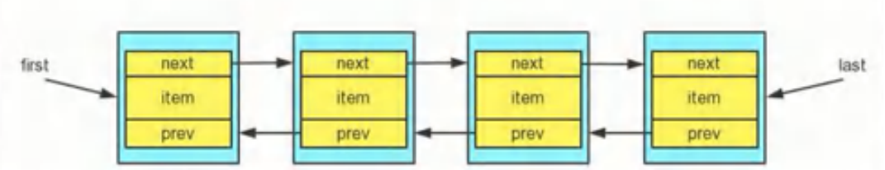

# List 接口

---

# 一、List 接口

## 1. 基本介绍

- ## （1） List 集合类中元素==有序==(即添加顺序和取出顺序一致)、且==可重复==
- ## （2） List 集合中的每个元素都有其对应的顺序索引，即==支持索引==
- ## （3） List 容器中的元素都对应一个整数型的序号记载其在容器中的位置，可以==根据序号存取容器中的元素==

## 2. 常用方法

## `List`接口是`Collection`接口的子接口，即也实现了`Collection`接口的方法

## 以下是`List`独有的方法

| 方法签名                                               | 描述                                                                                                |
| ------------------------------------------------------ | --------------------------------------------------------------------------------------------------- |
| `get(int index)`                                       | ==返回==列表中==指定索引位置==的元素。==索引从 0 开始==，超出范围会抛出 `IndexOutOfBoundsException` |
| ==set==`(int index, E element)`                        | 用指定元素==替换==列表中==指定位置==的元素，并返回被替换的原元素                                    |
| `remove(int index)`                                    | ==移除==并返回列表中==指定索引==位置的元素。后续元素的索引会自动递减                                |
| `void add(int index, E element)`                       | 在列表的==指定索引位置==插入指定元素。后续元素的索引会自动递增                                      |
| `boolean addAll(int index, Collection<? extends E> c)` | 从==指定位置==开始，将指定集合中的所有元素插入到列表中                                              |
| `int indexOf(Object o)`                                | 返回指定元素在列表中==第一次==出现的==索引==，==不存在则返回 -1==                                   |
| `int lastIndexOf(Object o)`                            | 返回指定元素在列表中==最后一次==出现的==索引==，不存在则返回 -1                                     |
| `List<E> subList(int fromIndex, int toIndex)`          | ==返回==列表中指定范围的==子列表==(fromIndex，toIndex)==左闭右开==                                  |

## 3. 代码示例

```java
import java.util.ArrayList;
import java.util.List;

@SuppressWarnings("all")
public class practise {
    public static void main(String[] args) {
        List list = new ArrayList();
        List list1 = new ArrayList();

        list.add("jack");
        list.add("computer");
        list.add("hello");
        list.add("java");

        list1.add("list2 - 1");
        list1.add("list2 - 2");

        System.out.println("list[0] = " + list.get(0));
        System.out.println("subList(0,1)：" + list.subList(0,1));

        list.add(list.size() - 1,"list");
        System.out.println("add(list.size() - 1,\"list\")：" + list);

        list.remove(list.size() - 1);
        System.out.println("remove(list.size() - 1)：" + list);

        list.add("jack");

        list.set(list.size() - 1,"jack");

        list.addAll(0,list1);
        System.out.println("addAll(list1)：" + list);
        System.out.println("indexOf(\"jack\") ：" + list.indexOf("jack"));
        System.out.println("lastIndexOf(\"jack\") ：" + list.lastIndexOf("jack"));


    }
}

// 输出结果
list[0] = jack
subList(0,1)：[jack]
add(list.size() - 1,"list")：[jack, computer, hello, list, java]
remove(list.size() - 1)：[jack, computer, hello, list]
addAll(list1)：[list2 - 1, list2 - 2, jack, computer, hello, list, jack]
indexOf("jack") ：2
lastIndexOf("jack") ：6
```

## 4. `List`接口遍历对象的方法

## 方法一：==Iterator (迭代器)==

## 返回一个 List 对象的迭代器，方法和 Collection 中的相同

## 方法二：==增强 for==循环

## 返回一个 List 对象的迭代器，方法和 Collection 中的相同

## 方法三：普通 for 循环

## 使用==get 方法==取值

```java
import java.util.ArrayList;
import java.util.List;

@SuppressWarnings("all")
public class practise {
    public static void main(String[] args) {
        List list = new ArrayList();
        List list1 = new ArrayList();

        list.add("jack");
        list.add("computer");
        list.add("hello");
        list.add("java");

        for (int i = 0; i < list.size(); i++) {
            System.out.println(list.get(i));
        }
    }
}
```

## 5. 练习：创建 book 对象（名称，价格），添加到 List 结合中，按照价格从低到高输出

## ==关键点==

- ## 通过==get()方法==获取对象
- ## 通过==set()方法==交换位置

```java
import java.util.ArrayList;
import java.util.Iterator;
import java.util.List;

@SuppressWarnings("all")
public class practise {
    public static void main(String[] args) {
        List list = new ArrayList();
        list.add(new book("西游记", 18));
        list.add(new book("水浒传", 20));
        list.add(new book("红楼梦", 30));

        for (int i = 0; i < list.size() - 1; i++) {
            for (int j = 0; j < list.size() - 1 - i; j++) {
                // 向下转型
                book book1 = (book) (list.get(i));
                book book2 = (book) (list.get(i));

                if (book1.price > book2.price) {
                    // 用 set() 方法交换位置
                    list.set(j + 1, book1);
                    list.set(j, book2);
                }
            }
        }

        // 使用迭代器遍历
        Iterator iterator = list.iterator();
        while(iterator.hasNext()){
            Object obj = iterator.next();
            System.out.println(obj);
        }
    }
}

class book {
    String name;
    double price;

    public book(String name, double price) {
        this.name = name;
        this.price = price;
    }

    public String getName() {
        return name;
    }

    public void setName(String name) {
        this.name = name;
    }

    public double getPrice() {
        return price;
    }

    public void setPrice(double price) {
        this.price = price;
    }

    @Override
    public String toString() {
        return "book{" +
                "name='" + name + '\'' +
                ", price=" + price +
                '}';
    }
}

// 输出结果
book{name='西游记', price=18.0}
book{name='水浒传', price=20.0}
book{name='红楼梦', price=30.0}
```

---

# 二、实现 List 接口的子类

- ## Arraylist
- ## Vector
- ## LinkedList

## 说明：这三个是实现接口的类，自然会实现接口的方法，==`Collection`和`List`接口的方法都可以使用==

# 1. Arraylist

## 1. 基本介绍

## （1） permits all elements, including null，==`ArrayList`可以加入 null==，并且多个

## （2） ArrayList 是由==数组来实现数据存储==的

## （3） ==`ArrayList` 基本等同于 `Vector`==，除了 `ArrayList` 是==线程不安全==，但是==执行效率高==。在==多线程==情况下，==不建议==使用 `ArrayList`

## 2. ==重点理解==： ==`ArrayList`的底层操作机制源码分析==

## 结论如下

- ## （1） ArrayList 中维护了一个 Object 类型的数组 elementData（`transient Object[] elementData`）
  - ## transient 表示瞬间,短暂的,表示==该属性不会被序列化==
- ## （2）当创建 ArrayList 对象时，如果使用的是==无参构造器==，则==初始== elementData ==容量为 0==，==第 1 次==添加，则==扩容== elementData 为 ==10==，如需要==再次扩容==，则扩容 elementData 为 ==1.5 倍==。
- ## （3）如果使用的是==指定大小的构造器==，则==初始== elementData 容量为==指定大小==，如果需要==再次扩容==，则直接扩容 elementData 为 ==1.5 倍==。

## 源码剖析

## （==预备工作==）IDEA 设置：在调试时显示隐藏的数据



## 调试代码示例

```java
public static void main(String[] args) {
    ArrayList list = new ArrayList();

    // 默认初始化10个大小的容量
    for (int i = 0; i < 10; i++) {
        list.add(i);
    }

    // 查看扩容的原理
    for (int i = 10; i < 13; i++) {
        list.add(i);
    }
}
```

## 1. 调用无参构造器,创建了一个数组（`transient Object[] elementData`）

```java
public ArrayList() {
    this.elementData = DEFAULTCAPACITY_EMPTY_ELEMENTDATA;
}
```

## 补充：在`add`之前会进行`valueOf()`方法的执行进行装箱，这部分略过不看

## 2. 执行`add()`方法

- ## 先确定是否要扩容，然后再进行赋值

```java
public boolean add(E e) {
    ensureCapacityInternal(size + 1);  // Increments modCount!!
    elementData[size++] = e;
    return true;
}
```

## 3. 进入`ensureCapacityInternal()`方法

- ## 找最大值，通过传值给函数，判断是否需要扩容

```java
private void ensureCapacityInternal(int minCapacity) {
    if (elementData == DEFAULTCAPACITY_EMPTY_ELEMENTDATA) {
        minCapacity = Math.max(DEFAULT_CAPACITY, minCapacity);
    }

    ensureExplicitCapacity(minCapacity);
}
```

## 4. 进入`ensureExplicitCapacity()`方法

- ## `modCount`记录集合修改的次数
- ## 根据之前的值，如果发现目前数组的大小比默认值（初始化为 10）大，执行`grow`方法，==执行扩容==

```java
private void ensureExplicitCapacity(int minCapacity) {
    modCount++;

    // overflow-conscious code
    if (minCapacity - elementData.length > 0)
        grow(minCapacity);
}
```

## 5. 进入`grow()`方法

- ## 向右位移(`>>`)一个大小：就是除以二的意识，即==如果数组需求的空间比默认值大，就在原基础上扩容为 1.5 倍==
- ## 使用`Arrays.copyOf()`方法先完成原内容的复制，扩容部分的位置值是`null`，之后返回`add()`方法，添加新内容到`elementData[]`数组中，完成内容的添加

```java
private void grow(int minCapacity) {
    // overflow-conscious code
    int oldCapacity = elementData.length;
    int newCapacity = oldCapacity + (oldCapacity >> 1);
    if (newCapacity - minCapacity < 0)
        newCapacity = minCapacity;
    if (newCapacity - MAX_ARRAY_SIZE > 0)
        newCapacity = hugeCapacity(minCapacity);
    // minCapacity is usually close to size, so this is a win:
    elementData = Arrays.copyOf(elementData, newCapacity);
}
```

---

# 2. Vector

## `Vector`==等价于==`ArrayList`，==区别在于底层扩容机制的不同==

## 基本介绍

## 1. 结构：`public class Vector<E>  extends AbstractList<E>  implements List<E>, RandomAccess, Cloneable, java.io.Serializable`

## 2. Vecotr 底层也是一个对象数组：`protected Object[] elementData`

## 3. ==Vector==是线程同步的，即==线程安全==（该类方法中都带有关键字==synchronized==）

## 举例

```java
public synchronized int indexOf(Object o, int index) {
    if (o == null) {
        for (int i = index ; i < elementCount ; i++)
            if (elementData[i]==null)
                return i;
    } else {
        for (int i = index ; i < elementCount ; i++)
            if (o.equals(elementData[i]))
                return i;
    }
    return -1;
}
```

## 4. 关于底层扩容机制

## 唯一和`ArrayList`不同的点在：如需要==再次扩容==，则扩容 elementData 为 ==2 倍==。

## 5. ArrayList 和 Vector 的区别

| 底层结构  | 版本              | 线程安全（同步） | 效率                   | 扩容机制                                                                                                      |
| --------- | ----------------- | ---------------- | ---------------------- | ------------------------------------------------------------------------------------------------------------- |
| ArrayList | 可变数组          | jdk1.2           | ==不安全==, ==效率高== | 如果==有参数构造 1.5 倍==, 如果是==无参==<br>1. 第一次 x 10 <br>2. 从第二次开始 x 1.5 倍                      |
| Vector    | 可变数组 Object[] | jdk1.0           | ==安全==, ==效率不高== | 1. 如果是==无参==, ==默认为 10==, 满后, 就按 ==2 倍扩容== <br> 2. ==如果指定大小==, 则每次==直接按 2 倍扩容== |

---

# 3. LinkedList

## 1. 基本介绍

## （1）底层实现了==双向链表==和==双端队列==特点

## （2）可以添加任意元素（==元素可以重复==），包括`null`

## （3）==线程不安全==，没有实现同步

## 2. 底层结构示意图



## 3. 属性说明

- ## first：指向头节点
- ## last：指向尾节点
- ## item：节点值
- ## prev：指向前驱检点
- ## next：指向后继节点

## 4. 模拟双向链表的操作

```java
public class pra {
    public static void main(String[] args) {
        /*
            模拟插入节点：jack,java,tom

            1. 首先生成节点
            2. 把节点连接起来
         */

        node jack = new node("jack");
        node java = new node("java");
        node tom = new node("tom");

        // 连接 jack 和 java
        jack.next = java;
        java.pre = jack;

        // 连接 java 和 tom
        java.next = tom;
        tom.pre = java;

        tom.next = null;

        // 设置头尾指针
        node head = jack;
        node tail = tom;

        System.out.print("从头到尾遍历：");
        // 遍历链表（从头到尾巴）
        while (true){
            if(head == null){
                break;
            }else{
                System.out.print(head.item + " ---> ");
                head = head.next;
            }
        }

        System.out.println();

        System.out.print("从尾到头遍历：");
        // 遍历链表（从尾到头）
        while (true){
            if(tail == null){
                break;
            }else{
                System.out.print(tail.item + " ---> ");
                tail = tail.pre;
            }
        }
    }
}

class node {
    Object item; // 节点元素值
    node pre; // 前驱结点指针
    node next; // 后继节点指针

    public node(Object item) {
        this.item = item;
    }

    @Override
    public String toString() {
        return "node{" +
                "item=" + item +
                '}';
    }
}

// 输出结果
从头到尾遍历：jack ---> java ---> tom --->
从尾到头遍历：tom ---> java ---> jack --->
```

## 5. LinkedList 方法

| 方法                        | 描述                                         |
| --------------------------- | -------------------------------------------- |
| 增                          |
| `add(E e)`                  | 向链表==末尾==添加元素。                     |
| `add(int index, E element)` | 在==指定索引==处插入元素。                   |
| `addFirst(E e)`             | 在链表的==开头==添加元素。                   |
| `addLast(E e)`              | 在链表的==末尾==添加元素。                   |
| 删                          |
| `remove(int index)`         | 删除==指定索引==位置的元素。                 |
| `remove(Object o)`          | 删除==首次出现==的指定元素。                 |
| `removeFirst()`             | 删除链表的==第一个==元素。                   |
| `removeLast()`              | 删除链表的==最后一个==元素。                 |
| 改                          |
| `set(int index, E element)` | 替换指定索引位置的元素，并返回被替换的元素。 |
| 查                          |
| `get(int index)`            | 获取==指定索引==位置的元素。                 |
| `getFirst()`                | 获取链表的==第一个==元素。                   |
| `getLast()`                 | 获取链表的==最后一个==元素。                 |
| 其他方法                    |
| `clear()`                   | 清空链表中的所有元素。                       |
| `contains(Object o)`        | 判断链表中是否包含==指定元素==。             |
| `size()`                    | 获取链表中的元素数量。                       |
| `isEmpty()`                 | 判断链表是否为空。                           |
| toArray（T【】）            |                                              |

## 6. ArrayList 和 LinkedList 的比较

| 底层结构   | 增删的效率 | 查找的效率             |
| ---------- | ---------- | ---------------------- |
| ArrayList  | 可变数组   | ==较低==               |
| LinkedList | 双向链表   | ==较高==，通过链表添加 |

## 如何选择 ArrayList 和 LinkedList？

## （1） 如果我们查看的操作多，选择 ArrayList

## （2） 如果我们增加的操作多，选择 LinkedList

## （3） 一般来说，在程序中，80%-90%都是查询，因此大部分情况下会选择 ArrayList

## （4） 在一个项目中，根据业务灵活选择，也可能这样，一个模块使用的是 ArrayList，另一个模块是 LinkedList，也就是说，==要根据业务来选择==
