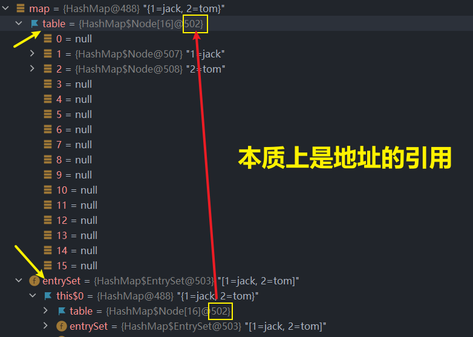
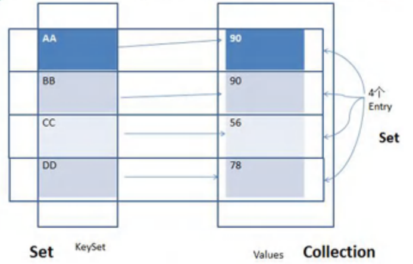

# Map 接口

## 实现类

- ## HashMap
  - ## LinkedHashMap（在 set 接口中的 HashSet 接口已经补充相关笔记）
- ## TreeMap
- ## Hashtable
  - ## Properties

## 1. 基本介绍

- ## Map 与 Collection ==并列存在==（即二者无联系）：用于存储具有==映射关系的数据==，形式为 ==Key-Value==
- ## Map 中的 ==key 和 value== 可以是==任何引用类型==的数据，通常会封装到`HashMap$Node`对象中。
- ## Map 中的 ==key 不允许重复==，原因和 ==HashSet== 一样（在 set 接口的笔记中分析过源码），但是 ==value 可以重复==
- ## Map 的 key 可以为 null，value 也可以为 null，注意 ==key 为 null，只能有一个键值对==
- ## ==Map 存放数据的 `key-value` 是存放在 `HashMap$Node` 中的，因为 Node 实现了 Entry 接口==
- ## ==常用 String 类型==作为 Map 的 ==key==，key 和 value 之间存在单向一对一关系，即通过指定的 key 能找到对应的 value（`get()`方法）

## 2. Map 接口的常用方法

| 方法                                                        | 描述                                                                                          |
| ----------------------------------------------------------- | --------------------------------------------------------------------------------------------- |
| `put(K key, V value)`                                       | 将指定的键和值添加到 `Map` 中，若键已存在则更新对应的值。                                     |
| `get(Object key)`                                           | 根据指定的键返回对应的值，若键不存在则返回 `null`。                                           |
| `entrySet()`                                                | 返回 `Map` 中所有键值对的 `Set` 集合，每个元素为 `Map.Entry` 对象。                           |
| `keySet()`                                                  | 返回 `Map` 中所有键的 `Set` 集合。                                                            |
| `values()`                                                  | 返回 `Map` 中所有值的 `Collection` 集合。                                                     |
| `remove(Object key)`                                        | ==删除指定的键及其对应的值（通过键值删除键值对）==，返回被删除的值，若键不存在则返回 `null`。 |
| `replace(K key, V value)`                                   | ==替换指定键的值==，若键不存在，则不做任何操作。                                              |
| `replaceALL((k,v) -> v.equals(newvalue)?newvalue:oldvalue)` | ==指定==所有键值对中的 oldvalue 替换成 newvalue                                               |
| `replaceALL((k,v) -> newvalue)`                             | 把所有的键值对中的 oldvalue 替换成新的 newvalue                                               |
| `containsKey(Object key)`                                   | 检查 `Map` 是否包含指定的键，返回 `true` 或 `false`。                                         |
| `containsValue(Object value)`                               | 检查 `Map` 是否包含指定的值，返回 `true` 或 `false`。                                         |
| `size()`                                                    | 返回 `Map` 中键值对的数量。                                                                   |
| `isEmpty()`                                                 | 检查 `Map` 是否为空，若为空返回 `true`，否则返回 `false`。                                    |
| `clear()`                                                   | 清空 `Map` 中的所有键值对。                                                                   |

## 3. Map 接口的==底层分析==

## （1）每一对 ==键值对== 会存储在 HashMap 的内部 ==table 数组中==（table 数组的==类型==是 `HashMap$Node[]`）。table 数组中的==每个位置存储==的是一个 ==Node 对象==

## 每个 Node 对象封装了四个属性

- ## key
- ## value
- ## hash
- ## next

## 说明：`HashMap$Node` 是 Node 的==全名==，==表示==它是 HashMap 类的一个==内部类==。在 Java 中，`$` 是用于==区分内部类和外部类==的符号

## 结论：`HashMap$Node` 是 Node 类的==全限定名==

## （2）由于`HashMap$Node implements Map.Entry`，这个接口提供了==getKey()和 getValue()方法==，==方便接口的遍历==

- ## EntrySet：entrySet 是 Map ==接口的一个方法==，返回一个`Set<Map.Entry<K,V>>` 集合，集合的==名字叫做 EntrySet==
  - ## ==集合的类型是 Set==
  - ## 集合中==每个元素的类型==是 ==Map.Entry==
- ## 存放不同的`Entry`==对象==，封装了一个键值对
  - ## key
  - ## value

##

- ## EntrySet 集合中每个 Entry 元素中的 ==key 被封装成 KeySet 集合（类型是 Set）==
- ## EntrySet 集合中每个 Entry 元素中的 ==value 被封装成 Values 集合（类型是 Collection）==

- ## 最终通过==引用==把 table 数组中存储的每个 Node 节点中的 `key 和 value` ==指向== `KeySet 集合和 Values 集合`
- ## 注意：本质上 `Key - Value 键值对`还是==存储在 table 数组 Node 节点中==（即本质上==entry 对象==的==运行类型=还是`HashMap$Node`），这里只是作为引用传递，==而不是存储在封装的集合中==

## 内存视图证明



## EntrySet 集合的结构



## 代码示例

```java
import java.util.Collection;
import java.util.HashMap;
import java.util.Map;
import java.util.Set;

@SuppressWarnings("all")
public class pra {
    public static void main(String[] args) {
        Map map = new HashMap();

        map.put("1","jack");
        map.put("2","tom");
        map.put("3","lucy");

        Set set = map.entrySet();
        System.out.println(set.getClass());

        Set set1 = map.keySet();
        System.out.println(set1.getClass());

        Collection set2 = map.values();
        System.out.println(set2.getClass());
    }
}

// 运行结果
class java.util.HashMap$EntrySet
class java.util.HashMap$KeySet
class java.util.HashMap$Values
```

## 注意：getClass()方法返回的是==运行类型==

---

# Map 接口的遍历

## 思路概括（核心是理解 Map 接口的底层机制）

- ## entrySet() 方法：提取每一对键值对
  - ## ==EntrySet== 集合是==双元素==集合
  - ## ==map.entrySet()方法==返回的是一个 `Set<Map.Entry<K, V>>` ==类型==的集合，包含多个 ==Map.Entry 对象==（每个对象包含==key 和 value==两个值）
  - ## 即返回的集合是==单元素集合==，==可以用迭代器==遍历
- ## keySet() 方法：提取所有的 key（==单元素==集合）
- ## values() 方法：提取所有的 value（==单元素==集合）

## 注意：对于==单元素==集合可以使用的遍历方式

- ## 增强 for 循环
- ## 迭代器（只适用==单元素==）

## ==第一组==：遍历 key

## 思路如下

- ## 首先通过 ==map.keySet()方法==提取键值对中的键值

- ## 然后通过==遍历 keySet 数组==获取键值对中的键值

## 方法一：增强 for 循环

```java
public class pra {
    public static void main(String[] args) {
        Map map = new HashMap();

        map.put("1", "jack");
        map.put("2", "tom");
        map.put("3", "lucy");

        Set set = map.keySet();
        for (Object key : map.keySet()) {
            System.out.println("键：" + key);
        }
    }
}

键：1
键：2
键：3
```

## 方法二：迭代器（keySet 是==单一元素集合==）

```java
public class pra {
    public static void main(String[] args) {
        Map map = new HashMap();

        map.put("1", "jack");
        map.put("2", "tom");
        map.put("3", "lucy");

        Set set = map.keySet();
        Iterator iterator = set.iterator();
        while (iterator.hasNext()) {
            Object key =  iterator.next();
            System.out.println("键：" + key + " --> " + "值：" + map.get(key));
        }
    }
}

// 输出结果
键：1
键：2
键：3
```

## 第二组：遍历 value

## 思路如下

- ## 首先通过 ==map.values()方法==提取键值对中的值

- ## 然后通过==遍历 values 数组==获取键值对中的值

## 方法一：增强 for 循环

```java
public class pra {
    public static void main(String[] args) {
        Map map = new HashMap();

        map.put("1", "jack");
        map.put("2", "tom");
        map.put("3", "lucy");

        Collection set = map.values();
        for (Object values :set) {
            System.out.println("值：" + values);
        }
    }
}

// 输出结果
值：jack
值：tom
值：lucy
```

## 方法二：迭代器

```java
public class pra {
    public static void main(String[] args) {
        Map map = new HashMap();

        map.put("1", "jack");
        map.put("2", "tom");
        map.put("3", "lucy");

        Collection set = map.values();
        Iterator iterator = set.iterator();
        while (iterator.hasNext()) {
            Object values =  iterator.next();
            System.out.println("值：" + values);
        }
    }
}
// 输出结果
值：jack
值：tom
值：lucy
```

## 第三组：遍历 key - value

## 思路一：结合 ==map 接口==中的 ==get()方法==，通过 key 来获取对应的 value，通过字符串拼接来得到键值对

> ### 补充说明：由于 Map 接口的特点，key 值不可以有相同的，但是不同 key 的 value 可以是相同的，若通过 value 来遍历 key 就会造成不确定性，这个无法实现的，但是==可以通过`map.values()`方法来遍历 value 的值==

## 思路二：通过 ==entryset()方法==，得到每个 entry 对象，之后通过实现接口中的==getKey()和 getValue()方法==来获取键和值

## 思路一：调用 ==get() 方法==

## 方法一：增强 for 循环

```java
public class pra {
    public static void main(String[] args) {
        Map map = new HashMap();

        map.put("1", "jack");
        map.put("2", "tom");
        map.put("3", "lucy");

        Set set = map.keySet();
        for (Object key : map.keySet()) {
            System.out.println("键：" + key + " --> " + "值：" + map.get(key));
        }
    }
}

// 输出结果
键：1 --> 值：jack
键：2 --> 值：tom
键：3 --> 值：lucy
```

## 方法二：迭代器

```java
public class pra {
    public static void main(String[] args) {
        Map map = new HashMap();

        map.put("1", "jack");
        map.put("2", "tom");
        map.put("3", "lucy");

        Set set = map.keySet();
        Iterator iterator = set.iterator();
        while (iterator.hasNext()) {
            Object key =  iterator.next();
            System.out.println("键：" + key + " --> " + "值：" + map.get(key));
        }
    }
}

// 输出结果
键：1 --> 值：jack
键：2 --> 值：tom
键：3 --> 值：lucy
```

## 思路二：调用 ==entryset() 方法==（需要使用==向下转型==）

## 方法一：增强 for 循环

```java
public class pra {
    public static void main(String[] args) {
        Map map = new HashMap();

        map.put("1", "jack");
        map.put("2", "tom");
        map.put("3", "lucy");

        Set set = map.entrySet();
        for (Object obj :set) {
            // 向下转型
            Map.Entry entry =(Map.Entry) obj;
            System.out.println("键：" + entry.getKey() + " --> 值：" + entry.getValue());
        }
    }
}

// 输出结果
键：1 --> 值：jack
键：2 --> 值：tom
键：3 --> 值：lucy
```

## 方法二：迭代器

```java

public class pra {
    public static void main(String[] args) {
        Map map = new HashMap();

        map.put("1", "jack");
        map.put("2", "tom");
        map.put("3", "lucy");

        Set set = map.entrySet();
        Iterator iterator = set.iterator();
        while (iterator.hasNext()) {
            Object obj =  iterator.next();
            Map.Entry entry = (Map.Entry)obj;
            System.out.println("键：" + entry.getKey() + " --> 值：" + entry.getValue());
        }
    }
}
```

---

# HashMap

## （1）==HashMap== 是 Map 接口中==使用频率最高==的实现类

## （2）HashMap 是以 key - value 对的方式存储数据的（==HashMap$Node 类型==）

## （3）==key 不能重复==, 但是==值可以重复,== 允许使用 null 键和 null 值，==key 的 null 值只能有一个==

## （4）如果==添加相同的 key==, 则会覆盖原来的 key-val, 等同于修改. (key 不会替换, ==val 会替换==)

## （5）与 HashSet 一样, ==不保证映射的顺序==, 因为底层是以 hash 表的方式来存储的. (jdk8 的 ==hashMap 底层是 数组 + 链表 + 红黑树==)

## （6）==HashMap== 没有线程同步, 因此是==线程不安全==的, 方法没有做同步操作, 没有 synchronized.

## 关于 HashMap 的底层添加机制和扩容机制在 Set 接口中的 HashSet 中已经分析，这里重点看一下如果添加==键值相同时，value 是如何被替换的==

## 源码如下

```java
if (e != null) { // existing mapping for key
    V oldValue = e.value;
    if (!onlyIfAbsent || oldValue == null)
        e.value = value;
    afterNodeAccess(e);
    return oldValue;
}
```

## 前面的源码分析可以跳到 Set 接口的笔记：[点我跳转 ](https://blog.csdn.net/jackson0607/article/details/148694059?spm=1001.2014.3001.5502)

## 经过前面的判断，key 相同，则 e 指向的对象和 p 指向的对象相同（都是==第一次添加的包含 key 的 Node 对象==），此时 e 不为空，进入这个分支判断

## 分析：==e.value = value==，传进来的 value 赋值给了 p（即 e）指向的对象（即第一次添加的包含 key 的 Node 对象）的 value，==完成了 value 的更新==

---

# Hashtable

## 基本介绍

## （1）存放的元素是键值对：即 K-V

## （2） Hashtable 的==键和值都不能为 null==，否则会抛出 `NullPointerException` ==异常==

## （3） Hashtable 使用方法基本==和 HashMap 一样==

## （4） ==Hashtable== 是==线程安全==的 (synchronized)

## （5）==HashMap== 是==线程不安全==的

## HashMap 和 Hashtable 的对比

| 类型      | 版本 | 线程安全（同步） | 效率   | 允许 null 键 null 值 |
| --------- | ---- | ---------------- | ------ | -------------------- |
| HashMap   | 1.2  | 不安全           | 高     | 可以                 |
| Hashtable | 1.0  | 安全             | ==低== | 不可以               |

---

# Properties

## 基本介绍

## （1） Properties 类==继承自 Hashtable 类==并且实现了 Map 接口，也是使用一种键值对的形式来存储数据。

## （2） 他的使用特点==和 Hashtable 类似==

## （3） Properties 还可以用于从 xxx.properties ==文件中，加载数据==到 Properties 类对象，并进行读取和修改

## （4） 说明：工作后 xxx.properties 文件通常作为==配置文件==，这个知识点在 IO 流举例中

## 说明：由于 Properties 类最主要的作用是实在文件的读取和操作上，==更多介绍会在 IO 流==中的笔记介绍，这里不做详述

---

# TreeMap

## 基本介绍

## 和 TreeSet 一样，可以传入一个比较器来指定添加的顺序，==不同==的是 TreeMap==传入的是键值对==

## 源码分析（和 HashMap 的原理大致相同，这里说明不同的地方）

## 注意：TreeMap 是双列集合，不会进入`add()`方法，而是==直接进入`put()`方法==

## 进入 put() 方法

```java
public V put(K key, V value) {
    Entry<K,V> t = root;
    if (t == null) {
        compare(key, key); // type (and possibly null) check

        root = new Entry<>(key, value, null);
        size = 1;
        modCount++;
        return null;
    }
    int cmp;
    Entry<K,V> parent;
    // split comparator and comparable paths
    Comparator<? super K> cpr = comparator;
    if (cpr != null) {
        do {
            parent = t;
            cmp = cpr.compare(key, t.key);
            if (cmp < 0)
                t = t.left;
            else if (cmp > 0)
                t = t.right;
            else
                return t.setValue(value);
        } while (t != null);
    }
    else {
        if (key == null)
            throw new NullPointerException();
        @SuppressWarnings("unchecked")
            Comparable<? super K> k = (Comparable<? super K>) key;
        do {
            parent = t;
            cmp = k.compareTo(t.key);
            if (cmp < 0)
                t = t.left;
            else if (cmp > 0)
                t = t.right;
            else
                return t.setValue(value);
        } while (t != null);
    }
    Entry<K,V> e = new Entry<>(key, value, parent);
    if (cmp < 0)
        parent.left = e;
    else
        parent.right = e;
    fixAfterInsertion(e);
    size++;
    modCount++;
    return null;
}
```

## 1. 第一次执行`add()`方法

```java
Entry<K,V> t = root;
if (t == null) {
    compare(key, key); // type (and possibly null) check

    root = new Entry<>(key, value, null);
    size = 1;
    modCount++;
    return null;
}
```

## 代码分析

## 第一次添加，把 k- v 键值对==封装到 Entry 对象中==，放入 root

## 2. 之后的添加

```java
Comparable<? super K> k = (Comparable<? super K>) key;
do {
    parent = t;
    cmp = k.compareTo(t.key);
    if (cmp < 0)
        t = t.left;
    else if (cmp > 0)
        t = t.right;
    else
        return t.setValue(value);
} while (t != null);
```

## 代码分析

## （1）遍历所有的 key，给当前的 key-value 键值对找到插入位置

## （2）调用传入的比较器，实现 compare 方法（==动态绑定机制==）

## （3）else 分支：在遍历过程中，如果发现当前的 key 和添加的 key 一样，就不会执行添加操作

# 易错题

## 问题：下面代码中的`java`会被添加到 TreeMap 中吗

```java
public class pra {
    public static void main(String[] args) {

        TreeMap treeMap = new TreeMap(new Comparator() {
            @Override
            public int compare(Object o1, Object o2) {
                return ((String)o1).length() - ((String)o2).length();
            }
        });

        treeMap.put("jack","1");
        treeMap.put("tom","2");
        treeMap.put("hi","3");
        treeMap.put("java","4");

        System.out.println("treeSet = " + treeMap);
    }
}
```

## 答案：不会

## 输出结果

```java
treeSet = {hi=3, tom=2, jack=4}
```

## 可以看到 jack 对应的==value 做了更新==

## 底层源码分析

```java
do {
    parent = t;
    cmp = k.compareTo(t.key);
    if (cmp < 0)
        t = t.left;
    else if (cmp > 0)
        t = t.right;
    else
        return t.setValue(value);
} while (t != null);
```

## 由于传入的比较器是比较字符串的长度，当==字符串的长度相同时==，就会返回 0，进入 else 分支

- ## 调用`setValue()`方法，把 key 对应的 ==value 做一个更新==，返回这个 value
- ## 函数遇到了 return 语句，==函数退出==

# 结论：遇到相同的 Keys 时，新的 key==不会添加进入==，但是会用==新的 vlaue 替换旧的 value 值==
