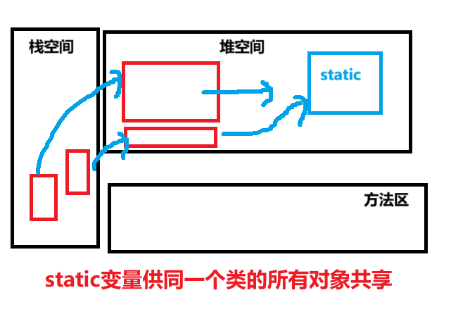

# 类变量

## 引出关键字：==static==

## 又名：静态变量，静态字段，类字段（字段又名属性，成员方法），类属性

# 是什么？

## 供该（==同一个类==）的==所有==对象==共享==的变量

- ## （1）任何一个该类的对象去访问它时，取到的都是相同的值
- ## （2）同样任何一个该类的对象去修改它时，修改的也是同一个变量
- ## （3）随着==类的加载==而==创建==

---

## 类变量的==创建机制==（内存布局）

- ## 第一种说法（JDK8 以前的版本）
  - ## 类加载的时候会在方法区创建一块空间（称为==静态域==），static 修饰的变量存储在其中
- ## 第二种说法（JDK8 以后的版本）
      - ## ==staic变量==保存在==堆空间==中
      - ## 类加载时候的时候通过==反射机制==加载一个==Class对象==，static变量保存在Class实例的尾部
  

---

## 类变量的使用

## 一、类变量的==定义==

## 两种定义方法

- ## 1.（==推荐！！==）访问修饰符 ==static== 变量类型 变量名

```java
public static int age;
```

- ## 2. ==static== 访问修饰符 变量类型 变量名

```java
static public int age;
```

## 二、类变量的==访问==

## ==注意点！！==

- ## 1. 由于类变量供同一个类的所有对象共享，因此==可以通过类名访问==
- ## 2. 静态变量的访问修饰符的==访问权限和范围== 和 普通欧冠属性是一样的

## 两种方式

- ## 1.（==推荐！！==）类名.类变量名
- ## 2. 对象名.类变量名

---

# 快速入门：统计创建对象的个数

```java
public class practise01 {
    public static void main(String[] args) {
        statictest statictest1 = new statictest();
        statictest statictest2 = new statictest();
        statictest statictest3 = new statictest();
        int tot = statictest.totalobjectnum();
        System.out.println("创建statictest类对象的总个数是：" + tot);
    }
}

class statictest{

    static int objectnum;

    public statictest(){
        statictest.objectnum ++;
    }

    public static int totalobjectnum(){
        return objectnum;
    }
}
// 输出结果
创建statictest类对象的总个数是：3
```

## 代码说明

## 1. 创建类变量`objectnum`用于统计创建该类对象的个数

## 2. 在构造器中加入逻辑，只要==创建==对象，类变量`objectnum`的值就==自增一==

## 3. 使用`totalobjectnum`方法返回该类对象创建的个数

---

# 类变量的==使用细节==

- ## （1）什么时候需要用类变量？

  - ## 当我们需要让某个==类的所有对象共享一个变量==时，就可以考虑使用类变量（静态变量）

- ## （2）==类变量==与==实例变量==（普通属性）==区别==

  - ## 1. ==类变量==是该类的所有对象==共享==的
  - ## 2. ==实例变量==是每个对象==独享==的。

- ## （3）==类变量==可以通过`类名.类变量`来访问，但==实例变量==只能通过`对象.类变量`来访问（但 Java 设计者推荐我们使用`类名.类变量`方式访问）。

- ## （4）实例变量==不能==通过`类名.类变量`方式访问，==需要创建对象==后才能通过`对象名.属性`的方法访问
- ## （5）==类变量是随类加载时就初始化了==，也就是说，即使你没有创建对象，只要类加载了，就可以使用类变量。

- ## （6）类变量的生命周期是随着类的加载开始，随着类消失而销毁。
