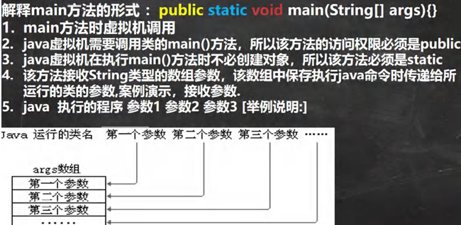
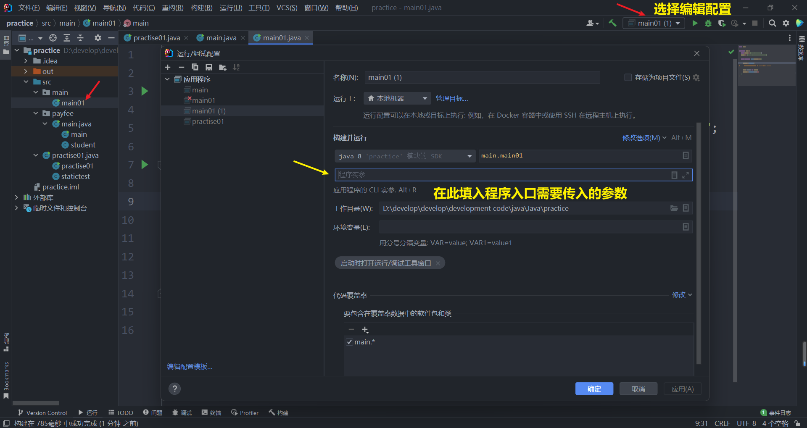
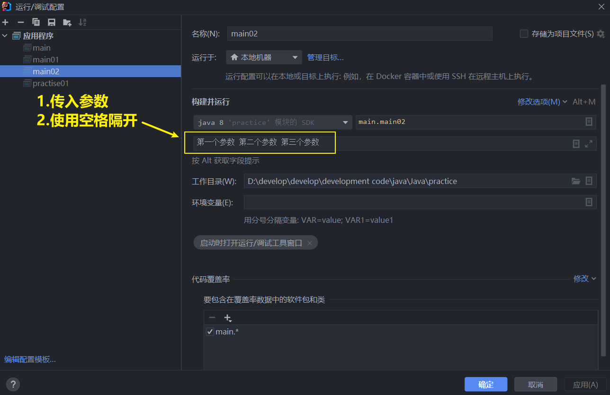

# main 方法

## 一、深入理解 main 方法



## ==特变注意！！==

- ## 1. 在`main()`方法中，我们可以直接调用 mian 方法所在类的静态方法或静态属性
- ## 2. ==不能访问==该类中的==非静态成员==，必须创建该类的一个实例对象后，才能通过这个对象去访问类中的非静态成员

## 代码示例

```java
package main;

public class main01 {
    static String n = "我是静态成员 n，可以通过类名直接访问";
    String n1 = "我是静态成员 n1，不可以通过类名直接访问，需要创建对象后，用对象访问";

    public static void main(String[] args) {

        System.out.println(n);
//        System.out.println(n1);  // 会报错，无法解析 n1，因为 n1 不是静态变量

        main01 main01 = new main01();
        System.out.println(main01.n1);
    }
}

```

## 二、如何给==args==数组赋初值？

## 使用方法：在参数区中填入字符串，==不同数组元素==使用==空格隔开==即可

## 

---

## 代码示例：在==main==方法中传参，并打印==args==数组



```java
package main;

public class main02 {
    public static void main(String[] args) {
        for (int i = 0; i < args.length; i++) {
            System.out.println("args[" + i + "]：" + args[i]);
        }
    }
}
```

## 输出结果

```java
args[0]：第一个参数
args[1]：第二个参数
args[2]：第三个参数
```
