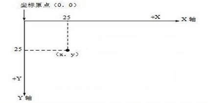
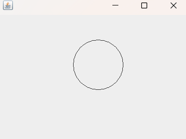

# Java 绘图基础

## 一、Java 坐标体系

## 1. 像素的概念

- ## 计算机在屏幕上==显示的内容==都是由屏幕上的每一个==像素组成==的
- ## 例如，计算机显示器的分辨率是 800×600，表示计算机屏幕上的==每一行由 800 个点组成，共有 600 行==，整个计算机屏幕共有 480 000 个像素
- ## 像素是一个==密度单位==，而厘米是==长度单位==，两者无法比较

## 2. 坐标



## 横坐标：x

## 纵坐标：y

## 坐标==原点==：位于==左上角==

## 距离：表示距离原点有多少个像素单位

---

## 二、绘图方法

## 1. 绘图原理

## Component 类提供了两个和绘图相关最重要的方法

- ## 1. paint(Graphics g)绘制组件的外观

- ## 2. repaint()刷新组件的外观。

## 当组件==第一次==在屏幕显示的时候,程序会==自动的调用 paint()方法==来绘制组件。

## 在以下情况 ==paint()将会被调用==

- ## 窗口最小化,再最大化

- ## 窗口的大小发生变化

- ## repaint 方法被调用

## 2. 绘制画板

## 类：`JPanel`

## 自定义类继承该类，重载 paint 构造器，调用父类的方法完成构造器的初始化（==画一个圆为示例==）

```java
class MyPanel extends JPanel{
    @Override
    public void paint(Graphics g) {
        super.paint(g);
        g.drawOval(150,50,100,100);
    }
}
```

## 代码解析

- ## `Graphics`是一个类，可以理解为画笔，通过调用该类中的方法来完成绘图
- ## 调用该类中的`drawOval()`方法，绘制一个圆形
- ## 画圆的方法：首先根据坐标找到对应的位置，从该坐标点开始，按照给定的长度和宽度开始画圆（如果长宽不一致就是椭圆）

## 3. 绘制窗口，显示画板内容

## 类：`JFrame`

## 让主类继承该类，创建画板对象，在该类的构造器中完成窗口的初始化并添加画板

## 窗口的构建步骤、

- ## 创建一个画板对象（初始化画板）
- ## `this.add`(画板对象)：把画板添加到窗口中，在窗口中显示画板内容
- ## `this.setSize`(长，宽)：设置窗口的大小
- ## `this.setTitle("窗口名")`：设置窗口名称
- ## `this.setVisible(true)`：设置窗口可见
- ## `this.setDefaultCloseOperation(JFrame.EXIT_ON_CLOSE)`：关闭窗口时退出程序，避免占用资源

## 运行查看效果：在主函数中创建一个窗口对象，==第一次会自动调用 paint()方法完成绘图==（前面的绘图原理）

```java
public class drawcircle extends JFrame{

    // 定义一个panel
    MyPanel panel = null;

    // 窗口的初始化，在构造器中完成
    public drawcircle(){
        // 初始化画板
        panel = new MyPanel();
        // 添加画板到窗口中
        this.add(panel);
        // 设置窗口大小
        this.setSize(400,300);
        // 设置窗口可见
        this.setVisible(true);
        // 设置关闭窗口，程序结束
        this.setDefaultCloseOperation(JFrame.EXIT_ON_CLOSE);
    }

    public static void main(String[] args) {
        new drawcircle();
    }
}
```

## 绘图效果



## 4. Graphics 类方法

| 方法                                                         | 描述                                                                   |
| ------------------------------------------------------------ | ---------------------------------------------------------------------- |
| `setColor(Color c)`                                          | 设置绘图颜色。使用 `Color` 类指定==颜色==。                            |
| `setFont(Font font)`                                         | 设置字体。使用 `Font` 类指定==字体样式==。                             |
| `drawLine(int x1, int y1, int x2, int y2)`                   | 绘制一条线段，连接指定的两个坐标点 `(x1, y1)` 和 `(x2, y2)`。          |
| `drawRect(int x, int y, int width, int height)`              | 绘制==矩形==，指定矩形的左上角 `(x, y)` 和宽度、高度。                 |
| `fillRect(int x, int y, int width, int height)`              | 绘制并==填充矩形==，指定矩形的左上角 `(x, y)` 和宽度、高度。           |
| `drawOval(int x, int y, int width, int height)`              | 绘制==椭圆==，指定椭圆的外接矩形的左上角 `(x, y)` 和宽度、高度。       |
| `fillOval(int x, int y, int width, int height)`              | 绘制并==填充椭圆==，指定椭圆的外接矩形的左上角 `(x, y)` 和宽度、高度。 |
| `drawString(String str, int x, int y)`                       | 在指定位置 `(x, y)` ==绘制文本==字符串。                               |
| `drawImage(Image img, int x, int y, ImageObserver observer)` | 在指定位置 `(x, y)` ==绘制图片==。                                     |

## （1）绘制直线：传入起始坐标和终点坐标

## （2）绘制矩形边框：传入起始坐标，传入矩形的长和宽

## （3）填充矩形颜色：需要在绘制前设置矩形颜色（默认是黑色）

## 方法：`setColor(Color.颜色名)`

```java
class MyPanel extends JPanel{
    @Override
    public void paint(Graphics g) {
        super.paint(g);
        System.out.println("paint方法被调用");
        g.setColor(Color.lightGray);
        g.fillRect(50,50,100,100);
    }
}
```

## （4）绘制椭圆边框，填充椭圆边框的方法大同小异，这里不做赘述

## （5）绘制文本字符串

- ## drwaString("字符串"，起始横坐标，起始纵坐标)，==起始坐标对应字体的左下角==
- ## 需要设置画笔颜色：`g.setColor(Color.颜色字段);`
- ## 需要设置字体（字体的类型，字体的样式，字体的大小）
  - ## `g.setFont(new Font("楷体",Font.PLAIN,100))`
  - ## ==需要传入一个`Font`对象==

## 字体样式

| 字段                      | 描述                                                   |
| ------------------------- | ------------------------------------------------------ |
| `Font.PLAIN`              | 普通字体，默认样式，没有加粗和斜体效果。               |
| `Font.BOLD`               | 粗体样式，文本加粗，通常用于强调文本。                 |
| `Font.ITALIC`             | 斜体样式，文本倾斜，用于表示风格或突出显示部分文本。   |
| `Font.BOLD + Font.ITALIC` | 粗斜体样式，文本既加粗又倾斜，通常用于非常显眼的文本。 |

```java
class MyPanel extends JPanel{
    @Override
    public void paint(Graphics g) {
        super.paint(g);
        System.out.println("paint方法被调用");
        g.setColor(Color.lightGray);  // 灰色
        g.setFont(new Font("楷体",Font.PLAIN,100));
        g.drawString("Java",70,150);
    }
}
```

## （6）绘制图片

## 准备工作：把图片放在 out 文件夹下的==项目的根目录==（易错：如果有多个包时，不是放在对应的包下，而是该项目名称的根目录下）

## 绘制步骤

- ## 获取图片资源：` Image image = Toolkit.getDefaultToolkit().getImage(Panel.class.getResource("/image.png"))`，此处为固定写法，把路径换成图片名称即可
- ## 调用`drawImage(image,起始横坐标,起始冲坐标,图片长度,图片宽度,this)`方法传入图片，起始位置，图片的大小，==this 参数==（通过图片属性中的详细信息查看像素，也可自定义）

```java
class MyPanel extends JPanel{
    @Override
    public void paint(Graphics g) {
        super.paint(g);
        System.out.println("paint方法被调用");
        Image image = Toolkit.getDefaultToolkit().getImage(Panel.class.getResource("/image.png"));
        g.drawImage(image,0,0,100,140,this);
    }
}
```
