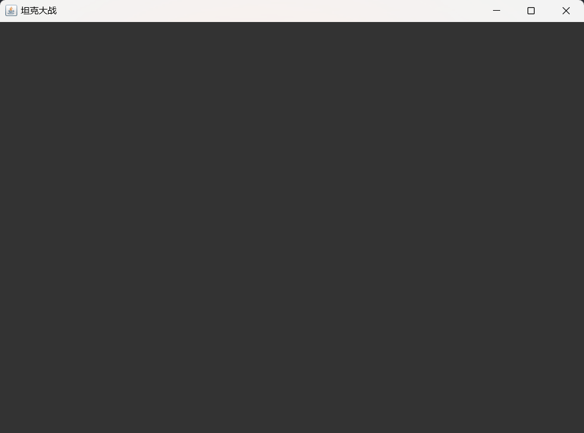

# 绘制游戏区域

## 思路：创建一个画板，通过调用`fillRect()`方法绘制一个矩形（默认是黑色），添加到窗口中

## 源码如下

## （1）创建`mypanel`类，继承`JPanel`类

```java
public class mypanle extends JPanel {
     @Override
    public void paint(Graphics g) {
        super.paint(g);
        g.fillRect(0, 0, 1000, 750); // 默认是黑色
    }
}
```

## （2）创建`Game_main`类，继承`JFrame`类，初始化窗口的各种属性，把画板添加到窗口中，在主函数中创建窗口对象，完成游戏区域的绘制

```java
public class Game_main extends JFrame {

    // 定义画板
    mypanle panel = null;

    // 构建窗口，添加画板
    public Game_main(){
        // 创建一个画板
        panel = new mypanle();
        // 添加画板
        this.add(panel);
        // 设置窗口大小
        this.setSize(1000,750);
        // 设置窗口的名称
        this.setTitle("坦克大战");
        // 设置可见
        this.setVisible(true);
        // 设置关闭窗口，退出程序
        this.setDefaultCloseOperation(JFrame.EXIT_ON_CLOSE);
    }

    public static void main(String[] args) {
        new Game_main();
    }
}
```

## 效果图如下


