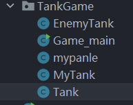

# 坦克的移动

## 实现思想：是==坦克重绘==的过程

## 结合业务需求：用户来控制==坦克的移动==（引入监听器接口==KeyListener==实现）

---

## 一、 KeyListener 接口的介绍

## 首先让 mypanel 类实现这个接口，==需要实现这个接口的三个方法==

## 原理：通过监听器来==控制坦克的重绘的方式==，进而实现坦克的移动效果

## 源码如下

```java
public class mypanle extends JPanel implements KeyListener {
    @Override
    public void keyTyped(KeyEvent e) {

    }

    @Override
    public void keyPressed(KeyEvent e) {

    }

    @Override
    public void keyReleased(KeyEvent e) {

    }
}
```

## 代码分析

## 1. 主要运用==keyPressed==方法来完成键盘按键的监听

## 2. ==keyPressed==方法的使用

- ## 通过==getKeyCode()方法==来获取键盘按下的字符
- ## 设置 ==w s a d ==为==上下左右==方向，通过 ==if 判断==来判断输入是否是对应的方向，进而实现相应的业务逻辑
- ## 参数类型 ==KeyEvent==：里面存储了==不同按键对应的十六进制值==，通过相应的字段来获取对应的值

---

## 二、实现坦克的移动

## 1. 坦克==移动的本质==

## 坦克的重绘，即改变绘制的起始坐标，之后==调用 repaint()方法==来实现重绘

## 实现步骤

- ## 在 Tank 类中==编写移动方法==，通过改==变绘制的起始坐标==来实现坦克的移动
- ## 设置坦克的==移动速度属性==，通过在移动方法中调用就可以完成移动速度的变化

```java
public class Tank {

    private int speed = 1;

    public int getSpeed() {
        return speed;
    }

    public void setSpeed(int speed) {
        this.speed = speed;
    }

    // 上右下左移动方法
    public void moveUp() {
        y -= speed;
    }

    public void moveRight() {
        x += speed;
    }

    public void moveDown() {
        y += speed;
    }

    public void moveLeft() {
        x -= speed;
    }
}

```

## 2. 结合键盘控制实现坦克的移动

## 实现步骤

- ## 首先在方法中编写 ==if 判断==逻辑，判断坦克的移动方向
- ## 在每一个==方向移动的逻辑中调用移动方法==，改变坦克绘制的起始位置
- ## ==调用 repaint()方法，实现坦克的重绘==，结合之前起始绘制位置的变化，进而实现了坦克的移动

## 源码如下

```java
public class mypanle extends JPanel implements KeyListener {
    @Override
    public void keyTyped(KeyEvent e) {

    }

    // 使用 w s a d 表示上下左右(需要接收英文)
    // 通过 getKeyCode() 方法来获取按下键的字符
    @Override
    public void keyPressed(KeyEvent e) {
        if (e.getKeyCode() == KeyEvent.VK_W) { // 按下W键
            // 改变坦克的方向
            myTank.setDirection(0);
            myTank.moveUp();
        } else if (e.getKeyCode() == KeyEvent.VK_D) { // D键
            myTank.setDirection(1);
            myTank.moveRight();
        } else if (e.getKeyCode() == KeyEvent.VK_S) { // S键
            myTank.setDirection(2);
            myTank.moveDown();
        } else if (e.getKeyCode() == KeyEvent.VK_A) { // A键
            myTank.setDirection(3);
            myTank.moveLeft();
        }

        // 让面板重绘
        this.repaint();
    }

    @Override
    public void keyReleased(KeyEvent e) {

    }
}
```

## 注意：如果==不调用 repaint()方法==实现画板的重绘，坦克是==无法实现移动效果==的

## 3. ==关键点==：在主函数的面板构造器中添加监听器，通过监听器来监视面板的变化

```java
public Game_main(){
    // 增加面板的监听器，实现坦克的移动
    this.addKeyListener(panel);
}
```

---

## 截止目前，已经完成了坦克的移动和坦克的绘制功能，完成代码如下

## 目前的项目结构如下



## （1）Tank 类

```java
package TankGame;

public class Tank {
    // 绘制坦克的起始坐标
    private int x;
    private int y;
    private int direction; // 坦克的方向：0向上、1向右、2向下、3向左
    private int speed = 1;

    public int getSpeed() {
        return speed;
    }

    public void setSpeed(int speed) {
        this.speed = speed;
    }

    // 上右下左移动方法
    public void moveUp() {
        y -= speed;
    }

    public void moveRight() {
        x += speed;
    }

    public void moveDown() {
        y += speed;
    }

    public void moveLeft() {
        x -= speed;
    }

    public int getDirection() {
        return direction;
    }

    public void setDirection(int direction) {
        this.direction = direction;
    }

    public Tank(int x, int y) {
        this.x = x;
        this.y = y;
    }

    public int getX() {
        return x;
    }

    public void setX(int x) {
        this.x = x;
    }

    public int getY() {
        return y;
    }

    public void setY(int y) {
        this.y = y;
    }
}

```

## （2）MyTank 类

```java
package TankGame;

public class MyTank extends Tank{
    public MyTank(int x, int y) {
        super(x, y);
    }
}

```

## （3）EnemyTank 类

```java
package TankGame;

public class EnemyTank extends Tank{
    public EnemyTank(int x, int y) {
        super(x, y);
    }
}
```

## （4）MyPanel 类

```java
package TankGame;

import javax.swing.*;
import java.awt.*;
import java.awt.event.KeyEvent;
import java.awt.event.KeyListener;
import java.util.Vector;

// 通过键盘监听接口来实现坦克的移动
public class mypanle extends JPanel implements KeyListener {

    // 定义自己的坦克
    MyTank myTank = null;

    // 考虑多线程问题，使用线程安全的 Vector 存放敌人的坦克
    Vector<EnemyTank> enemyTanks = new Vector<>();
    int enemyTankSize = 3;

    // 坦克的初始化
    public mypanle() {
        myTank = new MyTank(100, 100); // 绘制坦克的初始位置
        myTank.setSpeed(5); // 设置坦克的初始速度为 1

        for (int i = 0; i < enemyTankSize; i++) {
            EnemyTank enemyTank = new EnemyTank((100 * (i + 1)), 0);
            enemyTank.setDirection(2); // 初始化方向向下，和自己的坦克对峙
            enemyTanks.add(enemyTank);
        }
    }

    // 绘制游戏区域背景，在此基础上绘制坦克
    @Override
    public void paint(Graphics g) {
        super.paint(g);
        g.fillRect(0, 0, 1000, 750); // 默认是黑色

        // 调用方法绘制坦克
        /*
            diretion（顺时针方向：上下左右）
            （1）0表示向上的坦克
            （2）1表示向右的坦克
            （3）2表示向下的坦克
            （4）3表示向左的坦克

            type
            （1）0表示自己的坦克，颜色是青色
            （2）1表示敌方的坦克，颜色是红色
         */

        // 绘制自己的坦克
        drawTank(myTank.getX(), myTank.getY(), g, myTank.getDirection(), 0);

        // 绘制敌人的坦克
        for (int i = 0; i < enemyTanks.size(); i++) {
            EnemyTank enemyTank = enemyTanks.get(i);
            drawTank(enemyTank.getX(),enemyTank.getY(),g,enemyTank.getDirection(),1);
        }
    }

    // 运用封装思想实现绘制坦克的方法

    /**
     * @param x         绘制坦克的起始横坐标
     * @param y         绘制坦克的起始纵坐标
     * @param g         画笔参数，调用该类的方法绘制图形
     * @param direction 绘制坦克的朝向
     * @param type      坦克的类型：自己的坦克，地方坦克
     */
    public void drawTank(int x, int y, Graphics g, int direction, int type) {

        // 判断坦克类型，设置不同的颜色
        switch (type) {
            case 0: // 自己的坦克：青色
                g.setColor(Color.CYAN);
                break; // 防止穿透现象的发生
            case 1: // 敌人的坦克：红色
                g.setColor(Color.red);
                break;
        }


        // 根据坦克方向，绘制坦克
        switch (direction) {
            case 0: // 表示向上
                g.fill3DRect(x, y, 10, 60, false); // 画出坦克左边轮子
                g.fill3DRect(x + 30, y, 10, 60, false); // 画出坦克右边轮子
                g.fill3DRect(x + 10, y + 10, 20, 40, false); // 画出坦克盖子
                g.fillOval(x + 10, y + 20, 20, 20); // 画出圆形盖子
                g.drawLine(x + 20, y + 30, x + 20, y); // 画出炮筒，
                break;
            case 1: //表示向右
                g.fill3DRect(x, y, 60, 10, false); //画出坦克上边轮子
                g.fill3DRect(x, y + 30, 60, 10, false); //画出坦克下边轮子
                g.fill3DRect(x + 10, y + 10, 40, 20, false); //画出坦克盖子
                g.fillOval(x + 20, y + 10, 20, 20); //画出圆形盖子
                g.drawLine(x + 30, y + 20, x + 60, y + 20); //画出炮筒
                break;
            case 2: //表示向下
                g.fill3DRect(x, y, 10, 60, false); //画出坦克左边轮子
                g.fill3DRect(x + 30, y, 10, 60, false); //画出坦克右边轮子
                g.fill3DRect(x + 10, y + 10, 20, 40, false); //画出坦克盖子
                g.fillOval(x + 10, y + 20, 20, 20); //画出圆形盖子
                g.drawLine(x + 20, y + 30, x + 20, y + 60); //画出炮筒
                break;
            case 3: //表示向左
                g.fill3DRect(x, y, 60, 10, false); //画出坦克上边轮子
                g.fill3DRect(x, y + 30, 60, 10, false); //画出坦克下边轮子
                g.fill3DRect(x + 10, y + 10, 40, 20, false); //画出坦克盖子
                g.fillOval(x + 20, y + 10, 20, 20); //画出圆形盖子
                g.drawLine(x + 30, y + 20, x, y + 20); //画出炮筒
                break;
        }
    }

    @Override
    public void keyTyped(KeyEvent e) {

    }

    // 使用 w s a d 表示上下左右(需要接收英文)
    // 通过 getKeyCode() 方法来获取按下键的字符
    @Override
    public void keyPressed(KeyEvent e) {
        if (e.getKeyCode() == KeyEvent.VK_W) { // 按下W键
            // 改变坦克的方向
            myTank.setDirection(0);
            myTank.moveUp();
        } else if (e.getKeyCode() == KeyEvent.VK_D) { // D键
            myTank.setDirection(1);
            myTank.moveRight();
        } else if (e.getKeyCode() == KeyEvent.VK_S) { // S键
            myTank.setDirection(2);
            myTank.moveDown();
        } else if (e.getKeyCode() == KeyEvent.VK_A) { // A键
            myTank.setDirection(3);
            myTank.moveLeft();
        }

        // 让面板重绘
        this.repaint();
    }

    @Override
    public void keyReleased(KeyEvent e) {

    }
}
```

## （5）Game_main 类

```java
package TankGame;

import javax.swing.*;

public class Game_main extends JFrame {

    // 定义画板
    mypanle panel = null;

    // 构建窗口，添加画板
    public Game_main(){
        // 创建一个画板
        panel = new mypanle();
        // 添加画板
        this.add(panel);
        // 设置窗口大小
        this.setSize(1000,750);
        // 设置窗口的名称
        this.setTitle("坦克大战");
        // 设置可见
        this.setVisible(true);
        // 设置关闭窗口，退出程序
        this.setDefaultCloseOperation(JFrame.EXIT_ON_CLOSE);
        // 增加面板的监听器，实现坦克的移动
        this.addKeyListener(panel);
    }

    public static void main(String[] args) {
        new Game_main();
    }
}
```

## 结语：接下来需要通过==学习线程和 IO 流==的内容，继续完善坦克大战项目，==实现坦克的爆炸效果，游戏信息的存储==等
