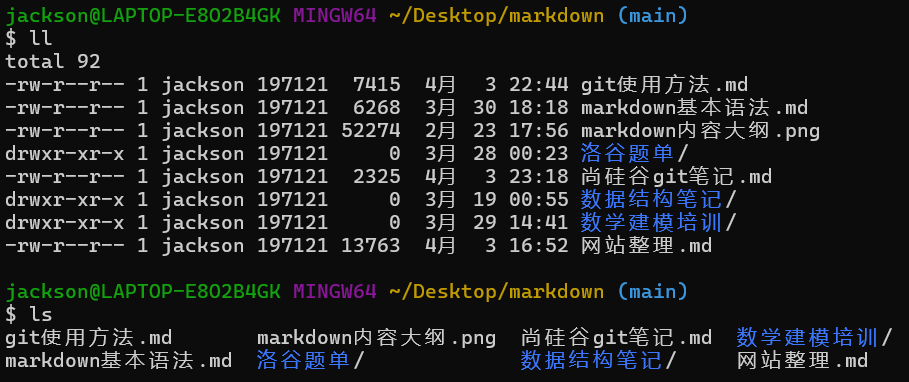
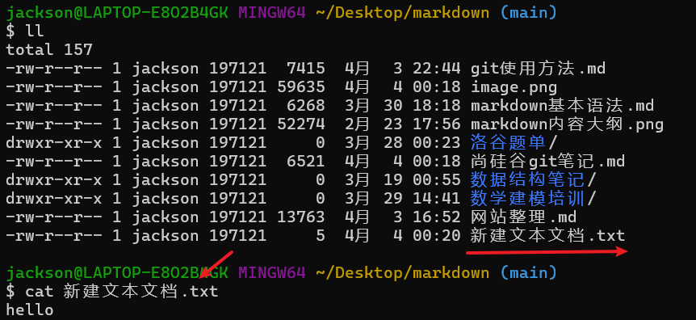
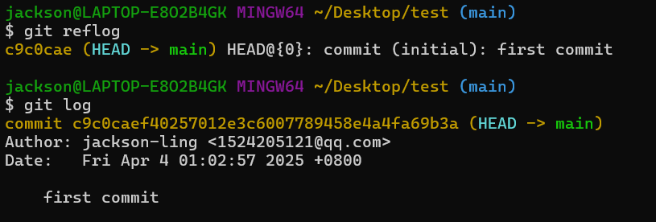
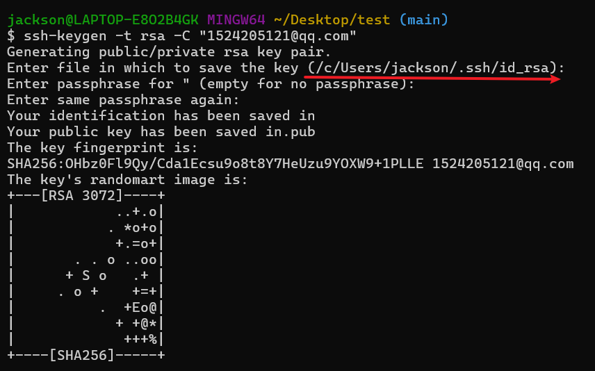
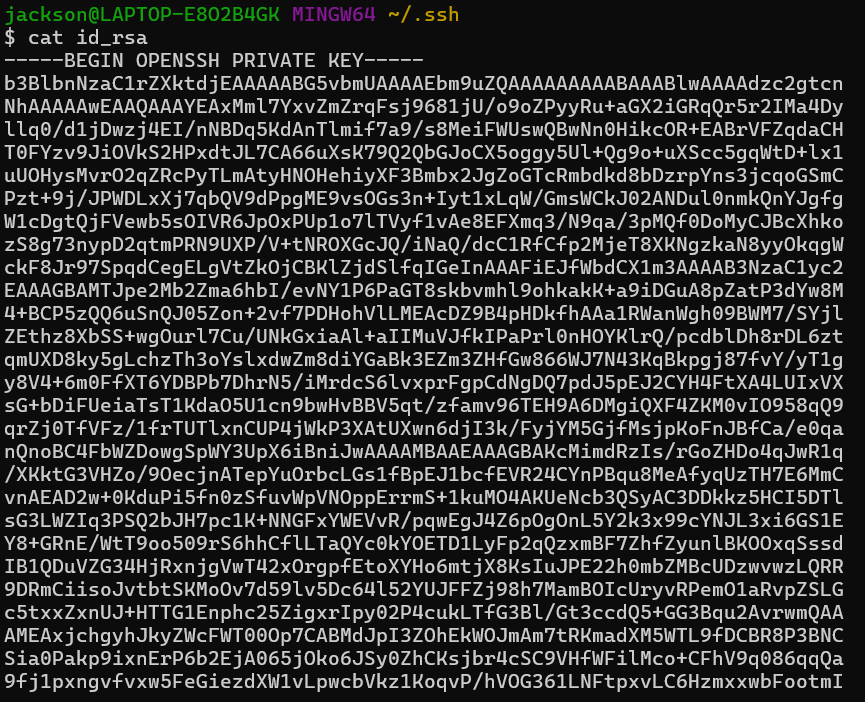
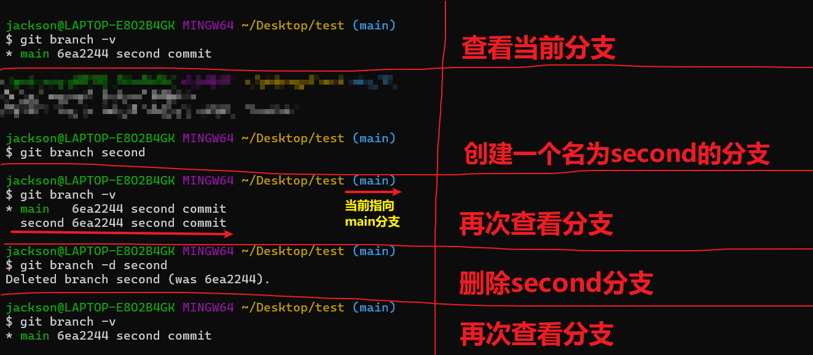
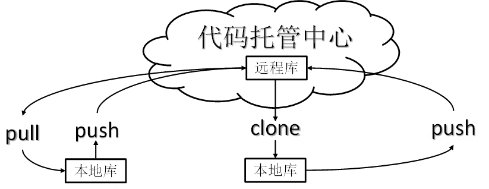

# 更适合大学生学习的 git 教程

---

## 温馨提示：本文的正文部分是按照操作过程一步步引导实现的，命令不会很集中分布，如果需要直接上手使用请跳转至`git常用命令汇总`查看对应的命令进行使用！！！

# 目录索引>>点击跳转

- ## [git 教程视频推荐](##git-教程视频推荐)
- ## [git 官网](##git-官网)
- ## [linux 的一些基本命令在 git 中的使用](#linux-的一些基本命令在-git-中的使用)
- ## 第一部分：[git 的介绍](#第一部分git-的介绍)
- ## 第二部分：[git 的使用教程](#第二部分git-的使用)
- ## 第三部分：[git 分支](#第三部分git-分支)
- ## <<补充：[SSH 的配置方法](#ssh-公钥配置方法)>>
- ## 第四部分：[git 在团队协作中的应用](#第四部分团队协作)
- ## 第五部分：IEDA 集成 git
- ## 第六部分：gitlab 的搭建和使用
- ## 第七部分：[git 常用命令汇总](#第七部分git-常用命令汇总)

---

## <span style="color:red">git 教程视频推荐</span>

- ## [尚硅谷 git 系统课程（极其推荐，讲的系统，透彻，以 github 为例）](https://www.bilibili.com/video/BV1vy4y1s7k6?spm_id_from=333.788.videopod.episodes&vd_source=822e86b53dab98632ef279a46d2536db)
- ## [狂神 git 教程（适用于速成）](https://www.bilibili.com/video/BV1FE411P7B3/?spm_id_from=333.337.search-card.all.click&vd_source=822e86b53dab98632ef279a46d2536db)

## <span style="color:red">git 官网</span>

- ## [点我](https://git-scm.com/)

## 说明：git 命令和 linux 命令是通用的，下面介绍一些常用的命令

## 清屏

```
clear
```

## 显示当前路径

```
pwd
```

## 进入某个目录

```
cd (目录名称)
```

## 回退到上一级目录

```
cd ..
```

## 显示当前目录所有文件

```
ls
```

## 显示当前目录所有文件的详细信息

```
ll
```

## 以下是二者的区别



## 查看某个文件的具体内容

```
cat (文件名称)
```

## 示例

## 

# <span style="color:red">第一部分：基本介绍</span>

## 什么是 git？

> ## git 是一个版本控制工具，同时还是一个协作开发的代码管理工具
>
> ## 为什么要进行版本控制？
>
> ## 假设有一个重要的文件，我们经过了多次更改产生了非常多的版本，然而如果每个文件都存储在本地必然会造成不必要的内存占用，同时如果在某一个版本的内容进行了修改后无法记录之前的修改，不便于我们后续的更改和使用

> ## 总结
>
> ## 优势（1）：可以帮助我们管理多个版本文件，并且不会造成版本文件的丢失，更轻量化
>
> ## 优势（2）：可以随时回退到对应版本查看那个版本的内容，每个版本的内容会保存，不会因为不小心的修改造成不可逆的损失

---

## git 的历史

## >与 linux 有渊源，感兴趣的小伙伴自行了解~~~

## [视频介绍链接,点我直达](https://www.bilibili.com/video/BV1vy4y1s7k6?spm_id_from=333.788.videopod.episodes&vd_source=822e86b53dab98632ef279a46d2536db&p=5)

---

## <span style="color:blue">一、集中式与分布式</span>

## 集中式工具：SVM（常见），CVS，VSS 等

## 分布式工具：git（主流），Mercurial，Bazaar，Darcs 等

> ### 简易区分，理解分布式和集中式
>
> ### (1) 集中式：有一台中央服务器存储和管理版本，所有操作和管理都要基于服务器，如果服务器崩溃或者出问题，就会造成不可逆的损害
>
> ### （2）分布式：一个个用户就相当一台微型服务器，所有的版本和记录都在本地，规避了集中式种服务器崩溃导致所有相关信息都没了的风险，在分布式中，集中式的服务器变成了远程库，每个用户可以在本地对代码进行修改和管理，本地就会生成对应的版本记录，方便用户随时回退到对应版本，而不需要再从服务器拉取，提高了便捷性。面对协同开发场景，用户可以把代码推送到远程库，实现代码的同步协作和开发

## 二者对比：git 的优势

## （1）服务器断网的情况下也可以进行开发（引文版本控制是在本地进行的）

## （2）每个客户端保存的也是整个完整的项目（包含历史记录，更加安全）

---

## <span style="color:blue">二、gitlab</span>

## gitlab 相当于一个远程库（或者说是属于个人单位的服务器），区别于 git，gitlab 是运行在局域网的一个远程库

## （1）git：范围所属互联网，所有人都可以访问，即开源

## 常见平台

- ## [gitee 码云（国内版 github）](https://gitee.com/)
- ## [github（全球最大的代码开源网站）](https://github.com/)

## （2）gitlab：范围属于局域网，只能在一定的范围内授权访问，是一个给有访问权限限制的远程库

> ## 理解如下
>
> ## 比如我创建了一个小公司，目前处于起步阶段，开发的内容不想开源（即使互联网中的远程库可以设置私有仓库的功能），为了提高代码安全性，公司自己搭建了一个服务器来管理存储代码，并且员工只能在连接公司的网络下才可以对代码进行管理，可见这个远程库（1）是一个人单位创建的，私密性更强（2）代码的安全性更好

## <span style="color:blue">三、git 的基本原理</span>

## ==工作区==：简单理解就算是本地代码文件存储的地方（在那个文件中？路径位置在哪？）

## ==暂存区==（==git add==）：暂时存放需要提交的代码，可以通过命令删除，可以理解是把需要管理的代码进行一个打包操作，这个时候可以随意变动，还没有送出去

## ==本地库==（==git commit==）：提交到本地存储库，并且生成一个版本号，==注意：一旦生成版本无法删除==，因此在提交前需要仔细检查，以免出现不好的内容，在后续可以通过本地存储库的记录回退到指定版本的文件，以此也就是实现了版本控制功能。

## <span style="color:blue">四、git 的安装</span>

## 小提示：安装路径不要有中文！！！

## [教学链接直达](https://www.bilibili.com/video/BV1vy4y1s7k6?spm_id_from=333.788.videopod.episodes&vd_source=822e86b53dab98632ef279a46d2536db&p=7)

---

# <span style="color:red">第二部分：git 的使用</span>

## 1. 安装成功后，需要进行基础配置

> ## 什么是配置？
>
> ## 在操作 git 之前，我们需要配置用户名和邮箱，即理解为对自己的标签，你是谁，你的邮箱是什么（邮箱），在后续推送代码到远程存储库的时候就会显示你的个人信息（1）用户名称（2）邮箱
>
> ## 注意！！！
>
> ## 这里的用户名和邮箱可以是虚拟的，而非需要配置真实的，只是起一个标签作用，实际开发中还是需要写上真实的工作邮箱，在后续开发中如有问题方便远程库（==仓库：repository==）作者与您联系

## >>右键需要管理的文件夹，使用<span style="color:red">git bash</span>打开！！！

## 配置用户名

```
git config --global user.name （填写你的用户名）
```

## 配置邮箱

```
git config --global user.email (填写你的邮箱)
```

## 查看本地用户名配置信息（检查是否配置成功）

```
git config --global user.name
```

## 查看本地邮箱配置信息（检查是否配置成功）

```
git config --gloabl user.email
```

---

## >>补充内容！！！

## 查看全局配置

```
git config --global --list
```

## 查看系统配置

```
git config --system --list
```

---

## 2.初始化到推送远程仓库

### 注意：git 的管理对象是文件，对于空文件夹是不会进行推送和管理的

> ## 新建了一个文件夹作文示例演示
>
> 

---

## （1）初始化一个远程仓库

```
git init
```

### 信息：（1）初始化了一个 git 仓库（2）这个仓库在本地的地址


---

## （2）添加文件到暂存区

## 添加单个文件

```
git add (文件名)
```

## 添加所有文件

```
git add .
```

---

## 补充内容：查看文件状态

```
git stauts
```

> ### 这里显示文件还没有被跟踪，也就是没有添加到暂存区
>
> 
>
> ### 使用 git add 命令把文件添加到暂存区
>
> ### 这里显示为绿色，就说明添加成功了，文件被跟踪
>
> 
>
> ### 通过提示可以看到一个命令（可以取消添加到暂存区，即取消跟踪，在之后 commit 的时候不提交这个文件到本地库）
>
> ```
> git rm -cached (文件名)
> ```

---

## （3）提交文件到本地存储库

### 注意：下方引号中的内容一般填写本地提交的信息，如修改了某个模块的什么功能等，用于标识这个版本文件做出的更改信息

```
git commit -m "first commit"
```

### 这里还可以对单个文件的提交更改信息进行编辑

```
git commit -m "更改信息" 文件名
```


---

## >>补充内容！！！

## 提交了之后，本地存储库就有对应的版本信息了

## 接下来实现---版本穿梭功能（本质是指针的移动）

##

## >>查看版本精简信息

```
git reflog
```

## >>查看详细信息

## 小提示：当信息很多的时候按回车可以往下逐个查看，按一次 q 即可退出

```
git log
```

> ### 1. 黄色的是版本号，用于回退到指定版本时使用
>
> ### 2. 可以看到详细信息中
>
> ### （1）会显示完整的版本号，精简信息中只会显示版本号的前七位，这七位为是可以作为版本号使用的，不必使用完整的版本号
>
> ### （2）会显示这个版本的更改对应作者的信息，修改时间
>
> ### （3）会显示某个版本的更改（提交）信息
>
> ### 3. HEAD 指针目前指向了主分支
>
> 
>
> ### 修改一次文件内容，再 commit，这个时候就有两个版本文件的信息了
>
> ### 可以看到目前指针指向的是第二个版本文件（看版本号）
>
> ## 

## 回退到某个版本

```
git reset --hard (版本号)
```

> ## 可以看到现在回退到了第一个版本，看指针指向的位置即可
>
> 

---

## （4）推送到远程仓库

### 两种连接方式

- ### http 连接
  - ### （1）如果是 github 网络可能连接不上，显示超时报错
  - ### （2）通用性强
  - ### （3）gitee 推荐使用 http 连接
  - ### （4）缺点：需要密码登录，可以通过一个命令保存记录，不必每次`push（推送到远程库）/pull（从远程库拉取代码到本地）`的时候需要登录，具体详见下文
- ### SSH 连接
  - ### （1）连接快速，忽视网络影响
  - ### （2）==免密连接==
  - ### （3）缺点：需要提前配置公钥
    > ### SSH 公钥配置方法
    >
    > ### [不想看文字教程的点我，跳转视频教学，以 gitee 为例](https://www.bilibili.com/video/BV1Tr4y1X7oY/?spm_id_from=333.337.search-card.all.click&vd_source=822e86b53dab98632ef279a46d2536db)
    >
    > ### 使用如下命令生成公钥
    >
    > ```
    > ssh-kegen -t rsa -C "填写你的邮箱"
    > ```
    >
    > ### 接下来一直回车直到出现以下界面
    >
    > 
    >
    > ### 图片中划线的位置就是密钥的保存地址，这里直接使用命令查看提升操作的便捷性
    >
    > ### 第一步：进入到密钥所在的根目录（以途中为示例，实际操作时换成自己的密钥保存路径）
    >
    > ```
    > cd /c/Users/jackson/.ssh/
    > ```
    >
    > 
    >
    > ### 图中可以看到目录发生了变化，此时采用`ls`命令查看当前目录下的所有文件
    >
    > ###
    >
    > ### 采用 cat 命令查看密钥
    >
    > ```
    > cat id_rsa
    > ```
    >
    > 
    >
    > ### 可以看到出现了一长串内容，这一大段内容就是公钥，复制粘贴到`github/gitee`生成公钥即可

##

## [还不会创建仓库的话点我跳转视频教程，以 gitee 为例](https://www.bilibili.com/video/BV1KL411E78P/?spm_id_from=333.337.search-card.all.click&vd_source=822e86b53dab98632ef279a46d2536db)

##

## 接着添加本地远程仓库，http 地址或者 ssh 地址任选一种

### ==注意==：<span style="color:red">origin</span>是==默认的仓库别名==，这里可以自行修改，在后续推送中直接使用仓库别名

```
git remote add origin (你的仓库地址)
```

## 查看本地远程仓库（检查是否添加成功/是否切换远程仓库地址）

```
git remote -v
```

## ==修改==远程仓库地址

```
git remote set-url origin (新的远程库地址)
```

### 同理可以使用`git remote -v`再次查看是否修改成功

---

## （5）推送到远程仓库

### 1.origin 是仓库的别名

### 2.main 是推送的分支，可以改

```
git push -u origin main
```

### >>提示：初次推送会让你登录 giee/github（取决于你的远程仓库地址），如果是 gitee 的话，这里的账号建议换成自己绑定的邮箱或者手机号（默认是显示输入用户名，这样不容易登录成功），填写相应的密码即可

> ### 成功示例图
>
> ## 

## ==注意==：为了防止每次推送都要登录，登录完成后需要==保存本地凭证==，在之后的推送中就不用登录了，采用如下命令

```
git config --global credential.helper store
```

## ==删除本地凭证==

```
git credential-cache exit
```

## ==（6）后续更新远程库代码==

### <span style="color:red">在不改变远程仓库的前提下，并且只使用 main 分支，后续更新代码采用如下命令</span>

### <span style="color:blue">1.添加文件暂存区让文件被 git 跟踪</span>

### 注意：这里是添加所有文件，如需单独添加某个文件也可自行更改,使用`git add (文件名)`命令

```
git add .
```

### <span style="color:blue">2.提交更改信息</span>(这里的提交信息只是示例，自行根据需要更改)

```
git commit -m "update data"
```

### <span style="color:blue">3.推送到远程库</span>

```
git push
```

### <span style="color:red">如果需要推送到其他分支</span>

```
git push (分支名)
```

---

# <span style="color:red">第三部分：git 分支</span>

> ### 什么是分支？
>
> ### 可以理解为是一个副本，主分支上运行的是可执行的代码，在开发过程中不可能在主分支上进行开发和修改（保证可执行的代码能够稳定的运行让用户使用），这个时候分支就相当于拷贝一份，在此基础上进行开发，修改，测试了没有问题之后合并到主分支（这就完成了一次版本的更新），同时还可以设置多个分支开发不同的功能

## [分支对于初学者不易理解，点我跳转视频教程](https://www.bilibili.com/video/BV1vy4y1s7k6?spm_id_from=333.788.videopod.episodes&vd_source=822e86b53dab98632ef279a46d2536db&p=17)

## 常见命令

## (1)创建一个分支

```
git branch (分支名)
```

## (2)查看所有分支

```
git branch -v
```

## (3)切换分支：在界面中会显示当前分支，看指针所指的位置

```
git checkout (需要切换的分支名)
```

## (4)删除==本地==分支

```
git branch -d <分支名>
```

## (5)删除==远程==分支

```
git push origin --delete <分支名>
```

## 示例图



## (6)合并分支

### 理解：在自己的分支上合并其他分支，即把其他分支的代码合并到自己的代码中

```
git merge (需要合并的分支)
```

> ### 分支合并冲突问题（理解起来稍有抽象，这里以视频方式呈现）
>
> ### 产生的原因：合并分支时，两个分支在==同一个文件的同一个位置==有两套完全不同的修改，git 无法替我们决定使用哪一个，必须==人为决定==新代码内容
>
> ### [点我跳转视频教学](https://www.bilibili.com/video/BV1vy4y1s7k6?spm_id_from=333.788.videopod.episodes&vd_source=822e86b53dab98632ef279a46d2536db&p=18)

---

# 第四部分：团队协作

## <span style="color:red">:warning:1. 团队内协作</span>



## <span style="color:red">:warning:2. 跨团队协作</span>


## 常见命令

## 1. 克隆仓库代码到本地

```
git clone 仓库地址
```

## 2. 拉取仓库代码到本地（<span style="color:red">注意：拉取后==会自动与本地代码合并==，相当于将本地代码和远程仓库代码同步</span>）

```
git pull origin main
```

### 这里是拉取主分支的代码和本地合并

### （1）origin 是仓库的别名

### （2）拉取远程库 main 分支的代码，<span style="color:red">这里可以自行修改为其他分支</span>

##

### 团队内开发过程简述

> ### 小明到了新公司，老板==邀请小明加入了公司远程库（给予 push 权限）==，同时给小明安排了任务，小明需要从公司的远程库中拉取代码（<span style="color:red">git clone</span>），为了影响主分支代码，保证公司开发的软件能够正常运行，接着小明创建了一个属于自己的分支，开发通信功能（<span style="color:red">git branch</span>），经过小明的不断努力，功能经过测试没有发现任何问题，在开发过程中公司的版本进行了更新，这个时候就需要（<span style="color:red">git pull</span>）拉取最新的代码和自己代码合并，最后合并到主分支（<span style="color:red">git merge</span>）或者推送到主分支（<span style="color:red">git push</span>），经过测试没有问题后就可以发布了，这就完成了一次版本更新

### 跨团队协作开发简述

> ### 小明有一天发现有个很有意思的项目，不幸的是代码写的惨不忍睹，这个时候小明看不下去了，下决心帮助这个团队开发，于是先将项目<span style="color:red">fork</span>到自己的仓库，之后<span style="color:red">git clone</span>到自己的本地，开发完成后推送（<span style="color:red">git push</span>）到 fork 的仓库，在这个仓库创建一个<span style="color:red">pull request</span>（这个是拉取请求，==又叫 PR==，就是请求别人拉取自己的代码并且和别人的代码合并），这个时候在对方的仓库就会收到这个请求（附有聊天功能），==由仓库主人审核是否合并==，如果没有问题并成功合并，那小明就成为了这个项目的协作开发者，在仓库主页就会加上小明的头像并显示

---

# <span style="color:red">第七部分：git 常用命令汇总</span>

> ### git config --global user.name （用户名）
>
> ### git config --global user.email （邮箱）
>
> ### git config --global --list
>
> ### git config --system --list
>
> ### git config --global user.name
>
> ### git config --global user.email
>
> ### git init
>
> ### git add .
>
> ### git rm -cached (文件名)
>
> ### git status
>
> ### git commit -m "first commit" (file name)
>
> ### git remote add origin (repository site)
>
> ### git push -u origin main
>
> ### git config --global credential.helper store
>
> ### git credential-cache exit
>
> ### git remote -v
>
> ### git remote set-url origin (新的仓库地址)
>
> ### git branch -v
>
> ### git checkout (分支名)
>
> ### git merge (分支名)
>
> ### git reflog
>
> ### git log
>
> ### git reset --hard (版本号)
>
> ### git branch -d (分支名)
>
> ### git push origin --delete <分支名>
