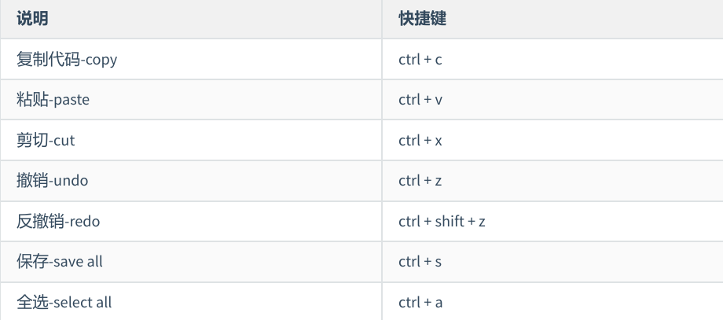
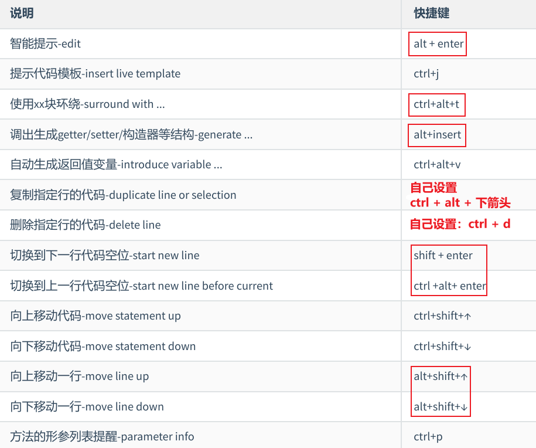
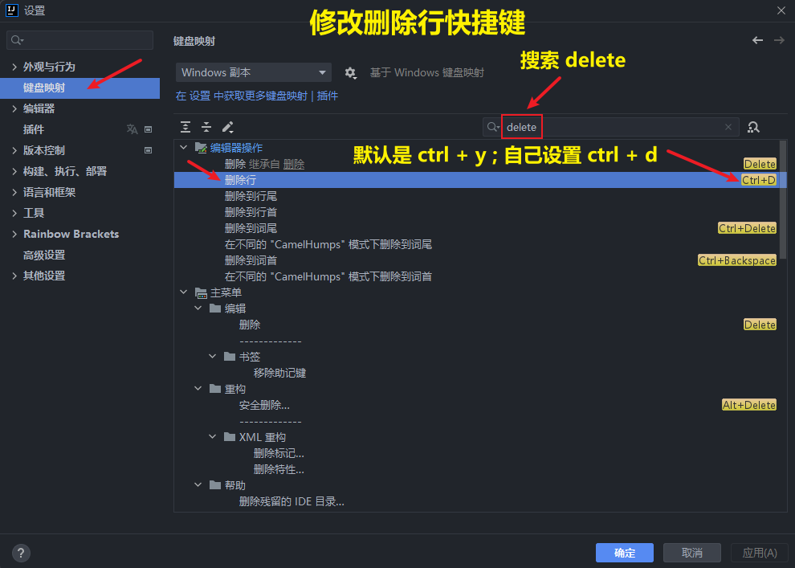
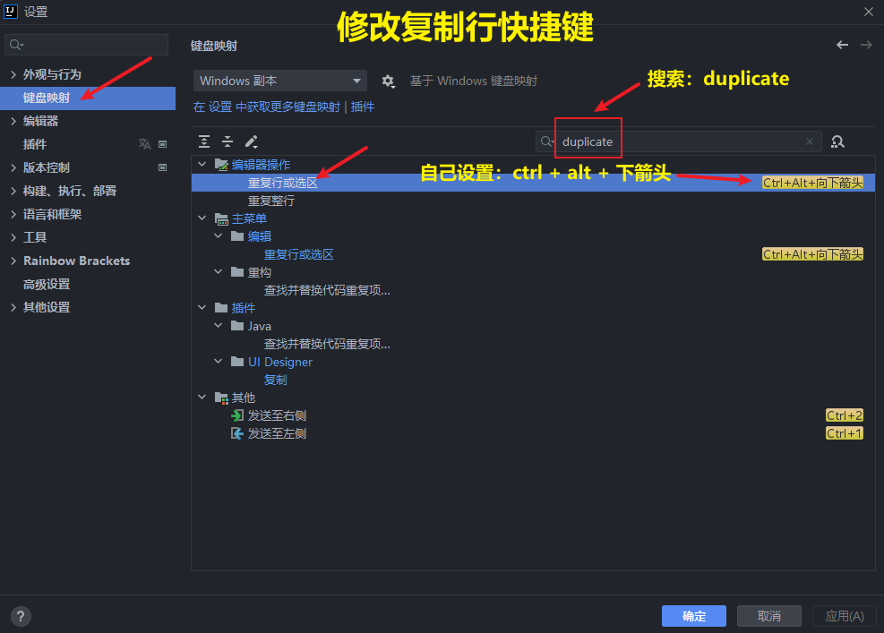
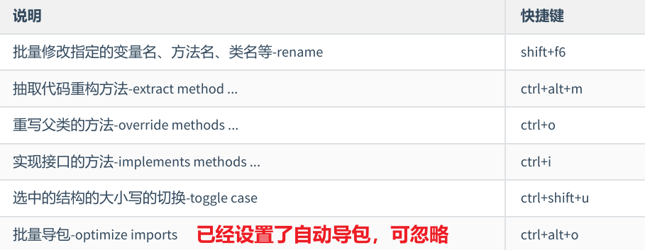
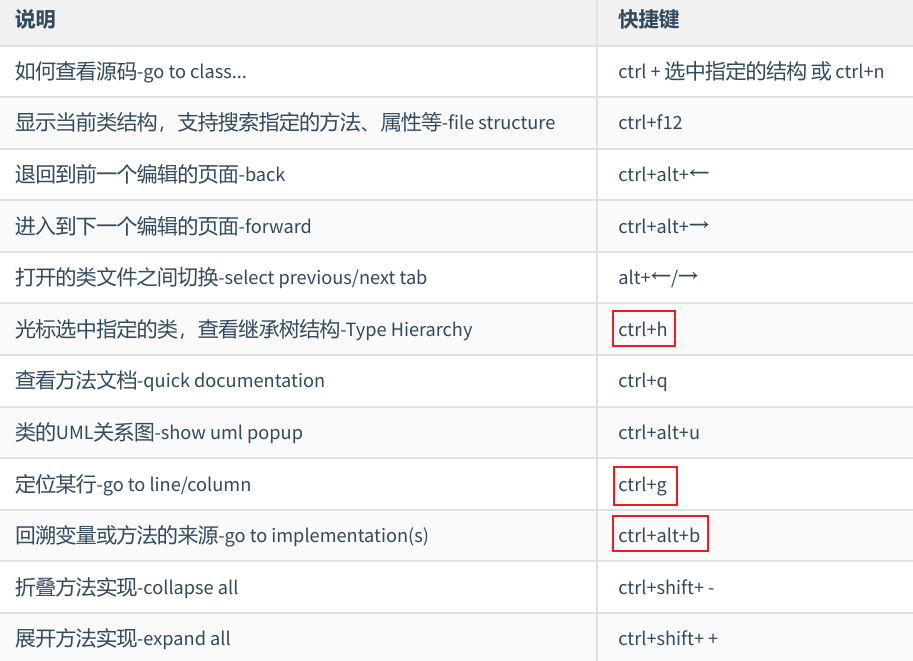
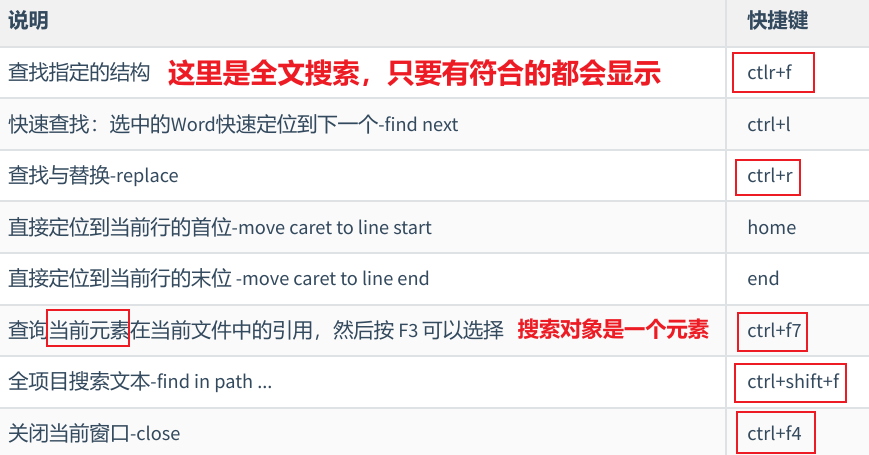
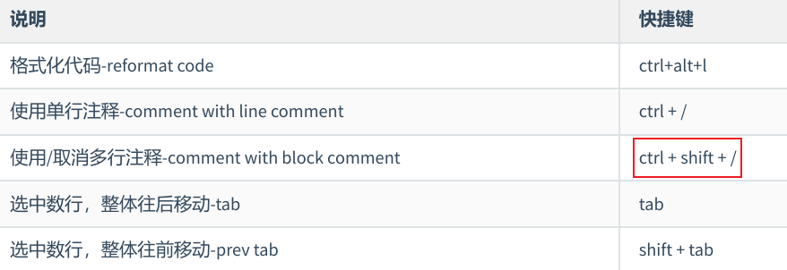
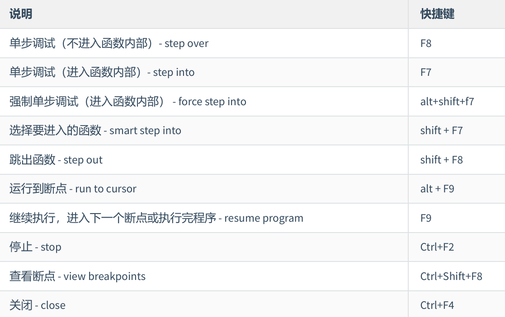
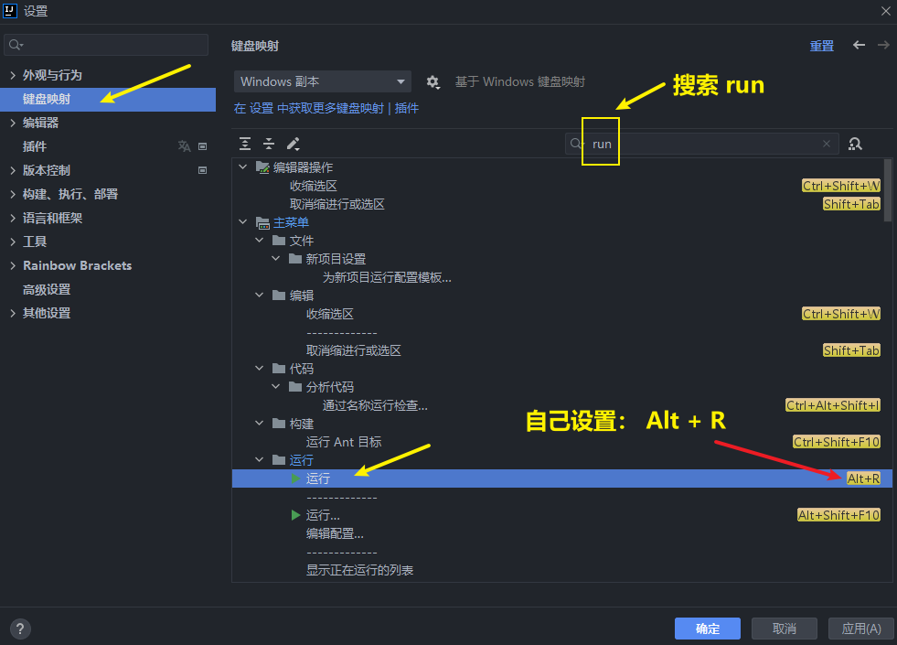

<h1 style="text-align: center; font-weight: bold;">IDEA 快捷键</h1>

---

## 1. 通用型

  

## 2. 提高编写速度（上）

  

  

 

  

## 3. 提高编写速度（下）

  

## 4. 类结构、查找和查看源码

  

## 5. 查找、替换与关闭

  

## 6. 调整格式

  

## 7. Debug 快捷键

  

## 8. 运行快捷键

  

## 8. 删除快捷键

> #### Del 键

#### 效果：保持光标固定的情况下删除其后面的内容
