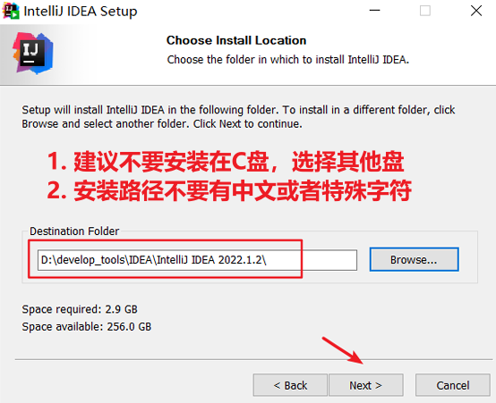
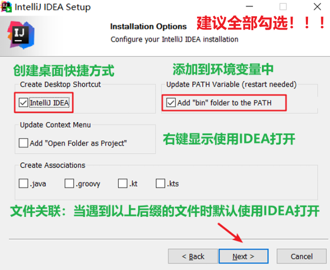
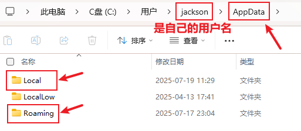
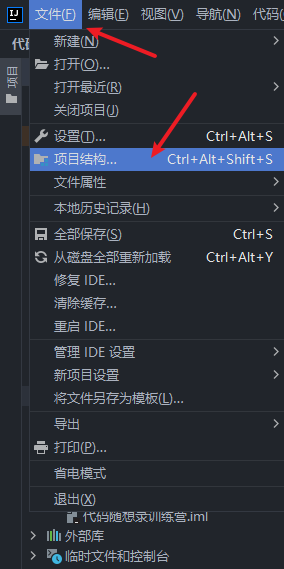

<h1 style="text-align: center; font-weight: bold;">Java环境配置</h1>

---

## 1. 基本介绍

### （1）JetBrais 公司

IDEA，是 **JetBrains** (https://www.jetbrains.com/)公司的产品，该公司成立于2000年，总部位于捷克的布
拉格，致力于为开发者打造最高效智能的开发工具。

- WebStorm：用于开发 JavaScript、HTML5、CSS3 等前端技术
- PyCharm：用于开发 Python
- PhpStorm：用于开发 PHP
- RubyMine：用于开发 Ruby/Rails
- AppCode：用于开发 Objective-C/Swift
- CLion：用于开发 C/C++
- DataGrip：用于开发数据库和 SQL
- Rider：用于开发 .NET
- GoLand：用于开发 Go

### （2）IDEA 介绍

IDEA，全称 IntelliJ IDEA，是 Java 语言的集成开发环境，目前已经（基本）代替了 Eclipse 的使用。IDEA 在业界被公认为是最好的 Java 开发工具（之一），因其 功能强悍、设置人性化，而深受 Java、大数据、移动端程序员的喜爱。尤其在智能代码助手、代码自动提示、重构、J2EE 支持、Ant、JUnit、CVS 整合、代码审查、创新的 GUI 设计等方面的功能可以说是超常的。

### （3）IDEA 的优势

<h4>（1）功能强大</h4>

- 强大的整合能力，比如：GIT、Maven、Spring 等
- 开箱即用的体验（集成版版本控制系统、多语言支持的框架随时可用，无需额外安装插件）

<h4>（2）符合人体工程学</h4>

- 高度智能（快速的智能代码补全、实时代码分析、可调的重构工具）
- 提示功能的快捷、便捷、范围广
- 好用的快捷键和代码模板
- 精准搜索

## 2. 版本说明

<h4>每年会发布三个小版本，例如：2023.x（1，2，3）</h4>

### （1）推荐版本

- IntelliJ IDEA **2023.2**（最新稳定版）

- IntelliJ IDEA **2022.1.x**（LTS 版本，适合追求稳定性的团队）

> #### 从 2022 版本开始，项目名不允许使用中文，如有需求，可以使用 2021.3 版本

### （2）选择理由

- 最新版本（如 2023.x）通常包含**最新**的功能、性能改进和 bug 修复，是希望利用新技术栈和开发工具的开发者的首选。

- LTS 版本（如 2022.1.x）适合那些对**稳定性**有较高要求的公司，尤其是在大型企业环境中，通常需要更长时间的支持和保证。

## 3. 2022.1.2 下载

<h4>点击下方连接即可下载👇</h4>

2022.1.2 Windows x64 （exe）：https://download.jetbrains.com/idea/ideaIU-2022.1.2.exe

## 4. ⭐ 安装 IDEA

### （1）硬件要求

- 64 位 Microsoft Windows 11、10、8
- 最低 2 GB 可用 RAM，推荐 8 GB 系统 RAM
- 2.5 GB 硬盘空间，推荐 SSD
- 最低屏幕分辨率 1024x768

### （2）安装过程

  

  

  

  

  

  

  

  

  

<h2>🎉完结散花：安装成功🎉</h2>

## 5. ⚠️ 激活 ⚠️

<h4>激活码：<a href="http://jets.idejihuo.com/" target="_blank">点击跳转</a></h4>
<h4>激活软件： <a href="https://pan.baidu.com/s/1hNC1vSXbkvOGnHNJS0SqaQ?pwd=3tn6" target="_blank">https://pan.baidu.com/s/1hNC1vSXbkvOGnHNJS0SqaQ?pwd=3tn6</a> 提取码: 3tn6</h4>

<h4>下载激活软件后，找到IDEA激活.vbs，关闭IDEA状态下双击运行脚本，激活成功🎉🎉</h4>

  

  

## 6. ⚠️ 软件打不开 ⚠️

### （1）问题类型

  

### （2）原因如下

> - **之前使用过的比如 2021.2.2 版本，破解了**
> - **新版 IEDA 太智能了，把现有的启运参数也都复制过去了**
> - **又因为最新的 IDEA，不兼容破解程序-javaagent:D:\develop_tools\IDEA\IntelliJ IDEA2021.2.2\bin\jetbrains-agent.jar 了，所以报错了，所以 JVM 结束了，所以没有启动画面，凉凉了**

### （3）解决方法

  

## 7. ⭐ 卸载 IDEA

### （1）显示隐藏文件

  

  

  

### （2）Local

  

### （3）Roaming

  

### （4）卸载 IDEA

  

  

  

  

## 3. 项目结构

### （1）JDK 配置

<h4>快捷键：ctrl + shift + alt + s 打开项目结构</h4>

 

  

 

  

### （2）out 目录和编译版本

 

  

## ⚠️ 同一年版本配置自动迁移

 

  

