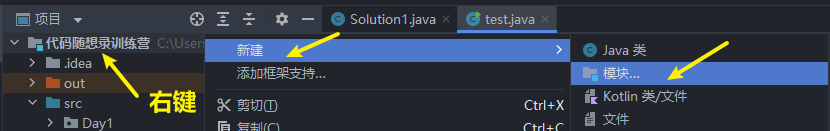
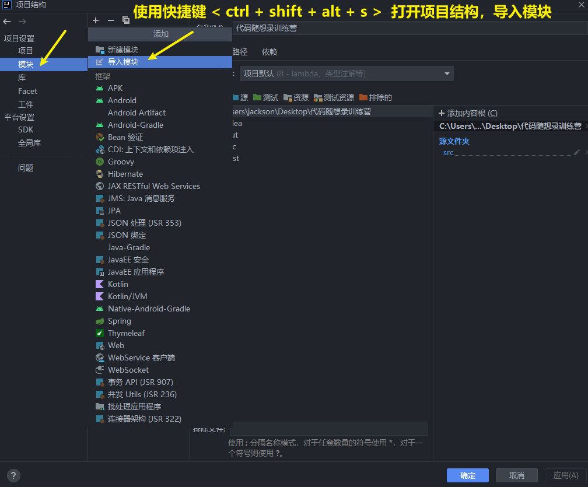

<h1 style="text-align: center; font-weight: bold;">模块与工程导入</h1>

---

## 1. 项目结构

  

## 2. Module

<h3>简单理解：一个项目中可以有不同的部分，每一个部分对应第一个模块，分类管理代码</h3>
 

  

## 3. 创建模块

  

  

  

  

## 4. 删除模块

### 移除模块

 

  

### 彻底删除

 

  

  

## 5. 模块导入

 

  

  

<h1>接着一直点下一步完成项目模块导入</h1>
 

  

## 6. 导入非 IDEA 工程代码

> <h3>直接把代码拷贝到 src 目录下即可</h3>

## 7. 导入项目乱码问题

 

  

