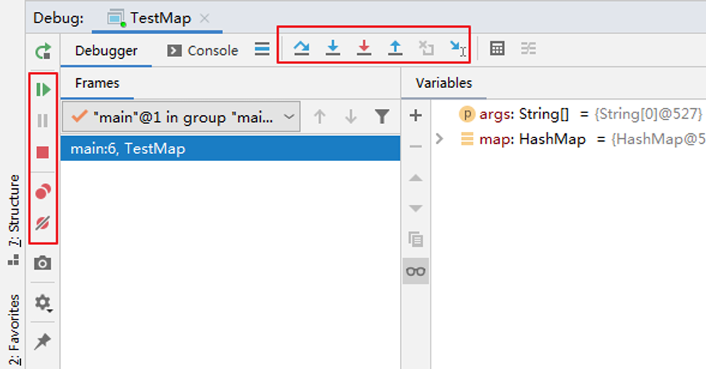

<h1 style="text-align: center; font-weight: bold;">IDEA调试</h1>

---

## 控制台介绍

 

  

  

## 行断点

> #### 断点打在代码所在的行上。执行到此行时，会停下来（等待执行状态），需要调试到下一步该语句才会被执行
>
> #### 视频链接（6 分 20 秒开始）：<a href="https://www.bilibili.com/video/BV1CK411d7aA?spm_id_from=333.788.videopod.episodes&vd_source=822e86b53dab98632ef279a46d2536db&p=16" target="_blank">点击跳转</a>

## 方法断点

> #### 视频链接：<a href="https://www.bilibili.com/video/BV1CK411d7aA?spm_id_from=333.788.videopod.episodes&vd_source=822e86b53dab98632ef279a46d2536db&p=17">点击跳转</a>

#### 应用场景

> - #### 断点设置在方法的签名上，默认当进入时，断点可以被唤醒
>
> - #### 也可以设置在方法退出时，断点也被唤醒
> - #### 在多态的场景下，在父类或接口的方法上打断点，会自动调入到子类或实现类的方法

## 字段断点

> #### 在类的属性声明上打断点，默认对属性的修改操作进行监控
>
> #### 视频链接：<a href="https://www.bilibili.com/video/BV1CK411d7aA?spm_id_from=333.788.videopod.episodes&vd_source=822e86b53dab98632ef279a46d2536db&p=18">点击跳转</a>

## 条件断点与异常断点

> #### 条件断点：希望满足某些条件时停下
>
> #### 异常断点：对异常进行跟踪。如果程序出现指定异常，程序就会执行断点，自动停住
>
> #### 视频链接：<a href="https://www.bilibili.com/video/BV1CK411d7aA?spm_id_from=333.788.videopod.episodes&vd_source=822e86b53dab98632ef279a46d2536db&p=19">点击跳转</a>

## 线程调试与强制结束

> #### 线程调试：当有多线程时，只检测某个线程
>
> #### 强制结束：不想继续调试某个方法，直接强制结束，跳出该方法
>
> #### 视频链接：<a href="https://www.bilibili.com/video/BV1CK411d7aA?spm_id_from=333.788.videopod.episodes&vd_source=822e86b53dab98632ef279a46d2536db&p=20">点击跳转</a>

## 显示隐藏数据

  

  

