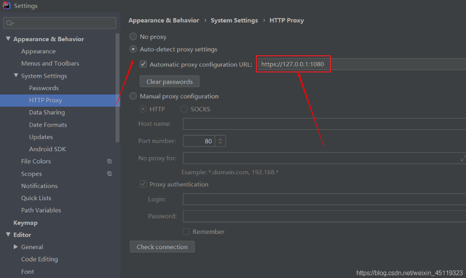

<h1 style="text-align: center; font-weight: bold;">常用插件</h1>

---

## IDEA 插件商店加载不出来

```bash
https://127.0.0.1:1080
```



<div style="font-size:20px">
    1. 简单好用，增强功能
    <ul>
        <ul>
            <li>Chinese Language Pack：中文语言包</li>
            <br/>
            <li>Translation：翻译插件，鼠标选中文本，点击右键即可自动翻译成多国语言（<span style="color:red;font-weight:bold">需要申请API</span>）</li>
            <br/>
            <li>Key Promoter X：快捷键提示插件。当你执行鼠标操作时，如果该操作可被快捷键代替，会给出提示，帮助你自然形成使用快捷键的习惯，告别死记硬背</li>
            <br/>
            <li>Rainbow Brackets：给括号添加彩虹色，使开发者通过颜色区分括号嵌套层级，便于阅读</li>
            <br/>
            <li>CodeGlance：在编辑器右侧生成代码小地图，可以拖拽小地图光标快速定位代码，阅读行数很多的代码文件时非常实用</li>
            <br/>
            <li>Statistic：代码统计</li>
        </ul>
    </ul>
    <br/>
    2. 提高开发效率和代码质量
    <ul>
        <ul>
            <li>Alibaba Java Coding Guidelines：代码规范检查插件</li>
            <br/>
            <li>JavaDoc：生成 Javadoc 文档（选取代码片段，<span style = "color:red;font-weight:bold">快捷键：alt + insert</span> 生成JavaDoc文档）</li>
            <br/>
            <li>GenerateAllSetter：快速生成调用对象 setter 方法的代码</li>
            <br/>
            <li>GenerateSerialVersionUID：一键为实现 Serializable 接口的类生成 SerialVersionUID</li>
            <br/>
            <li>GsonFormatPlus：根据 json 生成对象</li>
            <br/>
            <li>JUnitGenerator V2.0：自动生成单元测试</li>
            <br/>
            <li>MybatisX：MyBatis 增强插件，支持自动生成 entity、mapper、service 等常用操作的代码，优化体验</li>
            <br/>
            <li>jclasslib Bytecode Viewer：字节码查看器</li>
            <br/>
            <li>String Manipulation：字符串快捷处理</li>
            <br/>
        </ul>
    </ul>
    3. 其他
    <ul>
        <ul>
            <li>Leetcode Editor：在 IDEA 里刷算法题</li>
            <br/>
            <li>GitToolBox： Git 增强插件。在自带的 Git 功能之上，新增了查看 Git 状态、自动拉取代码、提交通知等功能。最好用的是可以查看到每一行代码的最近一次提交信息</li>
            <br/>
            <li>BashSupport：支持 Bash 脚本文件的高亮和提示等</li>
            <br/>
            <li>CSV：支持 CSV 文件的高亮和提示等</li>
            <br/>
        </ul>
    </ul>
</div>
