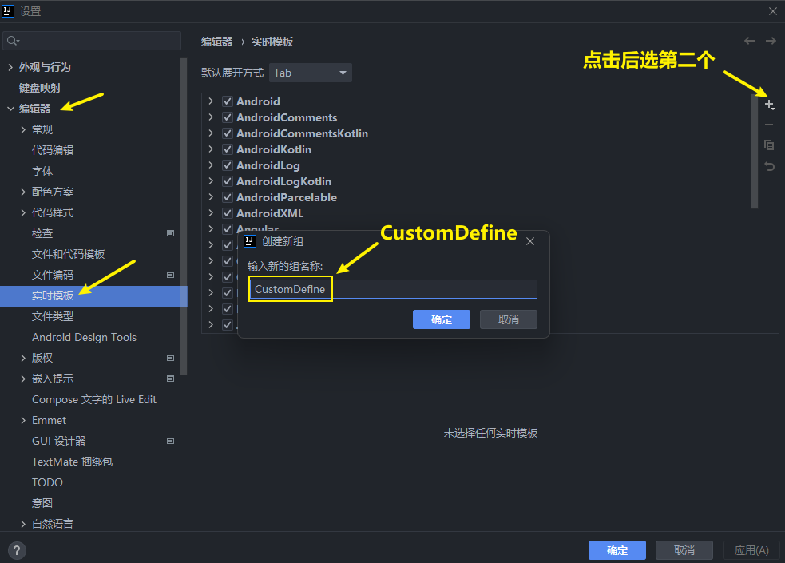
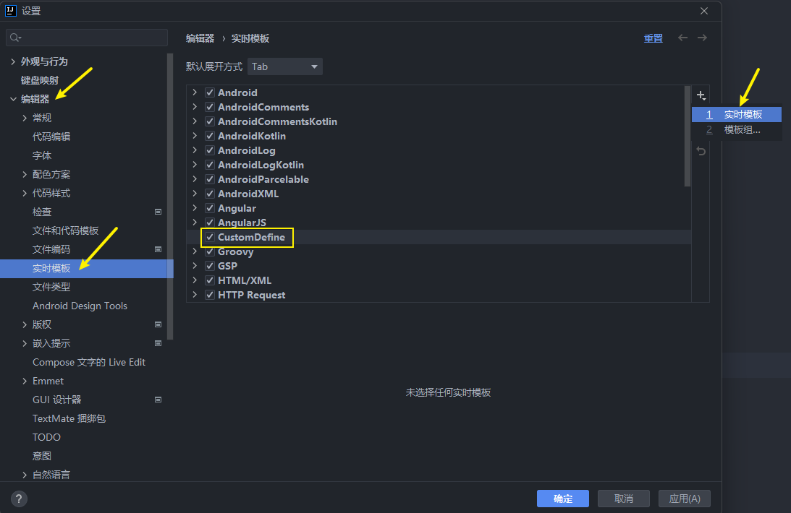
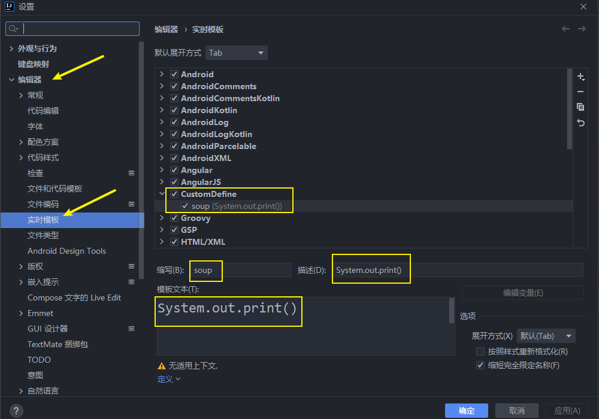

<h1 style="text-align: center; font-weight: bold;">常用代码模板</h1>

---

## 1. 非空判断

    <ul>
        <li>变量 . null : if(变量 == null)</li>
         
        <li>变量 . nn : if(变量 != null)</li>
         
        <li>变量 . notnull : if(变量 != null)</li>
         
        <li>ifn : if(xx == null)</li>
         
        <li>inn : if(xx != null)</li>
    </ul>

## 2. 遍历数组和集合

    <ul>
        <li>数组或集合变量 . fori: 循环</li>
        <li>数组或集合变量 . for: 增强的循环</li>
        <li>数组或集合变量 . forr: 反向的循环</li>
        <li>数组或集合变量 . iter: 增强的循环遍历数组或集合</li>
        <li>itit : 迭代器遍历模板</li>
        <li>fori : 普通for循环模板</li>
        <li>I : 增强for循环模板</li>
    </ul> 

## 3. 输出语句

    <ul>
        <li>sout: 相当于System.out.println()</li>
        <li>soup（自己设置）: 相当于System.out.print()</li>
        <li>soutm: 打印当前方法的名称</li>
        <li>soutp: 打印当前方法的形参及形式参数对应的实际参数值</li>
        <li>soutv: 打印方法内的最局部的变量的值</li>
        <li>变量 . sout: 打印当前变量值</li>
        <li>变量 . soutv: 打印当前变量名及变量值</li>
    </ul>

  

  

  

## 4. 对象操作

    <ul>
        <li>创建对象:
            <ul>
                <li>XXX . new var: 创建XXX类的对象，并赋给相应的变量</li>
                <li>XXX . new . field: 会将方法内所创建的XXX对象提取为一个属性</li>
            </ul>
        </li>
        <li>强转:
            <ul>
                <li>对象 . cast: 将对象强转</li>
                <li>对象 . castvar: 将对象强转后，并赋给一个变量</li>
            </ul>
        </li>
    </ul>

## 5. 静态常量声明

    <ul>
        <li>psf: public static final</li>
        <li>psfi: public static final int</li>
        <li>psfs: public static final String</li>
        <li>prsf: private static final</li>
    </ul>

