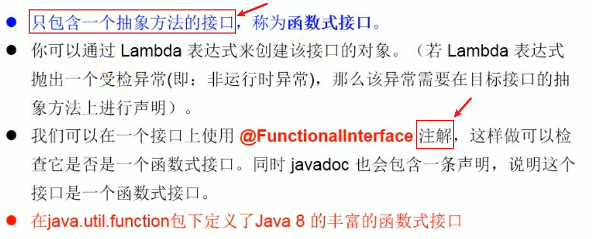
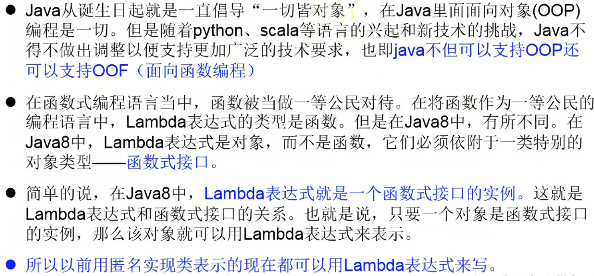
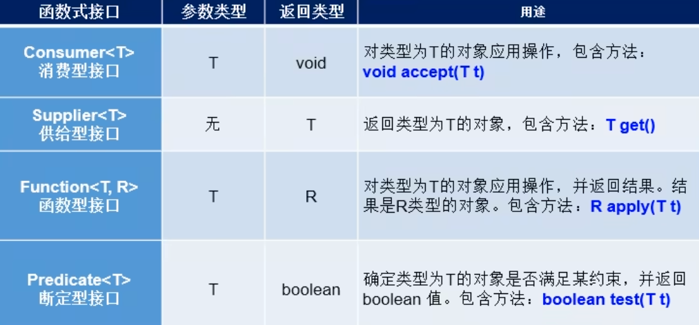
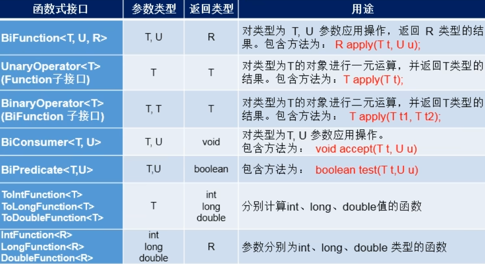

<h1 style="text-align: center; font-weight: bold;">函数式接口</h1>

---

## 基本介绍

<br>


## 如何理解

<br>


## 四大核心函数式接口

<br>


## 其他函数函数式接口

<br>


## Predicate 实现过滤

> #### 下方使用 Predicate 接口实现字符串过滤，只有字符串中包含 "京" 才符合条件

#### 代码示例

```java
class test{
    @Test
    public void test0(){
        List<String> list = Arrays.asList("北京", "南京", "天津", "东京", "西京", "普京");
        List<String> filterStrs = filterString(list, new Predicate<String>() { // 普通写法
            @Override
            public boolean test(String s) {
                return s.contains("京");
            }
        });
        System.out.println(filterStrs);
    }

    @Test
    public void test1(){
        List<String> list = Arrays.asList("北京", "南京", "天津", "东京", "西京", "普京");
        List<String> filterStrs = filterString(list, s -> s.contains("京")); // 使用 lambda 表达式
        System.out.println(filterStrs);
    }
    public List<String> filterString(List<String> list, Predicate<String> pre) {
        ArrayList<String> filterList = new ArrayList<>();
        for (String s : list) {
            if (pre.test(s)) {
                filterList.add(s);
            }
        }
        return filterList;
    }
}
```
